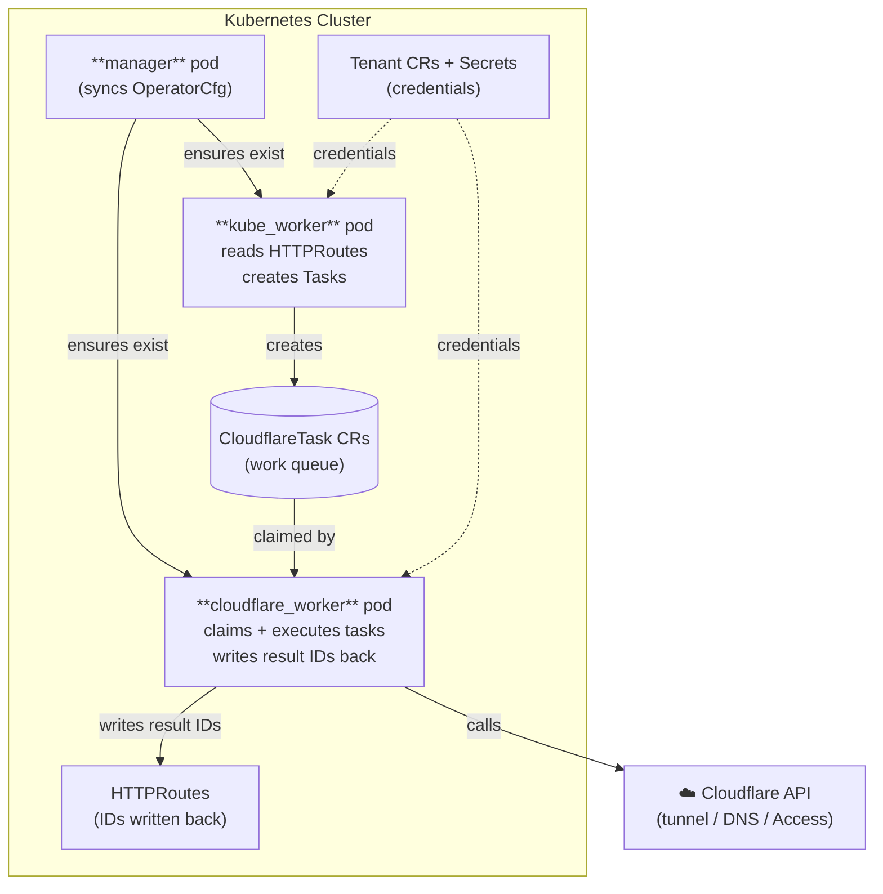

<!-- markdownlint-disable -->
# Cloudflare Zero Trust Operator

A Kubernetes Operator for managing Cloudflare Zero Trust resources directly from your cluster using Ansible.

## Features

- 🚀 **Annotation-driven configuration** — Manage Cloudflare Zero Trust from Kubernetes `HTTPRoute` annotations
- 🔒 **Access Control** — Automatically create and manage Cloudflare Access Applications and Policies
- 🔑 **Service Tokens** — Generate service tokens for machine-to-machine authentication
- 🌐 **Tunnel Management** — Configure Cloudflare Tunnel hostname routes
- 🔗 **Automatic DNS** — Creates the tunnel CNAME (`hostname → <tunnel-id>.cfargotunnel.com`) automatically; zone is auto-discovered from the hostname via the Cloudflare API (optional `zoneId` on the tenant acts as a validation guard)
- 📡 **DNS-only mode** — Publish internal services via a Cloudflare A record pointing at your cluster VIP, with no tunnel required
- 🔄 **Idempotent** — Safe to run repeatedly; handles creates, updates, and deletions
- 🎯 **Multi-tenant** — Support multiple Cloudflare accounts in one cluster
- 📝 **GitOps-friendly** — Managed entirely through Kubernetes CRs and HTTPRoute annotations

## Quick Start

### 1. Add the Helm repository

```bash
helm repo add wheetazlab https://wheetazlab.github.io/cloudflare-zero-trust-operator
helm repo update
```

### 2. Install with a values file

Create `my-values.yaml`:

```yaml
tenant:
  create: true
  instanceName: "prod-tenant"
  accountId: "abcdef1234567890abcdef1234567890"    # Cloudflare Account ID
  tunnelId:  "xxxxxxxx-xxxx-xxxx-xxxx-xxxxxxxxxxxx" # Cloudflare Tunnel ID
  # zoneId: "fedcba0987654321fedcba0987654321"    # optional — auto-discovered from hostname
  apiToken:  "your-cloudflare-api-token"
```

```bash
helm install cloudflare-zero-trust-operator wheetazlab/cloudflare-zero-trust-operator \
  --namespace cloudflare-zero-trust \
  --create-namespace \
  -f my-values.yaml
```

### 3. Annotate your HTTPRoutes

```yaml
apiVersion: gateway.networking.k8s.io/v1
kind: HTTPRoute
metadata:
  name: myapp
  namespace: default
  annotations:
    cfzt.cloudflare.com/enabled: "true"
    cfzt.cloudflare.com/tenant: "prod-tenant"
    cfzt.cloudflare.com/template: "my-template"
    cfzt.cloudflare.com/hostname: "myapp.example.com"
spec:
  # ... your HTTPRoute spec
```

The operator reconciles the annotation and:
- writes the hostname ingress rule to the Cloudflare Tunnel
- creates the DNS CNAME record (if `zoneId` is set on the tenant)
- creates the Cloudflare Access Application and policy
- stores all Cloudflare resource IDs back as annotations on the HTTPRoute

## Documentation

- [Helm chart README](charts/cloudflare-zero-trust-operator/README.md) — full install guide, all values, CRD reference, dns-only mode, upgrade/uninstall
- [docs/README.md](docs/README.md) — high-level documentation index
- [docs/architecture.md](docs/architecture.md) — component architecture and design
- [docs/flow.md](docs/flow.md) — reconciliation flow walkthrough
- [Examples](examples/) — example template and HTTPRoute configurations

## What It Does

The operator watches `HTTPRoute` resources for annotations and automatically manages:

1. **Cloudflare Tunnel hostname routes** — routes public hostnames through your tunnel to origin services
2. **Automatic CNAME DNS** — creates `hostname CNAME <tunnel-id>.cfargotunnel.com` (proxied, TTL auto); zone ID is auto-discovered from the hostname via the Cloudflare Zones API — no `zoneId` required. If `tenant.zoneId` is set it is validated against the discovered value as a safety check
3. **Cloudflare Access Applications** — protects your applications with Cloudflare Access
4. **Access Policies** — configures who can access your applications (email, groups, etc.)
5. **Service Tokens** — creates tokens for machine-to-machine authentication
6. **DNS-only A records** — for internal services reachable via DNS but not tunnelled (see [DNS-only mode](charts/cloudflare-zero-trust-operator/README.md#dns-only-mode-internal--direct-to-cluster-routing))
7. **State tracking** — uses per-HTTPRoute ConfigMaps (`cfzt-{namespace}-{name}`) to detect annotation changes via SHA256 hash (avoiding unnecessary API calls), and writes result Cloudflare resource IDs back to HTTPRoute annotations for idempotent updates and clean deletion

## Requirements

- Kubernetes 1.25+
- Gateway API CRDs installed (`HTTPRoute` must exist)
- Cloudflare account with Zero Trust enabled
- Cloudflare API token with the following permissions:

| Permission | Level | Access | When required |
|---|---|---|---|
| Cloudflare Tunnel | Account | Edit | Always |
| Access: Apps and Policies | Account | Edit | Always |
| Access: Service Tokens | Account | Edit | Always |
| Zone: DNS | Zone | Edit | When `tenant.zoneId` is set (tunnel CNAME + dns-only A records) |

## Architecture

The operator runs as **three coordinated Deployments** in the same namespace, all from the same container image, differentiated by the `ROLE` environment variable:



**`kube_worker`** is Kubernetes-only — it reads `HTTPRoute` annotations, detects changes via SHA256 hash, and creates `CloudflareTask` CRs as work items.

**`cloudflare_worker`** is API-only — it claims tasks and makes all Cloudflare REST API calls (tunnel routes, DNS, Access apps, service tokens), writing result IDs back to the task status.

**`manager`** keeps the other two Deployments healthy and applies any `CloudflareZeroTrustOperatorConfig` CR changes to the operator's own Deployment.

See [docs/architecture.md](docs/architecture.md) for the full three-tier design and [docs/flow.md](docs/flow.md) for the reconciliation flow.

## Development

```bash
git clone https://github.com/wheetazlab/cloudflare-zero-trust-operator.git
cd cloudflare-zero-trust-operator

# Install dependencies
pip install -r container/requirements.txt
ansible-galaxy collection install -r ansible/requirements.yml

# Build container
docker build -f container/Dockerfile -t ghcr.io/wheetazlab/cloudflare-zero-trust-operator:latest .

# Deploy via Helm (local chart)
helm install cloudflare-zero-trust-operator ./charts/cloudflare-zero-trust-operator \
  --namespace cloudflare-zero-trust \
  --create-namespace \
  -f my-values.yaml
```

## Contributing

Contributions are welcome! Please feel free to submit a Pull Request.

## License

MIT License — see [LICENSE](LICENSE) for details. 
