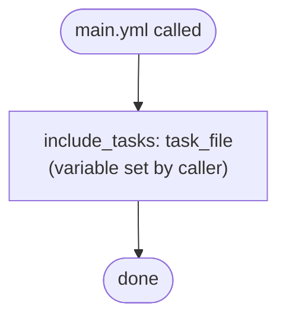
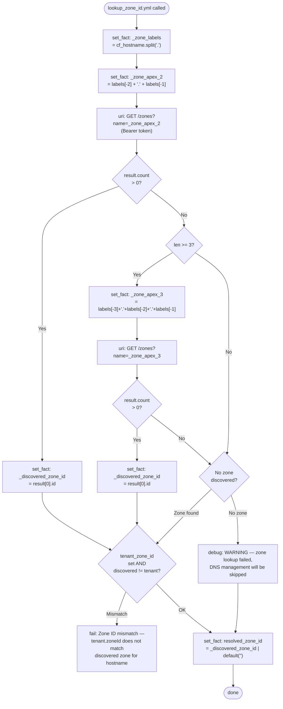
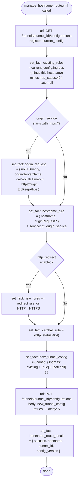
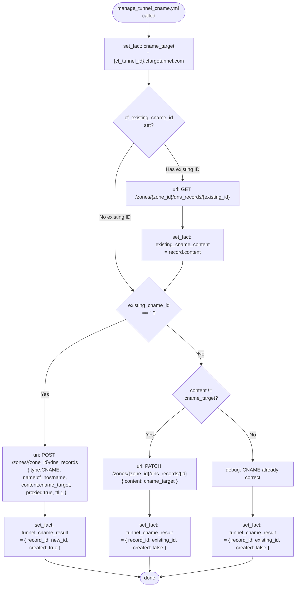
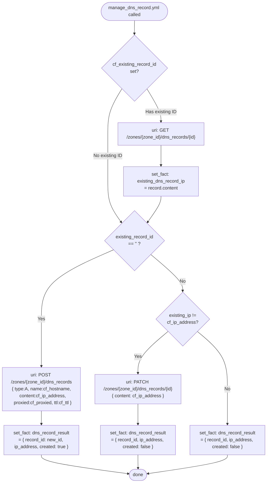
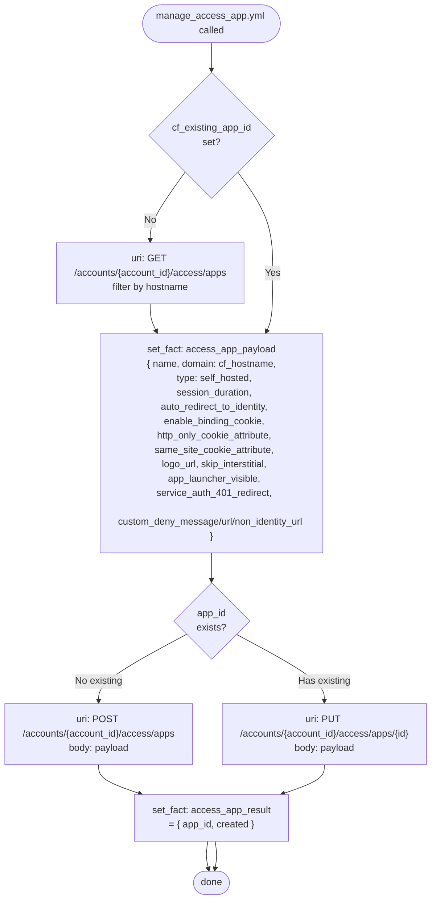
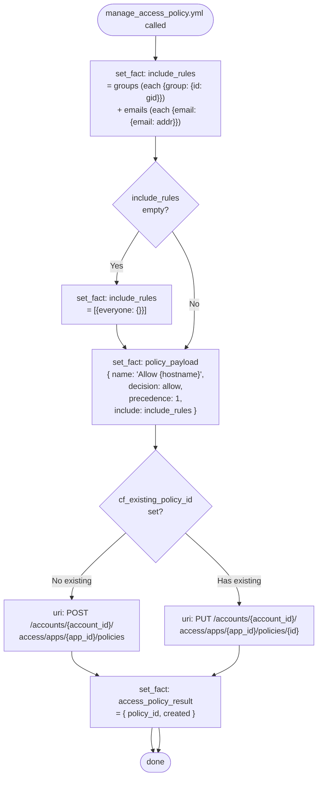
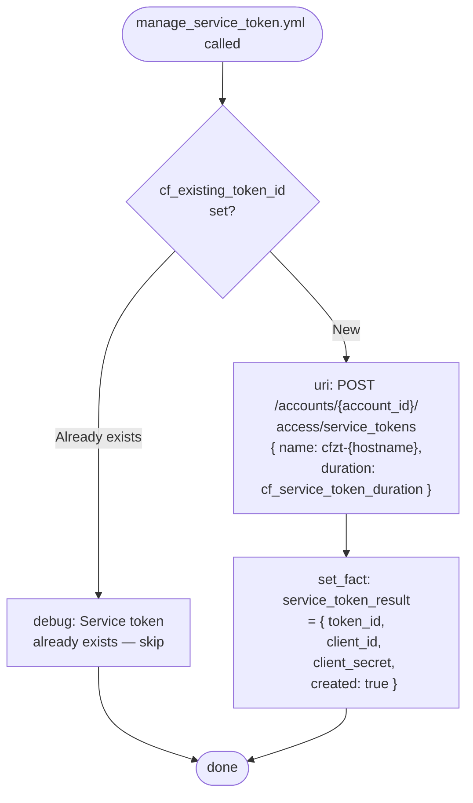
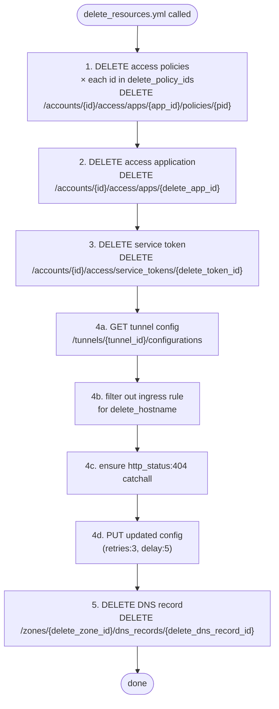

# cloudflare_api

Library role for all Cloudflare API interactions. Called exclusively by the `cloudflare_worker` role (via `execute_task.yml`) using `include_role: … tasks_from:`. Each task file is a focused, idempotent unit that makes one class of Cloudflare API call and returns a structured result fact.

This role does **not** touch Kubernetes. All Kubernetes reads and writes are handled by `kube_worker`.

---

## Caller pattern

```yaml
- name: Manage tunnel hostname route
  include_role:
    name: cloudflare_api
    tasks_from: manage_hostname_route.yml
  vars:
    cf_api_token:      "{{ cf_api_token }}"
    cf_tunnel_id:      "{{ cf_tunnel_id }}"
    cf_hostname:       "example.internal.company.com"
    cf_origin_service: "https://my-service.namespace.svc.cluster.local:8443"
    # ... additional vars per task
```

`main.yml` can also be used as a dispatcher:

```yaml
- include_role:
    name: cloudflare_api
  vars:
    task_file: "manage_hostname_route.yml"
    # ... task vars
```

---

## Task: `main.yml`

Dispatcher. Calls `include_tasks: "{{ task_file }}"`. Used when the caller selects the task file dynamically.



---

## Task: `lookup_zone_id.yml`

Auto-discovers the Cloudflare Zone ID for a hostname using the Zones API. Tries a 2-label apex first (`example.com`), then falls back to 3-label for country-code second-level domains (`example.co.uk`). Optionally validates the discovered zone matches `tenant.spec.zoneId`.



**Inputs:**

| Variable | Required | Description |
|---|---|---|
| `cf_api_token` | Yes | Cloudflare Bearer token |
| `cf_hostname` | Yes | Full hostname (e.g. `app.example.com`) |
| `cf_api_base` | Yes | API base URL |
| `cf_tenant_zone_id` | No | Optional validation: must match discovered zone |

**Outputs:**

| Fact | Description |
|---|---|
| `resolved_zone_id` | Zone ID string, or `""` if lookup failed (caller should skip DNS ops) |

---

## Task: `manage_hostname_route.yml`

Adds or updates the hostname ingress rule in a Cloudflare Tunnel's configuration. The entire tunnel config is fetched (GET), the rule for this hostname is inserted/replaced, and the full config is PUT back. A catch-all `http_status:404` rule is always preserved at the end.



**Inputs:**

| Variable | Required | Description |
|---|---|---|
| `cf_api_token` | Yes | Bearer token |
| `cf_tunnel_id` | Yes | Cloudflare Tunnel UUID |
| `cf_hostname` | Yes | Hostname for this rule |
| `cf_origin_service` | Yes | Origin URL (e.g. `https://svc.ns.svc.cluster.local:8443`) |
| `cf_http_redirect` | No (default false) | Add HTTP→HTTPS redirect rule |
| `cf_no_tls_verify` | No | Skip TLS verification at origin |
| `cf_origin_server_name` | No | Override SNI for origin TLS |
| `cf_ca_pool` | No | Custom CA pool for origin TLS |
| `cf_tls_timeout` | No (default 10) | TLS handshake timeout (seconds) |
| `cf_http2_origin` | No | Enable HTTP/2 to origin |
| `cf_match_sni_to_host` | No | Match SNI to hostname |
| `cf_api_base` | Yes | API base URL |

**Output:**

| Fact | Description |
|---|---|
| `hostname_route_result.success` | `true` |
| `hostname_route_result.hostname` | Hostname configured |
| `hostname_route_result.tunnel_id` | Tunnel UUID |
| `hostname_route_result.config_version` | Returned config version |

---

## Task: `manage_tunnel_cname.yml`

Creates or updates a proxied DNS CNAME record pointing `hostname` → `{tunnel-id}.cfargotunnel.com`. Three code-paths: create (no existing ID), update (target changed), no-op (already correct).



**Inputs:**

| Variable | Required | Description |
|---|---|---|
| `cf_api_token` | Yes | Bearer token |
| `cf_zone_id` | Yes | Zone ID (from `lookup_zone_id.yml`) |
| `cf_tunnel_id` | Yes | Tunnel UUID (determines CNAME target) |
| `cf_hostname` | Yes | DNS name to configure |
| `cf_existing_cname_id` | No | Skip lookup if record ID already known |
| `cf_api_base` | Yes | API base URL |

**Output:**

| Fact | Description |
|---|---|
| `tunnel_cname_result.record_id` | DNS record ID |
| `tunnel_cname_result.created` | `true` if newly created |

---

## Task: `manage_dns_record.yml`

Creates or updates a DNS A record for dns-only mode (no tunnel). Three code-paths: create, update (IP changed), no-op.



**Inputs:**

| Variable | Required | Description |
|---|---|---|
| `cf_api_token` | Yes | Bearer token |
| `cf_zone_id` | Yes | Zone ID |
| `cf_hostname` | Yes | DNS name to configure |
| `cf_ip_address` | Yes | IP address for A record |
| `cf_proxied` | No (default false) | Proxy through Cloudflare |
| `cf_ttl` | No (default 120) | TTL in seconds (1 = auto) |
| `cf_existing_record_id` | No | Skip lookup if ID already known |
| `cf_api_base` | Yes | API base URL |

**Output:**

| Fact | Description |
|---|---|
| `dns_record_result.record_id` | DNS record ID |
| `dns_record_result.ip_address` | Configured IP |
| `dns_record_result.created` | `true` if newly created |

---

## Task: `manage_access_app.yml`

Creates or updates a Cloudflare Access Application for the hostname. Performs a GET to check if an app already exists under this account for the exact hostname, then issues POST (new) or PUT (update).



**Inputs:**

| Variable | Required | Description |
|---|---|---|
| `cf_api_token` | Yes | Bearer token |
| `cf_account_id` | Yes | Cloudflare account ID |
| `cf_hostname` | Yes | Hostname = Access app domain |
| `cf_existing_app_id` | No | Skip lookup if ID known |
| `cf_session_duration` | No (default `24h`) | Session duration |
| `cf_allow_groups` | No | Comma-separated Access group IDs |
| `cf_allow_emails` | No | Comma-separated allowed emails |
| `cf_auto_redirect_to_identity` | No (false) | Redirect to IdP immediately |
| `cf_enable_binding_cookie` | No (false) | Cloudflare binding cookie |
| `cf_http_only_cookie_attribute` | No (true) | HttpOnly cookie flag |
| `cf_same_site_cookie_attribute` | No (`lax`) | SameSite cookie setting |
| `cf_logo_url` | No | Custom logo URL |
| `cf_skip_interstitial` | No (false) | Skip auth interstitial |
| `cf_app_launcher_visible` | No (true) | Show in app launcher |
| `cf_service_auth_401_redirect` | No (false) | Redirect 401 to service auth |
| `cf_custom_deny_message` | No | Custom deny message |
| `cf_custom_deny_url` | No | Custom deny redirect URL |
| `cf_custom_non_identity_deny_url` | No | Deny URL for non-identity requests |
| `cf_api_base` | Yes | API base URL |

**Output:**

| Fact | Description |
|---|---|
| `access_app_result.app_id` | Access Application UUID |
| `access_app_result.created` | `true` if newly created |

---

## Task: `manage_access_policy.yml`

Creates or updates an Access Policy attached to an Access Application. Builds an `include` rules array from group IDs and/or emails. Falls back to `{"everyone": {}}` if neither is specified.



**Inputs:**

| Variable | Required | Description |
|---|---|---|
| `cf_api_token` | Yes | Bearer token |
| `cf_account_id` | Yes | Account ID |
| `cf_app_id` | Yes | Access Application ID (from `manage_access_app.yml`) |
| `cf_hostname` | Yes | Used in policy name |
| `cf_allow_groups` | No | Comma-separated Access group IDs |
| `cf_allow_emails` | No | Comma-separated email addresses |
| `cf_existing_policy_id` | No | Update existing policy by ID |
| `cf_api_base` | Yes | API base URL |

**Output:**

| Fact | Description |
|---|---|
| `access_policy_result.policy_id` | Policy UUID |
| `access_policy_result.created` | `true` if newly created |

---

## Task: `manage_service_token.yml`

Creates a Cloudflare Access Service Token. **Create-only** — service tokens cannot be updated via API. The `client_id` and `client_secret` are returned only at creation time; subsequent runs skip if a token ID already exists.



> **Security note:** `client_secret` is only available in the POST response. Once the result is stored in the `CloudflareTask` status, `kube_worker` creates a Kubernetes `Secret` containing `client_id` and `client_secret`. The values are never stored in git or ConfigMaps.

**Inputs:**

| Variable | Required | Description |
|---|---|---|
| `cf_api_token` | Yes | Bearer token |
| `cf_account_id` | Yes | Account ID |
| `cf_hostname` | Yes | Used to name the token (`cfzt-{hostname}`) |
| `cf_existing_token_id` | No | Skip creation if token already exists |
| `cf_service_token_duration` | No (default `8760h`) | Token validity duration |
| `cf_api_base` | Yes | API base URL |

**Output:**

| Fact | Description |
|---|---|
| `service_token_result.token_id` | Service token ID |
| `service_token_result.client_id` | Client ID (only if newly created) |
| `service_token_result.client_secret` | Client secret (only if newly created) |
| `service_token_result.created` | `true` if newly created |

---

## Task: `delete_resources.yml`

Deletes all Cloudflare resources associated with an HTTPRoute in safe dependency order. Uses `status_code: [200, 204, 404]` — a 404 response is treated as success (resource already gone).



**Deletion order (dependency-safe):**

| Step | Resource | Guard |
|---|---|---|
| 1 | Access Policies | `delete_policy_ids` is a list; skip if empty |
| 2 | Access Application | `delete_app_id != ''` |
| 3 | Service Token | `delete_token_id != ''` |
| 4 | Tunnel ingress rule | GET/filter/PUT; `delete_hostname` must be set |
| 5 | DNS record | `delete_dns_record_id != ''` in `delete_zone_id` |

**Inputs:**

| Variable | Required | Description |
|---|---|---|
| `cf_api_token` | Yes | Bearer token |
| `cf_account_id` | Yes | Account ID |
| `cf_tunnel_id` | Yes | Tunnel UUID |
| `delete_hostname` | Yes | Hostname rule to remove from tunnel |
| `delete_zone_id` | Yes* | Zone for DNS deletion |
| `delete_dns_record_id` | No | DNS record to delete |
| `delete_app_id` | No | Access Application to delete |
| `delete_policy_ids` | No | List of policy IDs to delete |
| `delete_token_id` | No | Service token to delete |
| `cf_api_base` | Yes | API base URL |

---

## Summary: task inputs/outputs

| Task | Key inputs | Key output fact |
|---|---|---|
| `lookup_zone_id.yml` | `cf_hostname`, `cf_tenant_zone_id` | `resolved_zone_id` |
| `manage_hostname_route.yml` | `cf_tunnel_id`, `cf_hostname`, `cf_origin_service` | `hostname_route_result` |
| `manage_tunnel_cname.yml` | `cf_zone_id`, `cf_hostname`, `cf_tunnel_id` | `tunnel_cname_result` |
| `manage_dns_record.yml` | `cf_zone_id`, `cf_hostname`, `cf_ip_address` | `dns_record_result` |
| `manage_access_app.yml` | `cf_account_id`, `cf_hostname` | `access_app_result` |
| `manage_access_policy.yml` | `cf_account_id`, `cf_app_id`, `cf_allow_groups/emails` | `access_policy_result` |
| `manage_service_token.yml` | `cf_account_id`, `cf_hostname` | `service_token_result` |
| `delete_resources.yml` | `delete_*` vars | none (side-effects only) |
