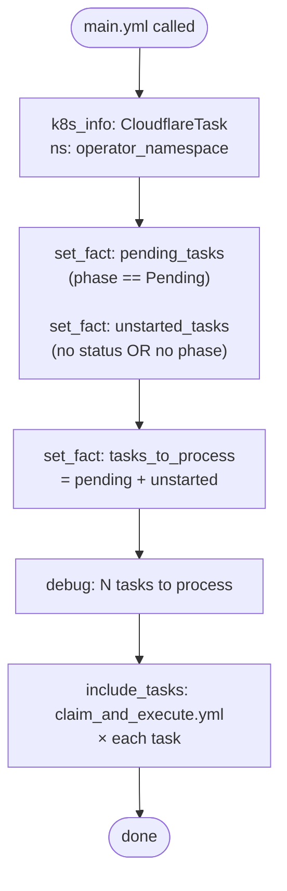
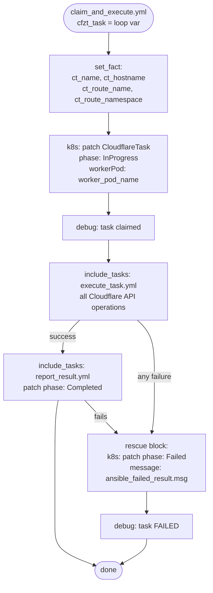
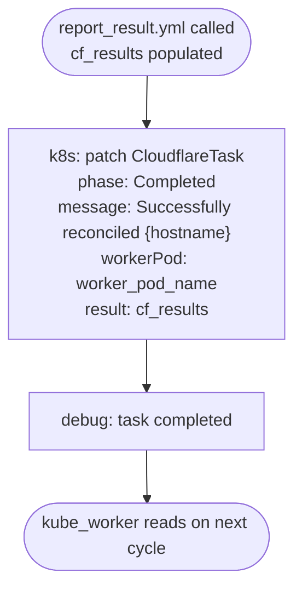
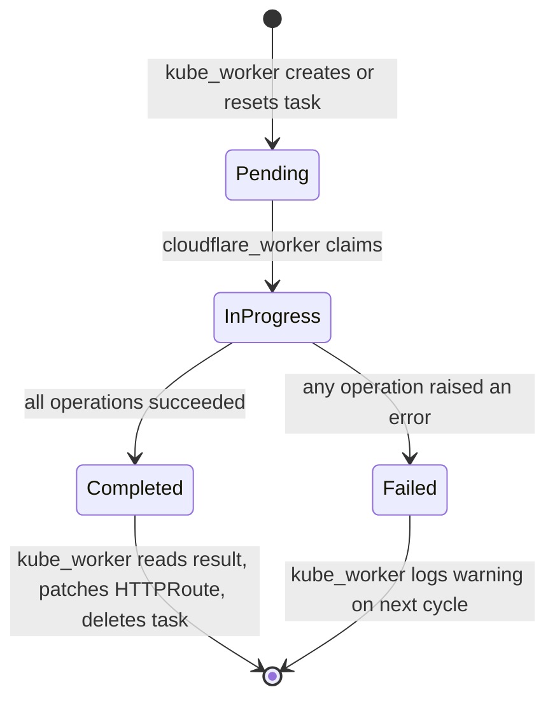

# cloudflare_worker

Cloudflare API executor. Polls for `Pending` `CloudflareTask` CRs, claims them (patches phase to `InProgress`), executes all configured Cloudflare API operations, and reports results back to the task status. The role makes **all** direct Cloudflare API calls — no Kubernetes state is written directly; the `kube_worker` reads the completed task and writes results back to HTTPRoute annotations.

---

## Position in the three-tier architecture

```
reconcile_cloudflare_worker.yml
│
└── cloudflare_worker role (main.yml)
      │
      ├── list Pending CloudflareTask CRs
      └── claim_and_execute.yml × each task
            │
            ├── Claim: patch phase → InProgress
            │
            ├── execute_task.yml
            │     ├── 1. tunnelRoute  → cloudflare_api/manage_hostname_route.yml
            │     ├── 2. cnameDns     → cloudflare_api/manage_tunnel_cname.yml
            │     ├── 3. accessApp    → cloudflare_api/manage_access_app.yml
            │     ├── 4. accessPolicy → cloudflare_api/manage_access_policy.yml
            │     ├── 5. serviceToken → cloudflare_api/manage_service_token.yml
            │     └── 6. dnsRecord    → cloudflare_api/manage_dns_record.yml
            │
            ├── report_result.yml  → patch phase: Completed + all result IDs
            └── rescue:            → patch phase: Failed + error message
```

---

## Task: `main.yml`

Entry point. Fetches all `CloudflareTask` CRs in the operator namespace, splits them into `Pending` and unstarted (no status yet) sets, combines them, and loops `claim_and_execute.yml` for each.



**Why unstarted tasks?** A freshly created `CloudflareTask` may not have a `status` subresource yet. The worker picks these up alongside explicit `Pending` tasks so no task is missed.

**Inputs:**

| Variable | Source |
|---|---|
| `operator_namespace` | `OPERATOR_NAMESPACE` env |
| `worker_pod_name` | `POD_NAME` env (fieldRef) |
| `cloudflare_api_base` | `CLOUDFLARE_API_BASE` env |

---

## Task: `claim_and_execute.yml`

Orchestrates the full lifecycle of a single CloudflareTask: claim → execute all operations → report result (or failure).



**Loop variable:** `cfzt_task` (CloudflareTask resource)

The `block/rescue` ensures that even if any Cloudflare API call fails, the task moves to `Failed` rather than staying `InProgress` forever.

---

## Task: `execute_task.yml`

Extracts all settings from `cfzt_task.spec`, fetches the API token from the credential Secret, then calls the `cloudflare_api` role's task files in sequence. Each operation is guarded by a `when:` condition.

```mermaid
flowchart TD
    START(["execute_task.yml called"])
    TOKEN["k8s_info: Secret from credentialSecretRef<br/>extract API token"]
    FACTS["set_fact:<br/>cf_ops = spec.operations<br/>cf_existing = spec.existingIds<br/>cf_hostname / zone_id / tunnel_id / account_id<br/>cf_results = {}"]

    TR{"tunnelRoute<br/>.enabled?"}
    ROUTE["cloudflare_api/manage_hostname_route.yml"]
    REC_TR["cf_results += tunnelRouteId"]

    CN{"cnameDns.enabled<br/>& zone_id != ''?"}
    CNAME["cloudflare_api/manage_tunnel_cname.yml"]
    REC_CN["cf_results += cnameRecordId"]

    AA{"accessApp<br/>.enabled?"}
    APP["cloudflare_api/manage_access_app.yml"]
    REC_AA["cf_results += accessAppId"]

    AP{"accessApp.enabled<br/>& NO existingPolicyIds?"}
    POLICY["cloudflare_api/manage_access_policy.yml"]
    REC_AP["cf_results += accessPolicyIds"]

    ST{"serviceToken<br/>.enabled?"}
    TOKEN_OP["cloudflare_api/manage_service_token.yml"]
    REC_ST["cf_results += serviceTokenId<br/>+ clientId + clientSecret"]

    DNS{"dnsRecord<br/>.enabled?"}
    DNS_OP["cloudflare_api/manage_dns_record.yml"]
    REC_DNS["cf_results += dnsRecordId, dnsRecordIp"]

    END(["cf_results ready for report_result.yml"])

    START --> TOKEN --> FACTS
    FACTS --> TR
    TR -->|Yes| ROUTE --> REC_TR --> CN
    TR -->|No| CN
    CN -->|Yes| CNAME --> REC_CN --> AA
    CN -->|No| AA
    AA -->|Yes| APP --> REC_AA --> AP
    AA -->|No| AP
    AP -->|Yes| POLICY --> REC_AP --> ST
    AP -->|No| ST
    ST -->|Yes| TOKEN_OP --> REC_ST --> DNS
    ST -->|No| DNS
    DNS -->|Yes| DNS_OP --> REC_DNS --> END
    DNS -->|No| END
```



**TLS settings passed to `manage_hostname_route.yml` (HTTPS origins only):**

| Variable | `spec.operations.tunnelRoute.originTLS.*` |
|---|---|
| `cf_no_tls_verify` | `noTLSVerify` |
| `cf_origin_server_name` | `originServerName` |
| `cf_ca_pool` | `caPool` |
| `cf_tls_timeout` | `tlsTimeout` |
| `cf_http2_origin` | `http2Origin` |
| `cf_match_sni_to_host` | `matchSNIToHost` |

**Accumulated `cf_results` keys:**

| Key | Set when |
|---|---|
| `tunnelRouteId` | tunnelRoute enabled |
| `cnameRecordId` | cnameDns enabled |
| `accessAppId` | accessApp enabled |
| `accessPolicyIds` | access policy created |
| `serviceTokenId` | serviceToken enabled |
| `serviceTokenCreated` | token was newly minted |
| `serviceTokenClientId` | token was newly minted |
| `serviceTokenClientSecret` | token was newly minted |
| `dnsRecordId` | dnsRecord enabled |
| `dnsRecordIp` | dnsRecord enabled |

---

## Task: `report_result.yml`

Patches the `CloudflareTask` status to `Completed` and writes all `cf_results` into `status.result`. The kube_worker reads this on the next cycle.



**Status fields written:**

| Field | Value |
|---|---|
| `status.phase` | `Completed` |
| `status.message` | `"Successfully reconciled {hostname}"` |
| `status.workerPod` | `worker_pod_name` |
| `status.result` | dict with all `cf_results` keys |

---

## CloudflareTask phase lifecycle



---

## Environment variables consumed

| Env Var | Default | Purpose |
|---|---|---|
| `OPERATOR_NAMESPACE` | `cloudflare-zero-trust` | Namespace for CloudflareTask CRs |
| `POD_NAME` | `cloudflare-worker` | Written to `status.workerPod` |
| `CLOUDFLARE_API_BASE` | `https://api.cloudflare.com/client/v4` | Cloudflare API base URL |
