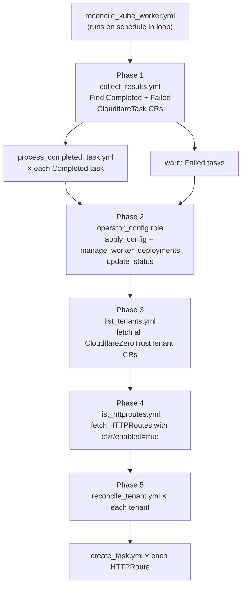
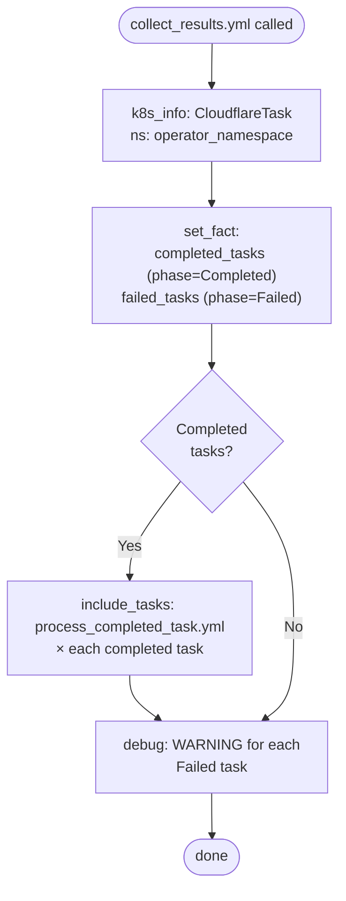
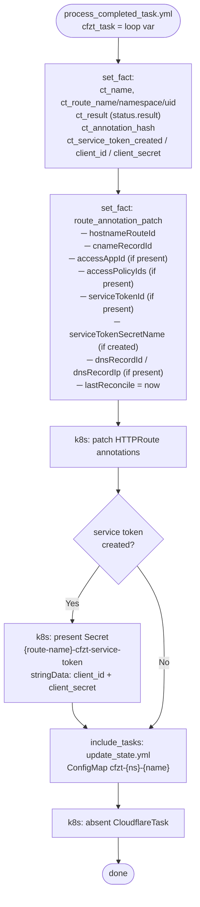
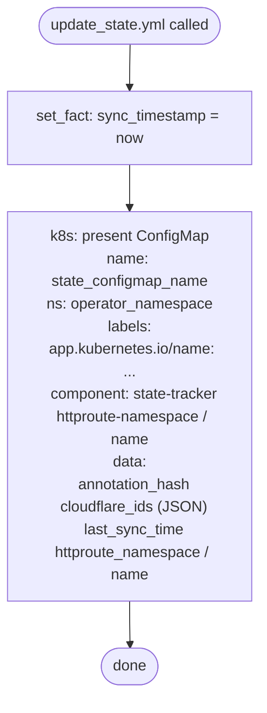
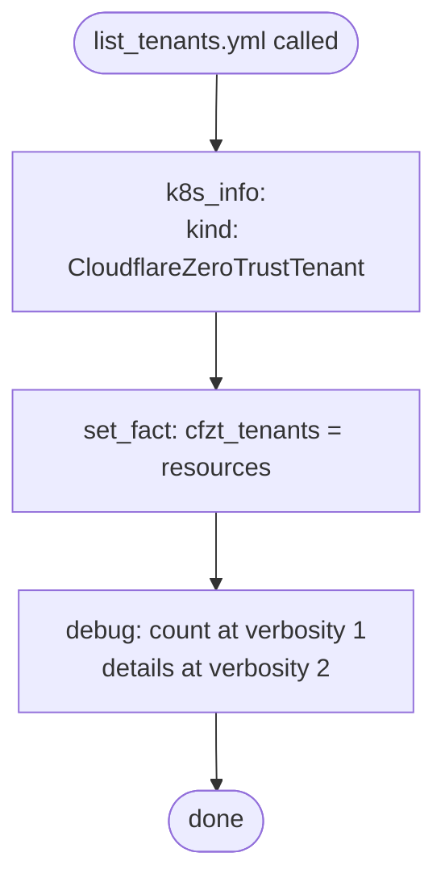
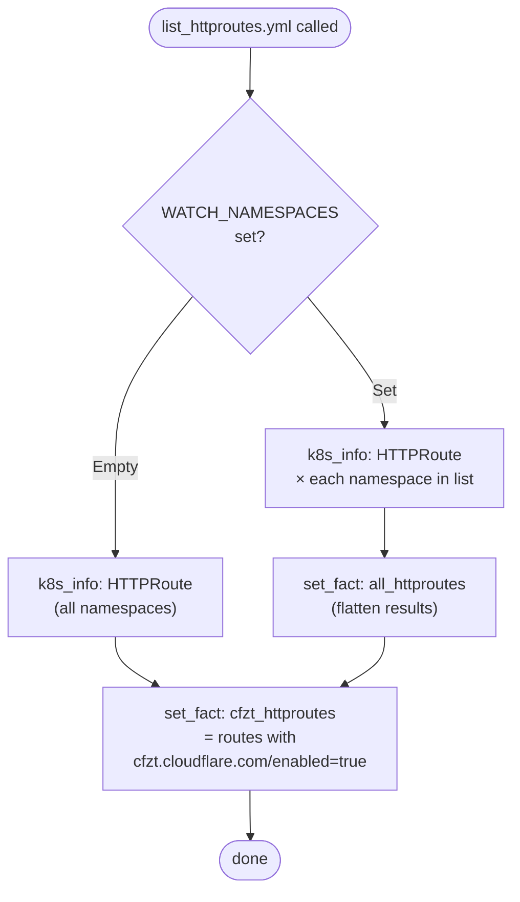
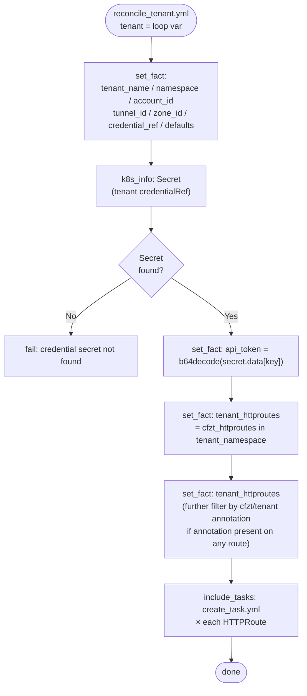
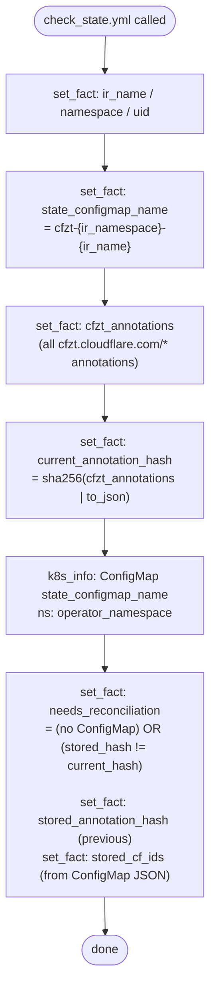
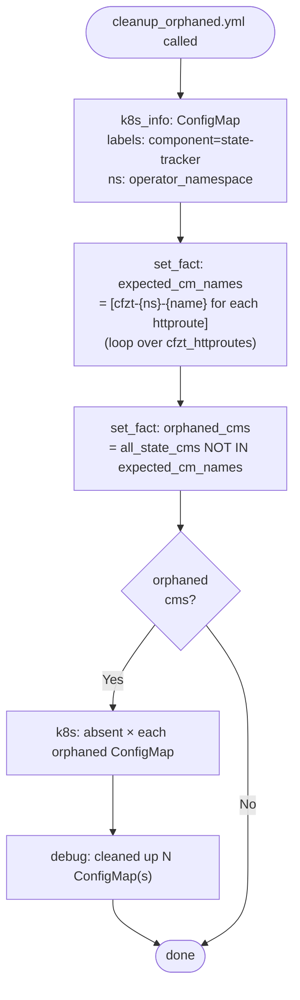

# kube_worker

Kubernetes state manager. Watches `CloudflareZeroTrustTenant` and `HTTPRoute` resources, detects which routes need Cloudflare reconciliation, and creates `CloudflareTask` CRs that the `cloudflare_worker` pod will execute. At the start of every cycle it also collects results from completed tasks, writes them back to HTTPRoute annotations, and optionally creates Kubernetes Secrets for service token credentials.

This role makes **no direct Cloudflare API calls** — it only calls the API once, at zone-ID resolution time (read-only), so it can embed the resolved `zoneId` in the CloudflareTask spec.

---

## Position in the three-tier architecture

```
reconcile_kube_worker.yml
│
├── Phase 1 — collect_results.yml   ← reads Completed CloudflareTask CRs
│     └── process_completed_task.yml (per task)
│           └── update_state.yml
│
├── Phase 2 — operator_config role  ← apply OperatorConfig, update status
│
├── Phase 3 — list_tenants.yml      ← discover CloudflareZeroTrustTenant CRs
│
├── Phase 4 — list_httproutes.yml   ← discover HTTPRoutes with cfzt enabled
│
└── Phase 5 — reconcile_tenant.yml  (per tenant)
      └── create_task.yml           (per HTTPRoute)
            ├── check_state.yml
            ├── cloudflare_api/lookup_zone_id.yml  ← only CF API read
            └── Apply CloudflareTask CR
```

---

## Full reconcile cycle



---

## Task: `collect_results.yml`

Runs at the **start** of every cycle. Fetches all `CloudflareTask` CRs in the operator namespace, splits them into Completed and Failed sets, then calls `process_completed_task.yml` for each Completed task.



**Inputs:**

| Variable | Source |
|---|---|
| `operator_namespace` | playbook env |
| `watch_namespaces` | playbook env |

---

## Task: `process_completed_task.yml`

Handles a single Completed `CloudflareTask`: extracts all result IDs from `status.result`, patches the source `HTTPRoute`'s annotations, optionally creates a Kubernetes Secret for a newly-minted service token, updates the state ConfigMap, then deletes the task CR.



**Loop variable:** `cfzt_task` (HTTPRoute CloudflareTask resource)

**Annotations written back to the HTTPRoute:**

| Annotation | Value |
|---|---|
| `cfzt.cloudflare.com/hostnameRouteId` | Tunnel config version / route ID |
| `cfzt.cloudflare.com/cnameRecordId` | Cloudflare DNS record ID for CNAME |
| `cfzt.cloudflare.com/accessAppId` | Access Application ID |
| `cfzt.cloudflare.com/accessPolicyIds` | Comma-separated policy IDs |
| `cfzt.cloudflare.com/serviceTokenId` | Service token ID |
| `cfzt.cloudflare.com/serviceTokenSecretName` | Kubernetes Secret name |
| `cfzt.cloudflare.com/dnsRecordId` | DNS A record ID (dns-only) |
| `cfzt.cloudflare.com/dnsRecordIp` | DNS A record IP (dns-only) |
| `cfzt.cloudflare.com/lastReconcile` | ISO8601 timestamp |

---

## Task: `update_state.yml`

Creates or updates the state-tracking `ConfigMap` (`cfzt-{namespace}-{name}`) in the operator namespace. This ConfigMap holds the annotation hash and all known Cloudflare resource IDs. `check_state.yml` reads this ConfigMap at the start of the next cycle to decide whether reconciliation is needed.



**Inputs:**

| Variable | Description |
|---|---|
| `state_configmap_name` | `cfzt-{namespace}-{name}` |
| `ir_name` / `ir_namespace` / `ir_uid` | HTTPRoute identity |
| `current_annotation_hash` | SHA256 of all `cfzt.cloudflare.com/*` annotations |
| `cloudflare_ids` | Dict of resource IDs from task result |
| `operator_namespace` | Namespace for the ConfigMap |

---

## Task: `list_tenants.yml`

Fetches all `CloudflareZeroTrustTenant` custom resources cluster-wide and sets the `cfzt_tenants` fact.



**Output:**

| Fact | Description |
|---|---|
| `cfzt_tenants` | List of all `CloudflareZeroTrustTenant` resources |

---

## Task: `list_httproutes.yml`

Discovers all `HTTPRoute` (gateway.networking.k8s.io/v1) resources, either cluster-wide or limited to the namespaces listed in `WATCH_NAMESPACES`, then filters to only those with annotation `cfzt.cloudflare.com/enabled: "true"`.



**Output:**

| Fact | Description |
|---|---|
| `cfzt_httproutes` | Filtered list of cfzt-enabled HTTPRoutes |

**Annotation that enables a route:**
```
cfzt.cloudflare.com/enabled: "true"
```

---

## Task: `reconcile_tenant.yml`

Called once per tenant. Extracts tenant metadata, fetches the API token Secret (needed for zone-ID resolution), filters HTTPRoutes to those in the tenant's namespace (and optionally matching the `cfzt.cloudflare.com/tenant` annotation), then calls `create_task.yml` for each matching route.



**Loop variable:** `tenant` (CloudflareZeroTrustTenant resource)

**HTTPRoute filtering logic:**

1. Select routes where `metadata.namespace == tenant_namespace`
2. If **any** of those routes carry `cfzt.cloudflare.com/tenant`, further filter to only those where the annotation equals `tenant_name` (supports multiple tenants per namespace)

---

## Task: `create_task.yml`

The most complex task. Decides whether an HTTPRoute needs reconciliation, loads and merges the `CloudflareZeroTrustTemplate`, resolves the Cloudflare zone ID (the only API call made by kube_worker), optionally resolves a LoadBalancer IP for dns-only mode, then creates or updates the `CloudflareTask` CR and resets its phase to `Pending`.

```mermaid
flowchart TD
    START(["create_task.yml<br/>httproute = loop var"])
    CHECK["include_tasks: check_state.yml<br/>(returns needs_reconciliation)"]
    SKIP{"needs_<br/>reconciliation?"}
    NOOP["debug: skip — no changes"]

    META["set_fact: ir_name / namespace / uid / annotations"]
    TMPL_NAME["set_fact: template_name<br/>(from cfzt/template annotation or 'default')"]
    LOAD_TMPL["k8s_info:<br/>kind: CloudflareZeroTrustTemplate<br/>name: template_name"]
    FAIL_TMPL{"Template<br/>exists?"}
    ABORT["fail: template not found"]
    DNS_ONLY["set_fact: dns_only_mode<br/>= template.spec.dnsOnly.enabled"]

    MERGE_ORIG["set_fact: origin_service, http_redirect"]
    MERGE_TLS["set_fact: no_tls_verify, origin_server_name<br/>ca_pool, tls_timeout<br/>http2_origin, match_sni_to_host<br/>(template > tenant_defaults > built-in defaults)"]
    MERGE_ACC["set_fact: create_access_app + all<br/>access application settings<br/>(session_duration, allow_groups/emails,<br/>existing_policy_ids, cookies, custom URLs…)"]
    MERGE_TOK["set_fact: create_service_token<br/>service_token_duration"]

    PARSE_ANN["set_fact: hostname, tunnel_id<br/>existing_app_id, token_id,<br/>cname_id, dns_record_id"]
    FAIL_HOST{"hostname<br/>annotation<br/>present?"}
    ABORT2["fail: hostname annotation missing"]
    HTTPS["set_fact: origin_uses_https"]

    ZONE["include_role: cloudflare_api<br/>tasks_from: lookup_zone_id.yml<br/>(read-only API call)"]

    DNS_IP{"dns_only_mode?"}
    STATIC{"staticIp<br/>defined?"}
    SVC["k8s_info: LoadBalancer Service<br/>(template.dnsOnly.ingressServiceRef)"]
    FAIL_SVC{"Service &<br/>IP found?"}
    ABORT3["fail: service not found / no IP"]
    SET_IP["set_fact: dns_target_ip"]
    NO_IP["set_fact: dns_target_ip = ''"]

    TASK_NAME["set_fact: task_name = cfzt-{ns}-{name}"]
    APPLY_TASK["k8s: present CloudflareTask CR<br/>(full spec with all merged settings,<br/>pre-populated existing IDs, annotation hash)"]
    RESET{"task_apply_result<br/>.changed?"}
    RESET_PHASE["k8s: patch phase → Pending<br/>message: Queued by kube_worker<br/>workerPod: ''"]
    LOG["debug: CloudflareTask queued"]
    END(["done"])

    START --> CHECK --> SKIP
    SKIP -->|No| NOOP --> END
    SKIP -->|Yes| META --> TMPL_NAME --> LOAD_TMPL --> FAIL_TMPL
    FAIL_TMPL -->|No| ABORT
    FAIL_TMPL -->|Yes| DNS_ONLY
    DNS_ONLY --> MERGE_ORIG --> MERGE_TLS --> MERGE_ACC --> MERGE_TOK
    MERGE_TOK --> PARSE_ANN --> FAIL_HOST
    FAIL_HOST -->|No| ABORT2
    FAIL_HOST -->|Yes| HTTPS --> ZONE
    ZONE --> DNS_IP
    DNS_IP -->|Yes| STATIC
    STATIC -->|Yes| SET_IP
    STATIC -->|No| SVC --> FAIL_SVC
    FAIL_SVC -->|No| ABORT3
    FAIL_SVC -->|Yes| SET_IP
    DNS_IP -->|No| NO_IP
    SET_IP --> TASK_NAME
    NO_IP --> TASK_NAME
    TASK_NAME --> APPLY_TASK --> RESET
    RESET -->|Yes| RESET_PHASE --> LOG --> END
    RESET -->|No| END
```



**Template merge priority (highest → lowest):** `CloudflareZeroTrustTemplate` spec → `tenant.spec.defaults` → built-in defaults

**CloudflareTask CR fields set:**

| CR field | Source |
|---|---|
| `spec.hostname` | `cfzt.cloudflare.com/hostname` annotation |
| `spec.accountId` | tenant `spec.accountId` |
| `spec.tunnelId` | annotation `cfzt/tunnelId` fallback tenant `spec.tunnelId` |
| `spec.zoneId` | resolved by `lookup_zone_id.yml` |
| `spec.credentialSecretRef` | tenant `spec.credentialRef` |
| `spec.operations.tunnelRoute.enabled` | `!dns_only_mode` |
| `spec.operations.cnameDns.enabled` | `!dns_only_mode && resolved_zone_id != ''` |
| `spec.operations.accessApp.*` | merged template/tenant settings |
| `spec.operations.serviceToken.*` | merged template/tenant settings |
| `spec.operations.dnsRecord.enabled` | `dns_only_mode` |
| `spec.operations.dnsRecord.ipAddress` | `dns_target_ip` (static or LoadBalancer) |
| `spec.existingIds.*` | pre-populated from existing annotations |
| `metadata.annotations[cfzt/annotation-hash]` | SHA256 of current cfzt annotations |

---

## Task: `check_state.yml`

Called by `create_task.yml` at step 0. Computes the SHA256 hash of all `cfzt.cloudflare.com/*` annotations on the HTTPRoute, fetches the state ConfigMap, and compares hashes.



**Outputs:**

| Fact | Description |
|---|---|
| `needs_reconciliation` | `true` if ConfigMap absent or hash mismatch |
| `stored_annotation_hash` | Previous hash (empty if no ConfigMap) |
| `stored_cf_ids` | Dict of existing Cloudflare IDs (empty if no ConfigMap) |
| `state_configmap_name` | `cfzt-{namespace}-{name}` |
| `current_annotation_hash` | Hash of current annotations |

---

## Task: `cleanup_orphaned.yml`

> **Note:** This task is provided as a utility but is **not currently called** by `reconcile_kube_worker.yml`. It can be invoked manually or added to a periodic cleanup step.

Lists all state-tracking ConfigMaps (label `app.kubernetes.io/component=state-tracker`), computes expected ConfigMap names from the live HTTPRoute list, identifies any ConfigMaps with no matching HTTPRoute (orphaned), and deletes them.



**Inputs needed:**

| Variable | Description |
|---|---|
| `cfzt_httproutes` | Current list of cfzt-enabled HTTPRoutes |
| `operator_namespace` | Namespace to scan |

---

## HTTPRoute annotation reference

| Annotation | Required | Description |
|---|---|---|
| `cfzt.cloudflare.com/enabled` | Yes (`"true"`) | Opts route into cfzt management |
| `cfzt.cloudflare.com/hostname` | Yes | Fully-qualified hostname to expose |
| `cfzt.cloudflare.com/template` | No (defaults to `default`) | `CloudflareZeroTrustTemplate` name |
| `cfzt.cloudflare.com/tenant` | No | Tenant name (multi-tenant namespaces) |
| `cfzt.cloudflare.com/tunnelId` | No | Override tenant default tunnel |
| `cfzt.cloudflare.com/accessAppId` | Written back | Cloudflare Access Application ID |
| `cfzt.cloudflare.com/accessPolicyIds` | Written back | Policy IDs (comma-separated) |
| `cfzt.cloudflare.com/serviceTokenId` | Written back | Service token ID |
| `cfzt.cloudflare.com/serviceTokenSecretName` | Written back | K8s Secret name |
| `cfzt.cloudflare.com/cnameRecordId` | Written back | DNS CNAME record ID |
| `cfzt.cloudflare.com/dnsRecordId` | Written back | DNS A record ID |
| `cfzt.cloudflare.com/dnsRecordIp` | Written back | DNS A record IP |
| `cfzt.cloudflare.com/lastReconcile` | Written back | ISO8601 timestamp |

---

## State ConfigMap structure

```yaml
apiVersion: v1
kind: ConfigMap
metadata:
  name: cfzt-{namespace}-{httproute-name}
  namespace: cloudflare-zero-trust
  labels:
    app.kubernetes.io/name: cloudflare-zero-trust-operator
    app.kubernetes.io/component: state-tracker
    cfzt.cloudflare.com/httproute-namespace: <ns>
    cfzt.cloudflare.com/httproute-name: <name>
  annotations:
    cfzt.cloudflare.com/httproute-uid: <uid>
data:
  annotation_hash: "<sha256>"        # change detection key
  cloudflare_ids: '{"tunnelRouteId":"...","cnameRecordId":"...",...}'
  last_sync_time: "2025-01-15T10:30:00Z"
  httproute_namespace: <ns>
  httproute_name: <name>
```

---

## Environment variables consumed

| Env Var | Default | Purpose |
|---|---|---|
| `OPERATOR_NAMESPACE` | `cloudflare-zero-trust` | Namespace for tasks, ConfigMaps |
| `WATCH_NAMESPACES` | `""` (all) | Comma-separated namespaces to watch |
| `CLOUDFLARE_API_BASE` | `https://api.cloudflare.com/client/v4` | Base URL for zone-ID resolution |
