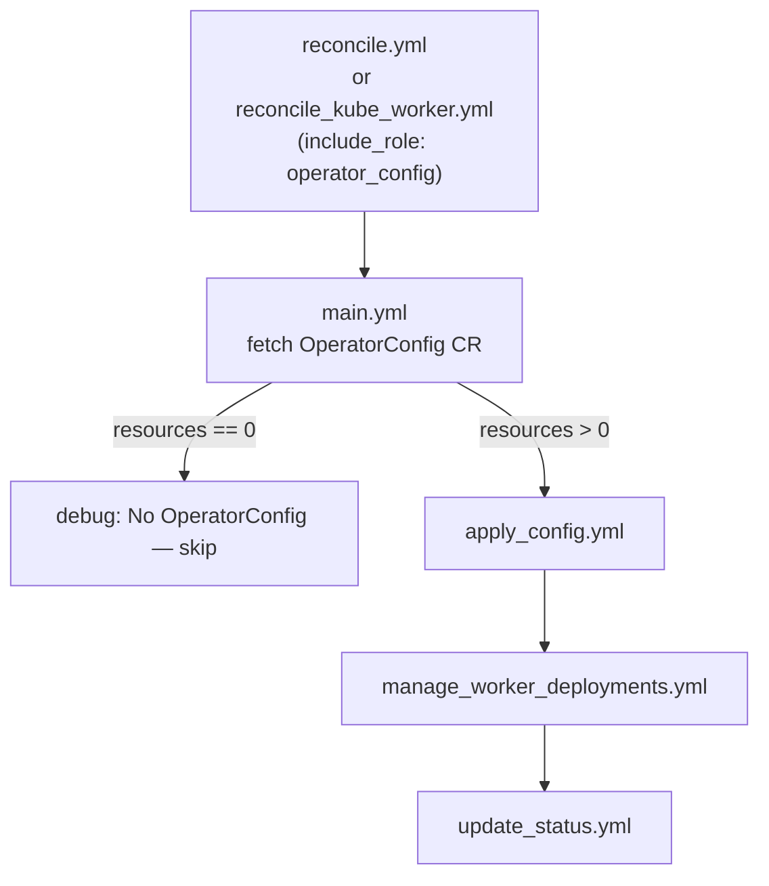
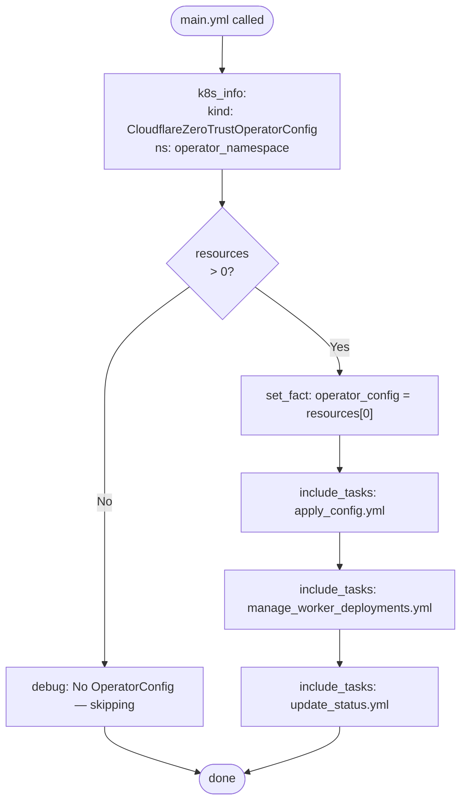
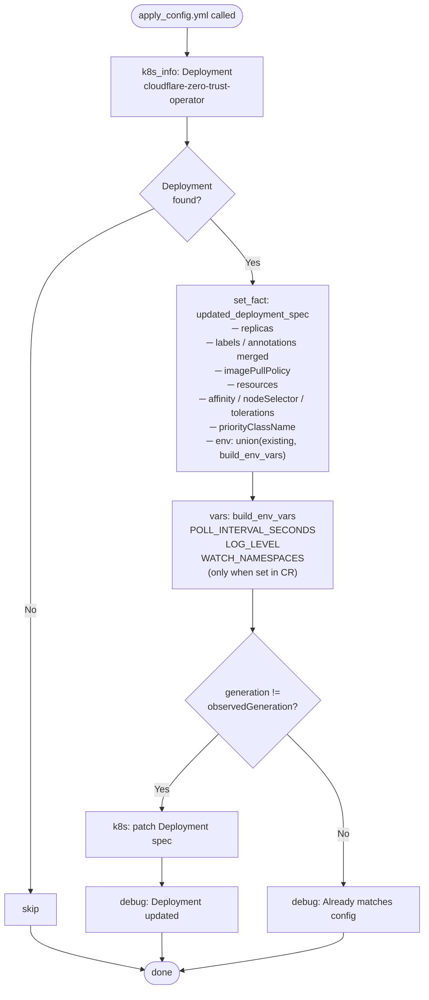
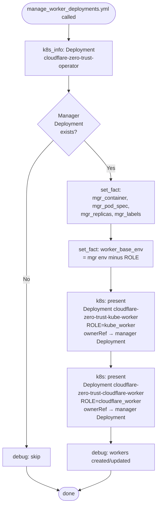
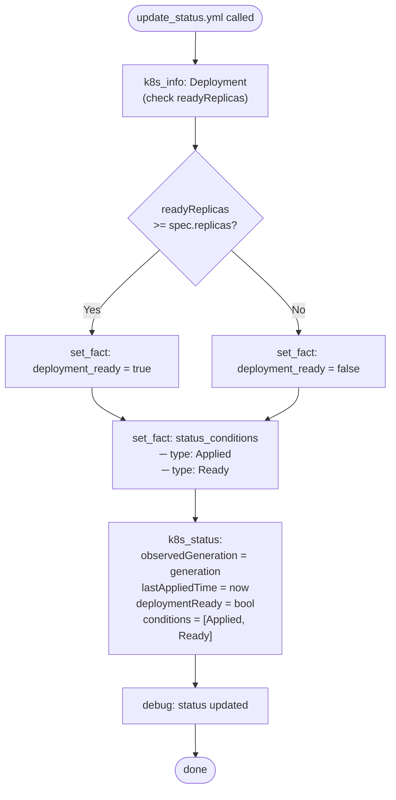

# operator_config

Self-management role that reads a `CloudflareZeroTrustOperatorConfig` CR and applies it to the operator Deployment. Called on every reconcile cycle — the **manager** pod uses it to bootstrap worker Deployments; the **kube_worker** pod uses it to apply configuration changes and write the CR status.

---

## Position in the three-tier architecture

```
┌────────────────────────────────────────────────────────────────┐
│  manager pod  (ROLE=manager)  — reconcile.yml                  │
│  → include_role: operator_config                               │
│      main.yml → apply_config.yml                               │
│              → manage_worker_deployments.yml   ◄── bootstraps  │
│              → update_status.yml                               │
└────────────────────────────────────────────────────────────────┘

┌────────────────────────────────────────────────────────────────┐
│  kube_worker pod  (ROLE=kube_worker)  — reconcile_kube...yml   │
│  → include_role: operator_config                               │
│      (same sequence — applies CR config changes, updates status)│
└────────────────────────────────────────────────────────────────┘
```

The cloudflare_worker pod does **not** call this role.

---

## Role call graph



---

## Task: `main.yml`

Fetches the `CloudflareZeroTrustOperatorConfig` CR and delegates to the three helper tasks.



**Outputs:**

| Fact | Description |
|---|---|
| `operator_config` | Full `CloudflareZeroTrustOperatorConfig` resource object |

---

## Task: `apply_config.yml`

Reads the current operator `Deployment`, merges the `OperatorConfig` CR spec on top of it, and patches Kubernetes only when the CR has a newer `generation` than `observedGeneration`.



**Inputs:**

| Variable | Source | Description |
|---|---|---|
| `operator_config` | `main.yml` | `CloudflareZeroTrustOperatorConfig` resource |
| `operator_namespace` | playbook | Kubernetes namespace |

**What gets merged onto the Deployment:**

| Deployment field | Source in OperatorConfig CR |
|---|---|
| `spec.replicas` | `spec.replicas` (fallback: existing) |
| pod labels / annotations | merged with `spec.podLabels` / `spec.podAnnotations` |
| `imagePullPolicy` | `spec.imagePullPolicy` |
| container `resources` | `spec.resources` |
| `affinity` | `spec.affinity` |
| `nodeSelector` | `spec.nodeSelector` |
| `tolerations` | `spec.tolerations` |
| `priorityClassName` | `spec.priorityClassName` |
| `POLL_INTERVAL_SECONDS` env | `spec.environmentVariables.pollIntervalSeconds` |
| `LOG_LEVEL` env | `spec.environmentVariables.logLevel` |
| `WATCH_NAMESPACES` env | `spec.environmentVariables.watchNamespaces` |

**Outputs:**

| Fact | Description |
|---|---|
| `deployment_needs_update` | `true` when generation differs from observedGeneration |
| `deployment_update_result` | k8s module return (`.changed` used by `update_status.yml`) |

---

## Task: `manage_worker_deployments.yml`

Reads the **manager Deployment's own spec** (image, serviceAccount, securityContext, nodeSelector, tolerations) and projects it onto two child Deployments with only the `ROLE` env var substituted. All three tiers always run the same container image without separate image configuration.



**Fields the worker Deployments inherit from the manager:**

| Field | Inherited |
|---|---|
| `spec.template.spec.containers[0].image` | ✓ (identical image) |
| `serviceAccountName` | ✓ |
| pod `securityContext` | ✓ |
| `nodeSelector` | ✓ |
| `tolerations` | ✓ |
| `affinity` | ✓ |
| `volumes` / `volumeMounts` | ✓ |
| `ROLE` env var | **Overridden** (`kube_worker` / `cloudflare_worker`) |
| `POD_NAME` env var | **Overridden** (fieldRef `metadata.name`) |

Both child Deployments carry an `ownerReference` to the manager Deployment — deleting the manager cascades to both workers.

---

## Task: `update_status.yml`

Checks whether the operator Deployment is ready and writes the outcome back to the `CloudflareZeroTrustOperatorConfig` CR's `.status` subresource using `kubernetes.core.k8s_status`.



**Status conditions written:**

| `type` | `status: True` when | `reason` |
|---|---|---|
| `Applied` | Deployment was changed this cycle | `ConfigurationApplied` |
| `Applied` | No change needed | `NoChangesNeeded` |
| `Ready` | `readyReplicas >= spec.replicas` | `DeploymentReady` |
| `Ready` | Not yet ready | `DeploymentNotReady` |

**Fields written to `.status`:**

| Field | Value |
|---|---|
| `observedGeneration` | `operator_config.metadata.generation` |
| `lastAppliedTime` | ISO8601 timestamp |
| `deploymentReady` | boolean |
| `conditions` | list with `Applied` and `Ready` entries |

---

## Environment variables consumed

| Env Var | Default | Purpose |
|---|---|---|
| `OPERATOR_NAMESPACE` | `cloudflare-zero-trust` | Namespace for all operator resources |

---

## OperatorConfig CR reference

```yaml
apiVersion: cfzt.cloudflare.com/v1alpha1
kind: CloudflareZeroTrustOperatorConfig
metadata:
  name: operator-config
  namespace: cloudflare-zero-trust
spec:
  replicas: 1
  imagePullPolicy: Always
  resources:
    requests: { cpu: "200m", memory: "512Mi" }
    limits:   { cpu: "1000m", memory: "1Gi" }
  nodeSelector:
    kubernetes.io/arch: amd64
  tolerations: []
  affinity: {}
  priorityClassName: ""
  podLabels: {}
  podAnnotations: {}
  environmentVariables:
    pollIntervalSeconds: "30"
    logLevel: "INFO"
    watchNamespaces: "app-ns-1,app-ns-2"
```
