<!-- markdownlint-disable -->
# Architecture

Complete architecture documentation for the Cloudflare Zero Trust Operator, from build to runtime.

## Table of Contents

- [Overview](#overview)
- [System Architecture](#system-architecture)
- [Build Process](#build-process)
- [Deployment Architecture](#deployment-architecture)
- [Runtime Architecture](#runtime-architecture)
- [Component Details](#component-details)
- [Data Flow](#data-flow)
- [Security Architecture](#security-architecture)

## Overview

The Cloudflare Zero Trust Operator is a Kubernetes-native operator that manages Cloudflare Zero Trust resources (tunnel routes, Access applications, policies, and service tokens) by watching Traefik HTTPRoute annotations.

**Key Design Principles:**

- **Annotation-driven**: Configuration through HTTPRoute annotations
- **Idempotent**: Safe to run repeatedly
- **Multi-tenant**: Support multiple Cloudflare accounts
- **Declarative**: Desired state defined in Kubernetes
- **Ansible-based**: Built with Ansible for simplicity and maintainability

## System Architecture

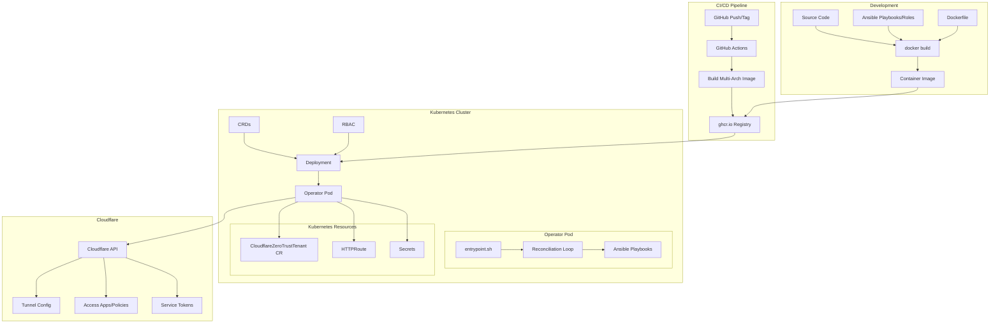

## Build Process

### Container Build Flow

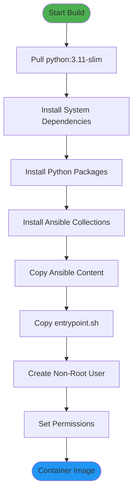

### Build Steps Detail

1. **Base Image**: `python:3.11-slim`
   - Minimal Debian-based Python runtime
   - Small attack surface
   - Multi-architecture support

2. **System Dependencies**:
   ```bash
   apt-get install git openssh-client
   ```

3. **Python Dependencies** (`container/requirements.txt`):
   - `ansible>=2.14.0`
   - `ansible-runner>=2.3.0`
   - `kubernetes>=25.0.0`
   - `jmespath` (for JSON parsing)

4. **Ansible Collections**:
   - `kubernetes.core>=2.4.0` (K8s API)
   - `community.general>=6.0.0` (URI modules)
   - `ansible.utils>=2.0.0` (Utilities)

5. **Content Copy**:
   - All Ansible playbooks → `/ansible/playbooks/`
   - All roles → `/ansible/roles/`
   - Configuration → `/ansible/ansible.cfg`
   - Entrypoint script → `/entrypoint.sh`

6. **Security Hardening**:
   - Non-root user (UID 1000)
   - Read-only root filesystem (runtime)
   - Dropped capabilities

### Build Commands

```bash
# Local build
docker build -f container/Dockerfile -t ghcr.io/wheetazlab/cloudflare-zero-trust-operator:latest .

# Multi-arch build (CI/CD)
docker buildx build \
  --platform linux/amd64,linux/arm64 \
  --push \
  -t ghcr.io/wheetazlab/cloudflare-zero-trust-operator:latest
```

## Deployment Architecture

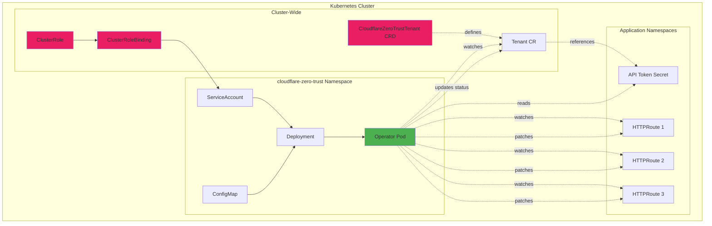

### Deployment Components

#### 1. Custom Resource Definition (CRD)

```yaml
apiVersion: apiextensions.k8s.io/v1
kind: CustomResourceDefinition
metadata:
  name: cloudflarezerotrusttenants.cfzt.cloudflare.com
spec:
  group: cfzt.cloudflare.com
  scope: Namespaced
  names:
    kind: CloudflareZeroTrustTenant
    plural: cloudflarezerotrusttenants
    shortNames: [cfzt, cfzttenant]
```

**Purpose**: Defines the schema for tenant configuration resources (one per Cloudflare account)

**Second CRD**:

```yaml
apiVersion: apiextensions.k8s.io/v1
kind: CustomResourceDefinition
metadata:
  name: cloudflarezerotrustoperatorconfigs.cfzt.cloudflare.com
spec:
  group: cfzt.cloudflare.com
  scope: Namespaced
  names:
    kind: CloudflareZeroTrustOperatorConfig
    plural: cloudflarezerotrustoperatorconfigs
    shortNames: [cfztconfig, operatorconfig]
```

**Purpose**: Configures operator pod scheduling, resources, and behavior (singleton per cluster)

#### 2. RBAC Configuration

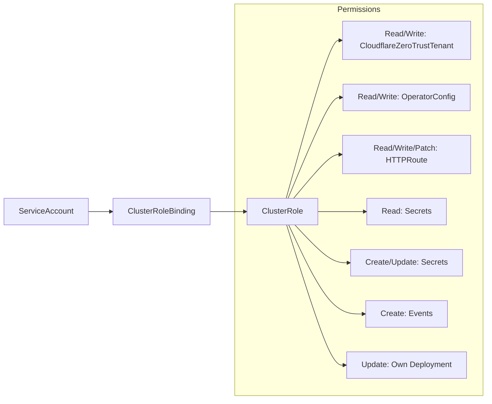

**ClusterRole Permissions**:
- CloudflareZeroTrustTenant: get, list, watch, update status
- CloudflareZeroTrustOperatorConfig: get, list, watch, update status (for self-configuration)
- HTTPRoute: get, list, watch, patch, update
- Secrets: get, list, watch, create, update, delete
- ConfigMaps: get, list, watch, create, update, patch, delete (for state tracking)
- Deployments: get, list, patch, update (restricted to operator's own deployment)
- Events: create, patch

#### 3. Operator Deployment

```yaml
apiVersion: apps/v1
kind: Deployment
metadata:
  name: cloudflare-zero-trust-operator
  namespace: cloudflare-zero-trust
spec:
  replicas: 1  # Single instance (leader election not implemented)
  selector:
    matchLabels:
      app: cloudflare-zero-trust-operator
  template:
    spec:
      serviceAccountName: cloudflare-zero-trust-operator
      containers:
      - name: operator
        image: ghcr.io/wheetazlab/cloudflare-zero-trust-operator:latest
        env:
        - name: WATCH_NAMESPACES
          value: ""  # Watch all namespaces
        - name: POLL_INTERVAL_SECONDS
          value: "60"
        - name: LOG_LEVEL
          value: "INFO"
```

**Configuration Options**:
- `WATCH_NAMESPACES`: Comma-separated list or empty for all
- `POLL_INTERVAL_SECONDS`: How often to reconcile (default: 60)
- `LOG_LEVEL`: Global log level - DEBUG, INFO, WARNING, ERROR (can be overridden per-tenant in CR)
- `CLOUDFLARE_API_BASE`: API endpoint (default: https://api.cloudflare.com/client/v4)
- `OPERATOR_NAMESPACE`: Namespace where operator runs and stores state ConfigMaps (default: cloudflare-zero-trust)

**Per-Tenant Configuration** (in CloudflareZeroTrustTenant CR):
- `spec.logLevel`: Override global log level for this tenant's reconciliation
- `spec.defaults.sessionDuration`: Default Access Application session duration
- `spec.defaults.originService`: Default origin service URL (auto-detects HTTP/HTTPS from URL scheme)
- `spec.defaults.httpRedirect`: Automatically redirect HTTP to HTTPS at Cloudflare edge (default: true)
- `spec.defaults.originTLS`: TLS configuration for HTTPS origin connections
  - `noTLSVerify`: Skip TLS certificate verification (default: false) - useful for self-signed certificates
  - `originServerName`: Custom SNI hostname for TLS handshake (optional)
  - `caPool`: Path to CA certificate file for validation (optional)
  - `tlsTimeout`: TLS handshake timeout in seconds, 1-300 (default: 10)
  - `http2Origin`: Use HTTP/2 for origin connection (default: false) - useful for gRPC backends
  - `matchSNIToHost`: Match SNI to Host header automatically (default: false)

**Note**: TLS settings can be overridden per-HTTPRoute using annotations (e.g., `cfzt.cloudflare.com/no-tls-verify`, `cfzt.cloudflare.com/tls-timeout`, etc.)

**Operator Pod Configuration** (via CloudflareZeroTrustOperatorConfig CR):
- Dynamically controls operator pod scheduling and resources without redeployment
- **Singleton**: Only one OperatorConfig should exist in the operator namespace
- Applied during each reconciliation loop

Available configuration:
- `spec.replicas`: Number of operator replicas (default: 1, recommended to keep at 1)
- `spec.resources.requests/limits`: CPU and memory resources
- `spec.affinity`: Pod affinity and anti-affinity rules for node placement
- `spec.nodeSelector`: Node selector labels for pod placement
- `spec.tolerations`: Tolerations for node taints
- `spec.priorityClassName`: Priority class for pod scheduling
- `spec.imagePullPolicy`: Image pull policy (Always, IfNotPresent, Never)
- `spec.environmentVariables`: Override poll interval, log level, watch namespaces
- `spec.podLabels`: Additional labels for operator pod
- `spec.podAnnotations`: Additional annotations for operator pod

**How it works**:
1. Operator watches its own OperatorConfig CR during reconciliation
2. If OperatorConfig changes (generation increments), operator updates its own Deployment
3. Kubernetes rolls out the updated Deployment
4. Operator updates OperatorConfig status with applied generation and readiness

Example usage:
```yaml
apiVersion: cfzt.cloudflare.com/v1alpha1
kind: CloudflareZeroTrustOperatorConfig
metadata:
  name: operator-config
  namespace: cloudflare-zero-trust
spec:
  replicas: 1
  resources:
    requests:
      cpu: "200m"
      memory: "512Mi"
    limits:
      cpu: "1000m"
      memory: "1Gi"
  nodeSelector:
    node-role.kubernetes.io/infra: ""
  tolerations:
    - key: "dedicated"
      operator: "Equal"
      value: "infrastructure"
      effect: "NoSchedule"
```

## Runtime Architecture

### Container Runtime Flow

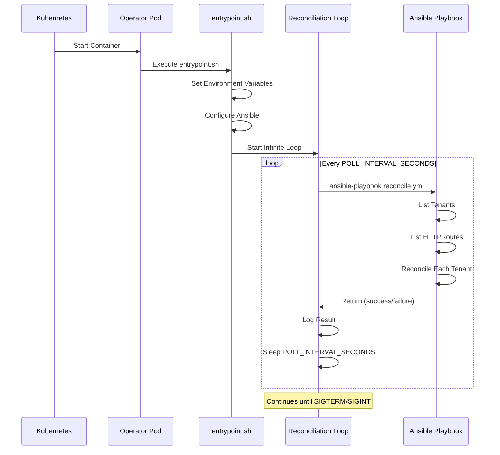

### Entrypoint Script Responsibilities

```bash
#!/bin/bash
# container/entrypoint.sh

# 1. Display startup banner
echo "Cloudflare Zero Trust Operator"

# 2. Set default environment variables
export POLL_INTERVAL_SECONDS="${POLL_INTERVAL_SECONDS:-60}"
export WATCH_NAMESPACES="${WATCH_NAMESPACES:-}"
export LOG_LEVEL="${LOG_LEVEL:-INFO}"
export OPERATOR_NAMESPACE="${OPERATOR_NAMESPACE:-cloudflare-zero-trust}"

# 3. Configure Ansible environment with colored output
export ANSIBLE_CONFIG="/ansible/ansible.cfg"
export ANSIBLE_FORCE_COLOR="true"
export ANSIBLE_NOCOLOR="false"
export ANSIBLE_STDOUT_CALLBACK="default"
export ANSIBLE_STDOUT_CALLBACK_COLORS="bright"
export ANSIBLE_DIFF_ALWAYS="True"

# 4. Set Ansible verbosity based on LOG_LEVEL
case "${LOG_LEVEL}" in
    DEBUG)
        export ANSIBLE_VERBOSITY=2
        export ANSIBLE_DEBUG="True"
        ;;
    INFO) export ANSIBLE_VERBOSITY=1 ;;
    *) export ANSIBLE_VERBOSITY=0 ;;
esac

# 5. Main reconciliation loop
while true; do
    ansible-playbook /ansible/playbooks/reconcile.yml
    sleep "${POLL_INTERVAL_SECONDS}"
done
```

**Log Output Features**:
- **Colored output**: ANSI color codes enabled for better readability in container logs
- **Callback plugin**: Uses "default" callback with bright colors for task status
- **Per-tenant verbosity**: Can override global LOG_LEVEL in CloudflareZeroTrustTenant CR
- **Diff output**: Shows changes when updating resources

### Pod Resource Usage

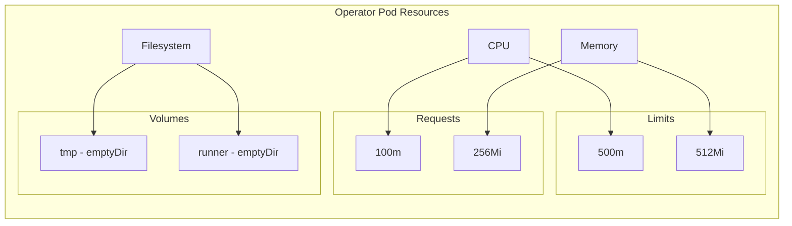

**Resource Profile**:
- **CPU**: 100m request, 500m limit (0.1 - 0.5 cores)
- **Memory**: 256Mi request, 512Mi limit
- **Storage**: EmptyDir volumes (ephemeral)
- **Read-only root filesystem**: Yes
- **Run as non-root**: Yes (UID 1000)

## Component Details

### 1. Ansible Playbook Structure

```
ansible/
├── playbooks/
│   └── reconcile.yml          # Main entry point
├── roles/
│   ├── reconciliation_loop/   # Continuous loop wrapper
│   ├── k8s_watch/             # Kubernetes resource discovery
│   ├── tenant_reconcile/      # Per-tenant orchestration
│   └── cloudflare_api/        # Cloudflare API interactions
├── ansible.cfg                # Ansible configuration
├── inventory                  # Localhost inventory
└── requirements.yml           # Collection dependencies
```

### 2. Kubernetes API Interaction

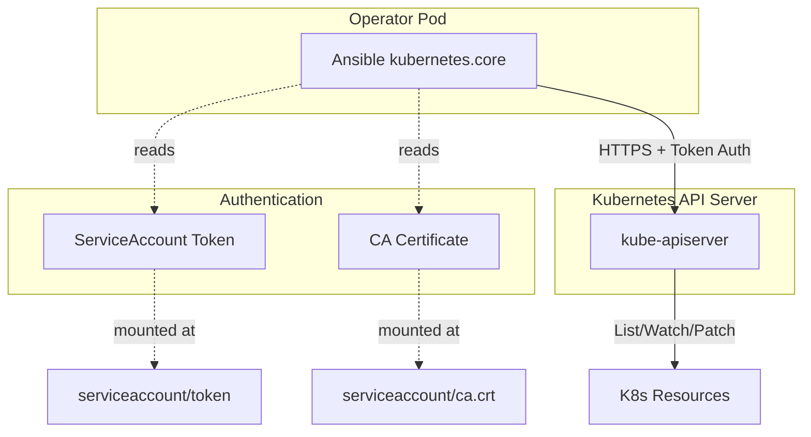

**Authentication Method**:
- ServiceAccount token automatically mounted by Kubernetes
- Token used by `kubernetes.core` collection
- TLS verification using cluster CA certificate

### 3. Cloudflare API Interaction

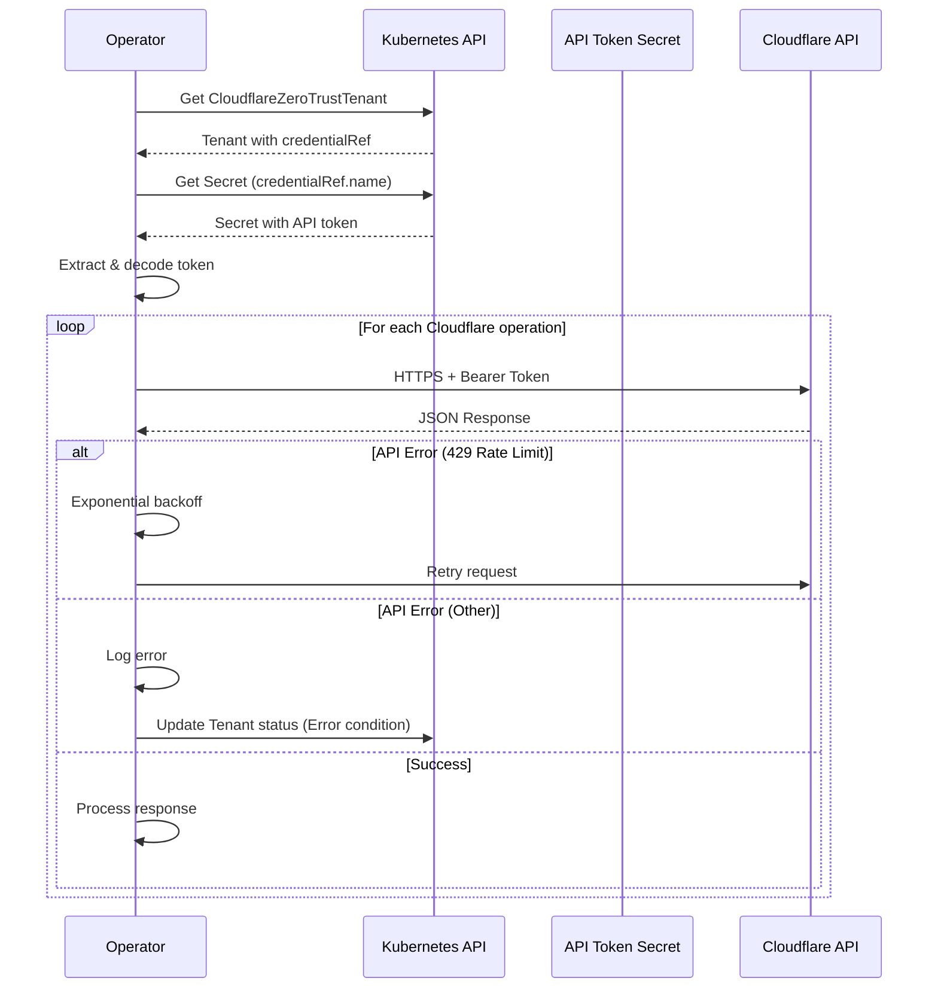

**API Interaction Pattern**:
- Bearer token authentication
- Retry logic with exponential backoff (3 retries, 5s delay)
- Rate limit handling
- Error propagation to Tenant status

## Data Flow

### Complete Reconciliation Flow

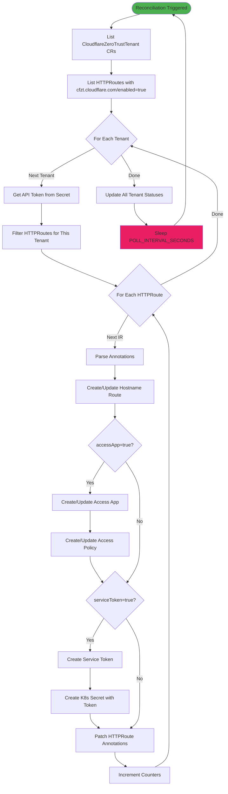

### State Management

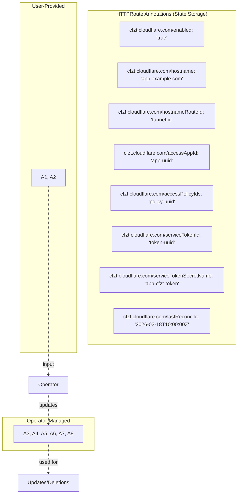

**State Tracking Strategy**:
- **User annotations**: Define desired state (enabled, hostname, accessApp, etc.)
- **Operator annotations**: Track Cloudflare resource IDs for updates/deletions
- **Idempotency**: Use stored IDs to update existing resources instead of creating duplicates
- **Deletion**: Use stored IDs to clean up Cloudflare resources when HTTPRoute is deleted

## Security Architecture

### Secrets Management

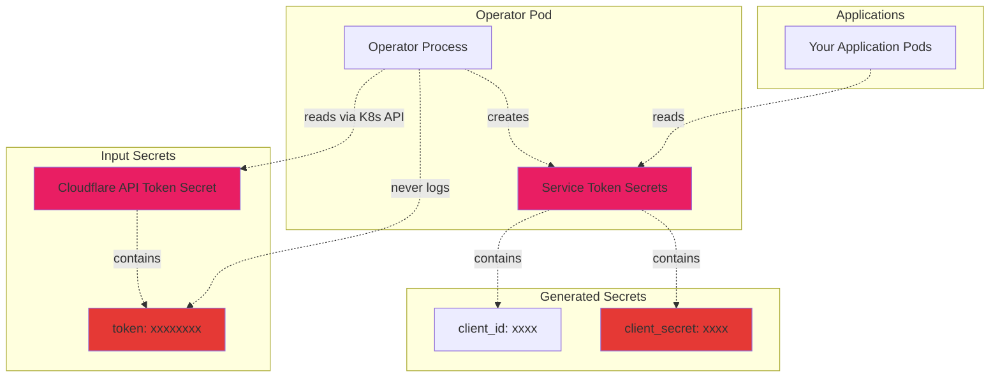

**Security Boundaries**:

1. **API Token Secret** (User-provided):
   - Contains Cloudflare API token
   - Referenced by CloudflareZeroTrustTenant CR
   - Read by operator via Kubernetes API
   - Never logged or exposed

2. **Service Token Secrets** (Operator-generated):
   - Created when `serviceToken: true`
   - Contains `client_id` and `client_secret`
   - Named: `{httproute-name}-cfzt-service-token`
   - Used by applications for machine-to-machine auth

3. **Annotations** (Public metadata):
   - Only store resource IDs, never credentials
   - Visible to anyone with HTTPRoute read access

### RBAC Security Model

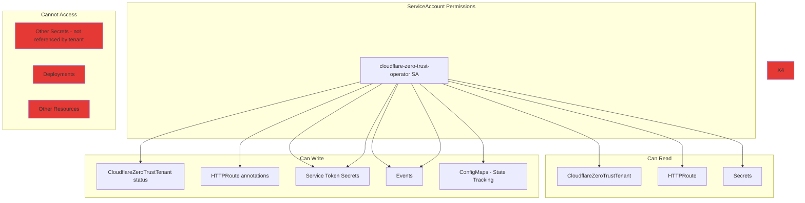

**Principle of Least Privilege**:
- Operator only has permissions for resources it manages
- Cannot read arbitrary secrets (only those referenced)
- Cannot modify other workloads
- No cluster-admin privileges required

### Container Security

```yaml
securityContext:
  # Pod-level
  runAsNonRoot: true
  fsGroup: 1000
  seccompProfile:
    type: RuntimeDefault
  
  # Container-level
  allowPrivilegeEscalation: false
  runAsUser: 1000
  capabilities:
    drop:
      - ALL
  readOnlyRootFilesystem: true
```

**Security Hardening**:
- Non-root user (UID 1000)
- Read-only root filesystem (writable volumes: /tmp, /runner)
- All capabilities dropped
- No privilege escalation
- Seccomp profile enabled

### Network Security

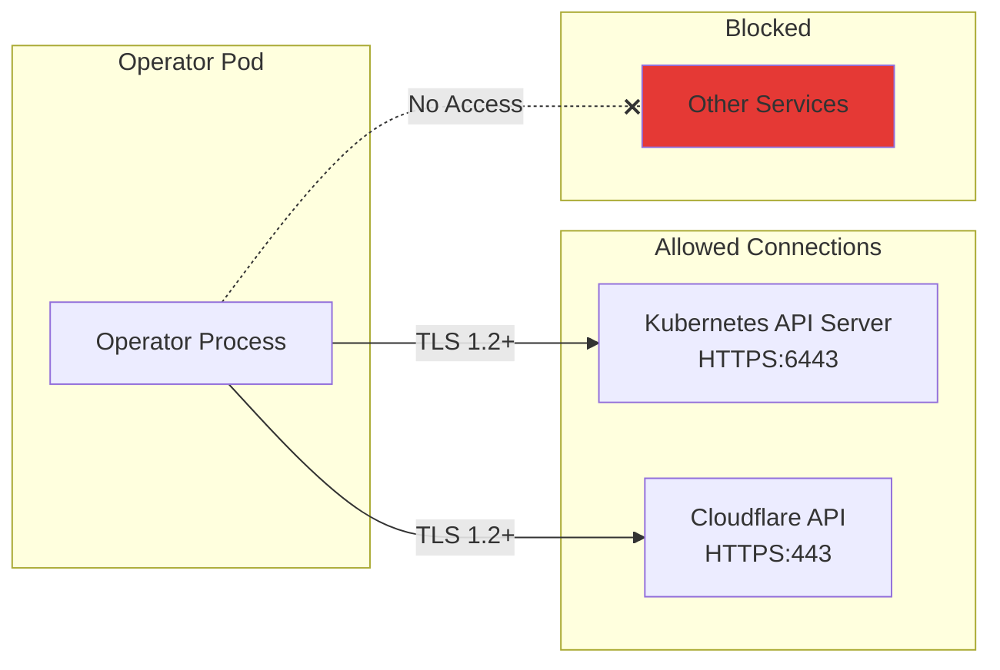

**Network Policy Recommendations**:
```yaml
apiVersion: networking.k8s.io/v1
kind: NetworkPolicy
metadata:
  name: cloudflare-zero-trust-operator
spec:
  podSelector:
    matchLabels:
      app: cloudflare-zero-trust-operator
  policyTypes:
  - Egress
  egress:
  - to:
    - namespaceSelector: {}  # kube-system for API server
    ports:
    - protocol: TCP
      port: 6443  # Kubernetes API
  - to:
    - namespaceSelector: {}
    ports:
    - protocol: TCP
      port: 53  # DNS
  - to: []  # Allow to internet for Cloudflare API
    ports:
    - protocol: TCP
      port: 443  # HTTPS
```

## Performance & Scalability

### Resource Scaling

| Metric | Single Tenant | 10 Tenants | 100 Tenants |
|--------|---------------|------------|-------------|
| Memory | ~100MB | ~200MB | ~400MB |
| CPU | ~50m | ~100m | ~200m |
| Reconciliation Time | 5-10s | 30-60s | 5-10min |

**Scaling Considerations**:
- Operator runs as single replica (no leader election)
- Reconciliation is sequential per tenant
- Cloudflare API rate limits apply
- Consider increasing `POLL_INTERVAL_SECONDS` for large deployments

### Optimization Strategies

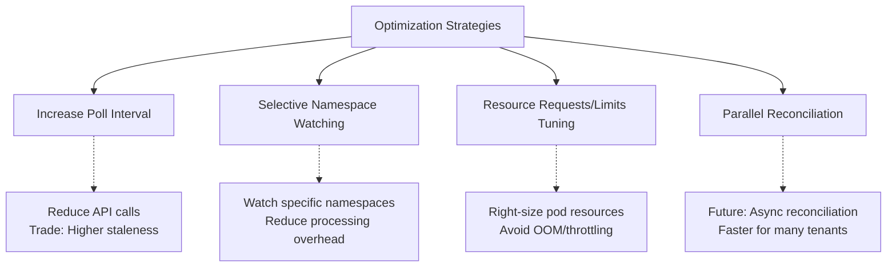

## Troubleshooting Architecture

### Logging Flow

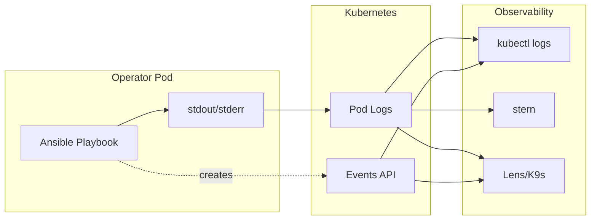

**Log Levels**:
- `DEBUG`: All Ansible task details (ANSIBLE_VERBOSITY=2)
- `INFO`: High-level reconciliation events (ANSIBLE_VERBOSITY=1)
- `WARNING/ERROR`: Only errors (ANSIBLE_VERBOSITY=0)

### Health Check Points


## Summary

The Cloudflare Zero Trust Operator follows a straightforward architecture:

1. **Build**: Container with Ansible + Python dependencies
2. **Deploy**: Kubernetes Deployment with RBAC
3. **Runtime**: Continuous reconciliation loop watching HTTPRoutes
4. **Integrate**: Call Cloudflare APIs to create/update/delete resources
5. **Track**: Store state in HTTPRoute annotations

The entire system is designed for simplicity, maintainability, and GitOps workflows.
