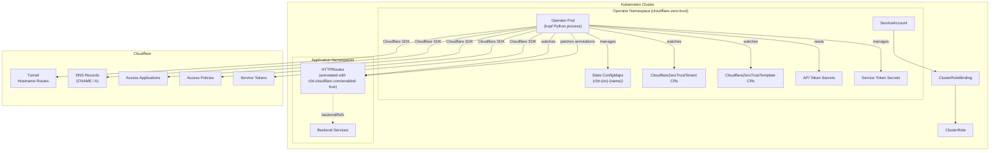
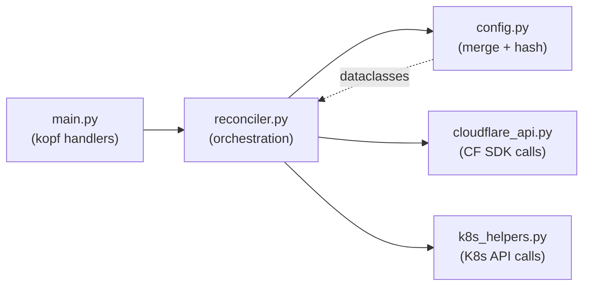
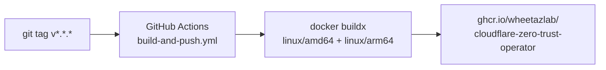
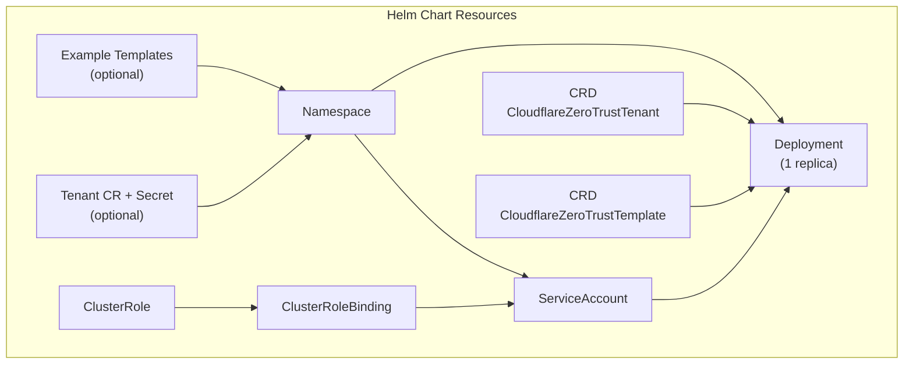
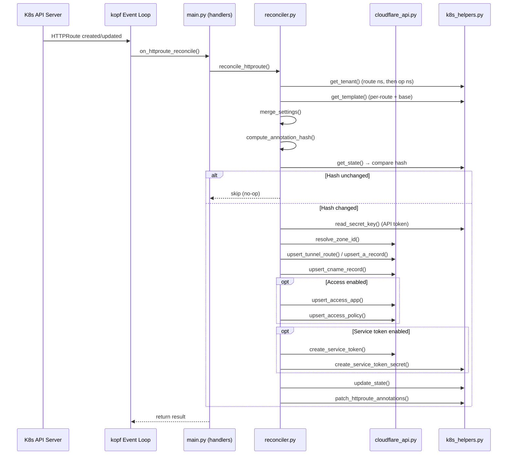
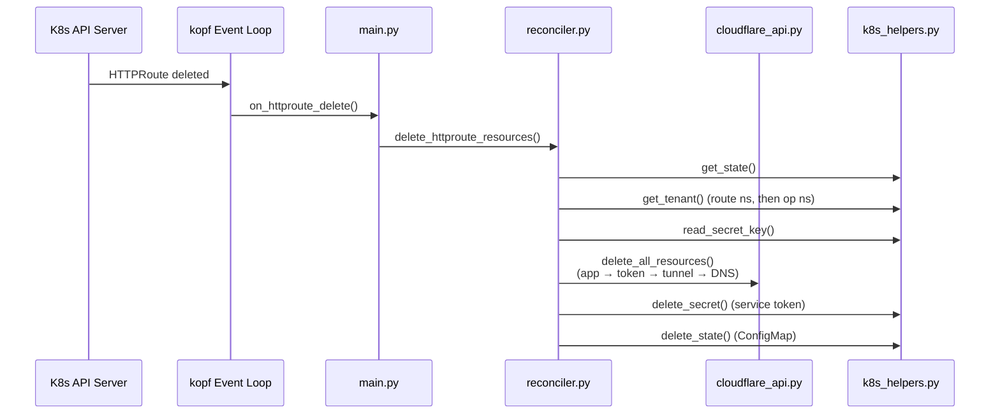
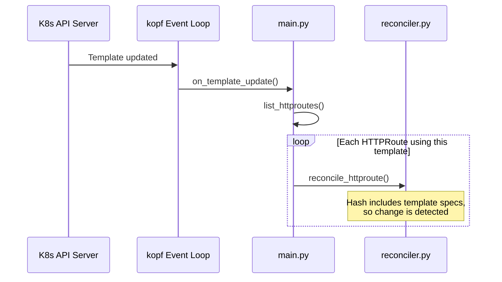
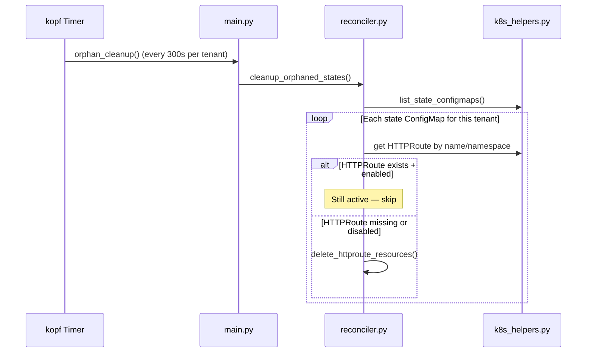
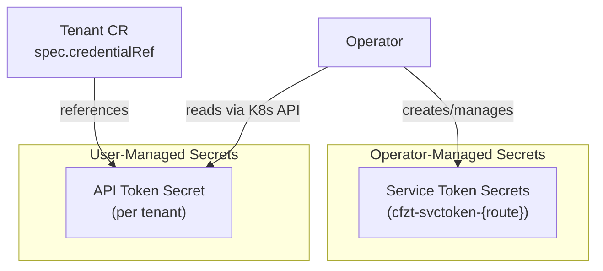

# Architecture

## Overview

The Cloudflare Zero Trust Operator is a Kubernetes operator that automates the management of Cloudflare Zero Trust resources (tunnels, DNS records, Access applications, service tokens) based on Gateway API `HTTPRoute` resources annotated with `cfzt.cloudflare.com/*` metadata.

Built on the [kopf](https://kopf.readthedocs.io/) framework, the operator runs as a **single Python process** that reacts to Kubernetes events in real time. When an `HTTPRoute` is created, updated, or deleted, the operator reconciles the corresponding Cloudflare resources automatically. Configuration is expressed through two custom resource definitions (CRDs) — `CloudflareZeroTrustTenant` and `CloudflareZeroTrustTemplate` — and per-route annotations on the HTTPRoute itself.

---

## System Architecture


```mermaid
graph TB
    subgraph "Kubernetes Cluster"
        subgraph "Operator Namespace (cloudflare-zero-trust)"
            OP["Operator Pod<br/>(kopf Python process)"]
            SA["ServiceAccount"]
            CM_STATE["State ConfigMaps<br/>(cfzt-{ns}-{name})"]
            TENANT_CR["CloudflareZeroTrustTenant CRs"]
            TPL_CR["CloudflareZeroTrustTemplate CRs"]
            API_SECRET["API Token Secrets"]
            SVC_SECRETS["Service Token Secrets"]
        end

        subgraph "Application Namespaces"
            HR["HTTPRoutes<br/>(annotated with cfzt.cloudflare.com/enabled: true)"]
            SERVICES["Backend Services"]
        end

        CRB["ClusterRoleBinding"]
        CR["ClusterRole"]
    end

    subgraph "Cloudflare"
        CF_TUNNEL["Tunnel<br/>Hostname Routes"]
        CF_DNS["DNS Records<br/>(CNAME / A)"]
        CF_ACCESS["Access Applications"]
        CF_POLICY["Access Policies"]
        CF_TOKEN["Service Tokens"]
    end

    OP -->|watches| HR
    OP -->|watches| TENANT_CR
    OP -->|watches| TPL_CR
    OP -->|reads| API_SECRET
    OP -->|manages| CM_STATE
    OP -->|manages| SVC_SECRETS
    OP -->|patches annotations| HR

    SA --> CRB --> CR

    OP -->|Cloudflare SDK| CF_TUNNEL
    OP -->|Cloudflare SDK| CF_DNS
    OP -->|Cloudflare SDK| CF_ACCESS
    OP -->|Cloudflare SDK| CF_POLICY
    OP -->|Cloudflare SDK| CF_TOKEN

    HR -.->|backendRefs| SERVICES
```

---

## Process Architecture

The operator is a **single-process, single-container** deployment. There is no manager/worker split, no CRD-based work queue, and no sidecar — just one Python process running `kopf run /app/main.py`.

| Aspect | Detail |
|--------|--------|
| **Runtime** | Python 3.13 (slim) |
| **Framework** | kopf v1.44.0 |
| **Cloudflare SDK** | cloudflare-python v4.3.x (official SDK) |
| **K8s client** | kubernetes-python v35.0.0 |
| **Replicas** | 1 (no leader election needed — kopf handles peer peering internally) |
| **Entrypoint** | `/entrypoint.sh` → `exec kopf run /app/main.py` |

### Python Modules

```
python/
├── main.py           # kopf handlers — startup, HTTPRoute CRUD, template update, orphan timer
├── reconciler.py     # Core reconciliation and deletion orchestration
├── config.py         # Dataclasses, template merge chain, annotation hash computation
├── cloudflare_api.py # Cloudflare SDK wrapper (tunnels, DNS, access, tokens)
└── k8s_helpers.py    # K8s API helpers (state ConfigMaps, secrets, CRD lookups)
```


```mermaid
graph LR
    MAIN["main.py<br/>(kopf handlers)"] --> RECON["reconciler.py<br/>(orchestration)"]
    RECON --> CONFIG["config.py<br/>(merge + hash)"]
    RECON --> CFAPI["cloudflare_api.py<br/>(CF SDK calls)"]
    RECON --> K8S["k8s_helpers.py<br/>(K8s API calls)"]
    CONFIG -.->|dataclasses| RECON
```

### Module Responsibilities

#### `main.py` — Event Handlers

Defines all kopf event handlers and the operator startup configuration:

| Handler | Trigger | Action |
|---------|---------|--------|
| `configure()` | `@kopf.on.startup` | Sets annotation prefix, posting level, error backoffs |
| `on_httproute_reconcile()` | `@kopf.on.resume`, `@kopf.on.create`, `@kopf.on.update` | Calls `reconciler.reconcile_httproute()` |
| `on_httproute_delete()` | `@kopf.on.delete` (optional=True) | Calls `reconciler.delete_httproute_resources()` |
| `on_template_update()` | `@kopf.on.update` on Templates | Finds matching HTTPRoutes, re-reconciles each |
| `orphan_cleanup()` | `@kopf.timer` on Tenants (300s interval, 60s initial) | Calls `reconciler.cleanup_orphaned_states()` |

All HTTPRoute handlers share `HTTPROUTE_KWARGS`:
- **Group**: `gateway.networking.k8s.io`
- **Version**: `v1`
- **Plural**: `httproutes`
- **Annotation filter**: `cfzt.cloudflare.com/enabled: "true"`
- **Namespace filter**: `_ns_filter()` (reads `WATCH_NAMESPACES` env var)
- **Backoff**: 15 seconds max retry

> **Why `optional=True` on delete?** The operator does not own HTTPRoutes and should not add a finalizer. This means delete events are best-effort — if the operator is down when an HTTPRoute is deleted, the orphan cleanup timer catches it later.

#### `reconciler.py` — Orchestration

Core logic that ties together K8s reads, settings merge, change detection, Cloudflare API calls, state persistence, and annotation patching. Three entry points:

- **`reconcile_httproute()`** — Full create/update lifecycle
- **`delete_httproute_resources()`** — Tear down CF resources and K8s state
- **`cleanup_orphaned_states()`** — Timer-driven garbage collection

Plus four sub-reconcilers:
- `_reconcile_tunnel()` — Tunnel hostname route + CNAME record
- `_reconcile_dns_only()` — DNS A record (no tunnel)
- `_reconcile_access()` — Access Application + Policy
- `_reconcile_service_token()` — CF Service Token + K8s Secret

#### `config.py` — Settings & Merge Logic

Defines the settings dataclasses and the template merge chain:

```
Priority (highest wins):
  HTTPRoute annotations → per-route template → base template → hardcoded default
```

Key types:
- `ReconcileSettings` — top-level settings for a single reconciliation
- `OriginTLS` — TLS parameters (noTLSVerify, originServerName, caPool, etc.)
- `AccessSettings` — Access Application parameters
- `ServiceTokenSettings` — token duration and enabled flag
- `DnsOnlySettings` — A-record mode settings (staticIp, ingressServiceRef, proxied, ttl)

Also provides:
- `compute_annotation_hash()` — SHA-256 over cfzt annotations + template specs (for change detection)
- `merge_settings()` — 3-way merge with `{{ hostname }}` variable substitution

#### `cloudflare_api.py` — Cloudflare SDK Wrapper

Stateless functions that wrap the official `cloudflare` Python SDK:

| Function | Cloudflare Resource |
|----------|-------------------|
| `make_client()` | SDK client construction |
| `resolve_zone_id()` | Zone lookup by hostname |
| `resolve_policy_ids()` | Access Policy name → ID resolution |
| `upsert_tunnel_route()` | Tunnel hostname config (with originServerName auto-default) |
| `delete_tunnel_route()` | Tunnel hostname config removal |
| `upsert_cname_record()` | DNS CNAME record (tunnel mode) |
| `upsert_a_record()` | DNS A record (dns-only mode) |
| `delete_dns_record()` | DNS record removal |
| `upsert_access_app()` | Access Application create/update |
| `delete_access_app()` | Access Application removal |
| `upsert_access_policy()` | App-level Access Policy create/update |
| `create_service_token()` | Service Token creation |
| `delete_service_token()` | Service Token removal |
| `delete_all_resources()` | Bulk deletion in order: app → token → tunnel route → DNS |

#### `k8s_helpers.py` — Kubernetes API Helpers

Encapsulates all direct Kubernetes API calls:

| Category | Functions |
|----------|-----------|
| **Namespace** | `operator_namespace()` — reads from service account or `OPERATOR_NAMESPACE` env var |
| **State ConfigMaps** | `get_state()`, `update_state()`, `delete_state()`, `list_state_configmaps()` |
| **Secrets** | `read_secret_key()`, `create_service_token_secret()`, `delete_secret()` |
| **CRD lookups** | `get_tenant()`, `get_template()` |
| **HTTPRoute** | `list_httproutes()`, `patch_httproute_annotations()` |
| **Service** | `get_service_ip()` — LoadBalancer IP for dns-only mode |

---

## Build Process

### Container Image

The container image is built and published by **GitHub Actions** — never locally.


```mermaid
graph LR
    TAG["git tag v*.*.*"] --> GHA["GitHub Actions<br/>build-and-push.yml"]
    GHA --> BUILD["docker buildx<br/>linux/amd64 + linux/arm64"]
    BUILD --> GHCR["ghcr.io/wheetazlab/<br/>cloudflare-zero-trust-operator"]
```

**Dockerfile overview:**

```dockerfile
FROM python:3.13-slim
# Install Python dependencies
COPY container/requirements.txt /tmp/
RUN pip install --no-cache-dir -r /tmp/requirements.txt
# Copy operator source
COPY python/*.py /app/
COPY container/entrypoint.sh /entrypoint.sh
# Non-root user
RUN useradd -u 1000 -m operator
USER 1000
ENTRYPOINT ["/entrypoint.sh"]
```

**Key dependencies** (from `requirements.txt`):
- `kopf>=1.44.0,<2.0.0`
- `kubernetes>=35.0.0,<36.0.0`
- `cloudflare>=4.3.0,<5.0.0`

### Entrypoint

`entrypoint.sh` handles environment-to-kopf flag translation:

| Env Var | Default | Description |
|---------|---------|-------------|
| `WATCH_NAMESPACES` | `""` (all) | Comma-separated namespaces to watch |
| `LOG_LEVEL` | `INFO` | Maps to kopf verbosity flags |
| `OPERATOR_NAMESPACE` | from Downward API | Operator's own namespace |

**LOG_LEVEL mapping:**
- `DEBUG` → `--verbose --debug`
- `INFO` → `--verbose`
- `WARNING` / `ERROR` → `--quiet`

**Namespace args:**
- If `WATCH_NAMESPACES` is set: `--namespace=ns1 --namespace=ns2 ...`
- If empty: `--all-namespaces`

Final command:
```bash
exec kopf run /app/main.py ${KOPF_VERBOSE} ${NAMESPACE_ARGS}
```

---

## Deployment Architecture

### Helm Chart

The operator is deployed via a Helm chart located at `charts/cloudflare-zero-trust-operator/`.


```mermaid
graph TB
    subgraph "Helm Chart Resources"
        NS["Namespace"]
        CRD_T["CRD<br/>CloudflareZeroTrustTenant"]
        CRD_TPL["CRD<br/>CloudflareZeroTrustTemplate"]
        CR["ClusterRole"]
        CRB["ClusterRoleBinding"]
        SA["ServiceAccount"]
        DEP["Deployment<br/>(1 replica)"]
        EX_TPL["Example Templates<br/>(optional)"]
        TENANT["Tenant CR + Secret<br/>(optional)"]
    end

    NS --> SA
    NS --> DEP
    CRD_T --> DEP
    CRD_TPL --> DEP
    CR --> CRB
    CRB --> SA
    SA --> DEP
    EX_TPL --> NS
    TENANT --> NS
```

### Custom Resource Definitions

#### CloudflareZeroTrustTenant (`cfzt.cloudflare.com/v1alpha1`)

Represents a Cloudflare account configuration — one per Cloudflare account/tunnel pair.

```yaml
apiVersion: cfzt.cloudflare.com/v1alpha1
kind: CloudflareZeroTrustTenant
metadata:
  name: home
  namespace: cloudflare-zero-trust
spec:
  accountId: "abc123..."          # 32-char hex Cloudflare Account ID
  tunnelId: "xxxxxxxx-xxxx-..."   # UUID of the Cloudflare Tunnel
  zoneId: ""                      # Optional — auto-discovered per hostname
  credentialRef:
    name: cfzt-api-token          # Secret containing the API token
    key: token                    # Key within the Secret (default: "token")
  logLevel: INFO                  # Per-tenant log level
```

**Short names:** `cfzt`, `cfzttenant`

#### CloudflareZeroTrustTemplate (`cfzt.cloudflare.com/v1alpha1`)

Reusable configuration preset applied to HTTPRoutes. Templates can define origin service settings, Access Application parameters, Service Token settings, and dns-only mode configuration.

```yaml
apiVersion: cfzt.cloudflare.com/v1alpha1
kind: CloudflareZeroTrustTemplate
metadata:
  name: base-home
  namespace: cloudflare-zero-trust
spec:
  originService:
    url: "https://traefik.traefik.svc:443"
    httpRedirect: true
    originTLS:
      noTLSVerify: false
      originServerName: "{{ hostname }}"  # Substituted at reconcile time
      tlsTimeout: 10
  accessApplication:
    enabled: false
  serviceToken:
    enabled: false
```

**Template naming convention:**
- `base-{tenant}` — Base template applied to all routes for a tenant
- Any name — Per-route template referenced via annotation

**Namespace resolution:** Templates are looked up first in the HTTPRoute's namespace, then fall back to the operator's namespace.

### RBAC

The operator uses a **ClusterRole** bound to its ServiceAccount via a **ClusterRoleBinding**:

| API Group | Resources | Verbs | Purpose |
|-----------|-----------|-------|---------|
| `apiextensions.k8s.io` | `customresourcedefinitions` | get, list, watch | kopf CRD discovery |
| `cfzt.cloudflare.com` | `cloudflarezerotrusttenants`, `cloudflarezerotrusttemplates` | get, list, watch, patch | Read CRDs + kopf handler annotations |
| `cfzt.cloudflare.com` | `*/status` | get, patch, update | Status subresource updates |
| `gateway.networking.k8s.io` | `httproutes` | get, list, watch, patch, update | Watch routes + patch result annotations |
| `gateway.networking.k8s.io` | `httproutes/status` | get, patch, update | Status updates |
| `""` (core) | `secrets` | get, list, watch, create, update, delete | API token reads + service token secret management |
| `""` (core) | `configmaps` | get, list, watch, create, update, patch, delete | State ConfigMap lifecycle |
| `""` (core) | `events` | create, patch | kopf K8s event posting |
| `""` (core) | `services` | get, list | LoadBalancer IP lookups (dns-only mode) |

### Operator Deployment

Single-container Deployment:

```yaml
containers:
  - name: operator
    image: ghcr.io/wheetazlab/cloudflare-zero-trust-operator:<version>
    env:
      - name: WATCH_NAMESPACES
        value: ""                  # All namespaces
      - name: LOG_LEVEL
        value: "INFO"
      - name: OPERATOR_NAMESPACE   # Downward API
        valueFrom:
          fieldRef:
            fieldPath: metadata.namespace
    securityContext:
      allowPrivilegeEscalation: false
      runAsNonRoot: true
      runAsUser: 1000
      capabilities:
        drop: [ALL]
      readOnlyRootFilesystem: true
    volumeMounts:
      - name: tmp
        mountPath: /tmp
```

---

## Runtime Architecture

### Event-Driven Processing

The kopf framework maintains a watch stream on the Kubernetes API server for all configured resource types. When an event arrives, kopf invokes the matching handler(s) in the operator process.


```mermaid
sequenceDiagram
    participant K8s as K8s API Server
    participant kopf as kopf Event Loop
    participant main as main.py (handlers)
    participant recon as reconciler.py
    participant cf as cloudflare_api.py
    participant k8s as k8s_helpers.py

    K8s->>kopf: HTTPRoute created/updated
    kopf->>main: on_httproute_reconcile()
    main->>recon: reconcile_httproute()
    recon->>k8s: get_tenant() (route ns, then op ns)
    recon->>k8s: get_template() (per-route + base)
    recon->>recon: merge_settings()
    recon->>recon: compute_annotation_hash()
    recon->>k8s: get_state() → compare hash
    alt Hash unchanged
        recon-->>main: skip (no-op)
    else Hash changed
        recon->>k8s: read_secret_key() (API token)
        recon->>cf: resolve_zone_id()
        recon->>cf: upsert_tunnel_route() / upsert_a_record()
        recon->>cf: upsert_cname_record()
        opt Access enabled
            recon->>cf: upsert_access_app()
            recon->>cf: upsert_access_policy()
        end
        opt Service token enabled
            recon->>cf: create_service_token()
            recon->>k8s: create_service_token_secret()
        end
        recon->>k8s: update_state()
        recon->>k8s: patch_httproute_annotations()
    end
    main-->>kopf: return result
```

### Delete Flow


```mermaid
sequenceDiagram
    participant K8s as K8s API Server
    participant kopf as kopf Event Loop
    participant main as main.py
    participant recon as reconciler.py
    participant cf as cloudflare_api.py
    participant k8s as k8s_helpers.py

    K8s->>kopf: HTTPRoute deleted
    kopf->>main: on_httproute_delete()
    main->>recon: delete_httproute_resources()
    recon->>k8s: get_state()
    recon->>k8s: get_tenant() (route ns, then op ns)
    recon->>k8s: read_secret_key()
    recon->>cf: delete_all_resources()<br/>(app → token → tunnel → DNS)
    recon->>k8s: delete_secret() (service token)
    recon->>k8s: delete_state() (ConfigMap)
```

### Template Change Propagation


```mermaid
sequenceDiagram
    participant K8s as K8s API Server
    participant kopf as kopf Event Loop
    participant main as main.py
    participant recon as reconciler.py

    K8s->>kopf: Template updated
    kopf->>main: on_template_update()
    main->>main: list_httproutes()
    loop Each HTTPRoute using this template
        main->>recon: reconcile_httproute()
        Note over recon: Hash includes template specs,<br/>so change is detected
    end
```

### Orphan Cleanup


```mermaid
sequenceDiagram
    participant kopf as kopf Timer
    participant main as main.py
    participant recon as reconciler.py
    participant k8s as k8s_helpers.py

    kopf->>main: orphan_cleanup() (every 300s per tenant)
    main->>recon: cleanup_orphaned_states()
    recon->>k8s: list_state_configmaps()
    loop Each state ConfigMap for this tenant
        recon->>k8s: get HTTPRoute by name/namespace
        alt HTTPRoute exists + enabled
            Note over recon: Still active — skip
        else HTTPRoute missing or disabled
            recon->>recon: delete_httproute_resources()
        end
    end
```

---

## Data Flow

### State Management

Each HTTPRoute has a corresponding **state ConfigMap** in the operator namespace:

- **Name**: `cfzt-{route_namespace}-{route_name}`
- **Namespace**: Operator namespace (e.g., `cloudflare-zero-trust`)
- **Labels**:
  - `app.kubernetes.io/managed-by: cfzt-operator`
  - `cfzt.cloudflare.com/httproute-name: {name}`
  - `cfzt.cloudflare.com/httproute-namespace: {namespace}`
  - `cfzt.cloudflare.com/tenant: {tenant_name}`

**State ConfigMap data keys:**

| Key | Description |
|-----|-------------|
| `annotation_hash` | SHA-256 hash for change detection |
| `hostname` | Hostname being managed |
| `tenant_name` | Associated tenant |
| `tunnel_id` | Cloudflare Tunnel ID |
| `zone_id` | Resolved Cloudflare Zone ID |
| `hostname_route_id` | Tunnel hostname route ID (tunnel mode) |
| `cname_record_id` | CNAME record ID (tunnel mode) |
| `dns_record_id` | A record ID (dns-only mode) |
| `dns_record_ip` | A record IP (dns-only mode) |
| `access_app_id` | Access Application ID |
| `access_policy_ids` | Access Policy ID(s) |
| `service_token_id` | Service Token ID |
| `service_token_secret_name` | K8s Secret holding token credentials |
| `last_reconcile` | ISO 8601 timestamp of last reconcile |
| `httproute_namespace` | Source HTTPRoute namespace |
| `httproute_name` | Source HTTPRoute name |

### Change Detection

The operator uses a **SHA-256 annotation hash** to detect meaningful changes:

```
Hash input = {
    "annotations": { all cfzt.cloudflare.com/* annotations },
    "per_route_template": { template spec (if any) },
    "base_template": { base template spec (if any) }
}
```

By including template specs in the hash, a template change automatically invalidates the cached hash for all routes using that template — even when annotations haven't changed.

### Template Merge Chain

Settings are resolved through a 3-way merge with clear priority ordering:

```
┌─────────────────────────────────┐
│ HTTPRoute Annotations           │  ← Highest priority (overrides)
├─────────────────────────────────┤
│ Per-route Template              │  ← cfzt.cloudflare.com/template annotation
│ (CloudflareZeroTrustTemplate)   │
├─────────────────────────────────┤
│ Base Template                   │  ← base-{tenant} (auto-discovered)
│ (CloudflareZeroTrustTemplate)   │
├─────────────────────────────────┤
│ Hardcoded Defaults              │  ← Lowest priority (fallback)
└─────────────────────────────────┘
```

**Variable substitution:** The special string `{{ hostname }}` in template fields (e.g., `originServerName`) is replaced with the actual hostname from the HTTPRoute's annotations at merge time.

**Namespace fallback:** Both tenants and templates are looked up first in the HTTPRoute's namespace, then in the operator's namespace. This allows:
- Cluster-wide shared templates in the operator namespace
- Namespace-specific overrides alongside the HTTPRoute

### Annotation Flow

The operator reads configuration from HTTPRoute annotations and writes results back:

**Input annotations** (set by the user):

| Annotation | Description |
|-----------|-------------|
| `cfzt.cloudflare.com/enabled` | `"true"` to enable the operator |
| `cfzt.cloudflare.com/tenant` | Tenant CR name |
| `cfzt.cloudflare.com/hostname` | Target hostname |
| `cfzt.cloudflare.com/template` | Per-route template name (optional) |
| `cfzt.cloudflare.com/tunnelId` | Override tenant's tunnel ID (optional) |
| `cfzt.cloudflare.com/origin.url` | Override origin service URL (optional) |
| `cfzt.cloudflare.com/origin.noTLSVerify` | Override TLS verify (optional) |
| `cfzt.cloudflare.com/access.enabled` | Override access app enabled (optional) |
| ... | (many more access/service-token overrides) |

**Output annotations** (written by the operator):

| Annotation | Description |
|-----------|-------------|
| `cfzt.cloudflare.com/lastReconcile` | ISO 8601 timestamp |
| `cfzt.cloudflare.com/hostnameRouteId` | Tunnel hostname route ID |
| `cfzt.cloudflare.com/cnameRecordId` | CNAME record ID |
| `cfzt.cloudflare.com/dnsRecordId` | A record ID (dns-only) |
| `cfzt.cloudflare.com/dnsRecordIp` | A record IP (dns-only) |
| `cfzt.cloudflare.com/accessAppId` | Access Application ID |
| `cfzt.cloudflare.com/accessPolicyIds` | Access Policy ID(s) |
| `cfzt.cloudflare.com/serviceTokenId` | Service Token ID |
| `cfzt.cloudflare.com/serviceTokenSecretName` | K8s Secret name |

---

## Security Architecture

### Secrets Management


```mermaid
graph TB
    subgraph "User-Managed Secrets"
        API_TOKEN["API Token Secret<br/>(per tenant)"]
    end

    subgraph "Operator-Managed Secrets"
        SVC_TOKEN["Service Token Secrets<br/>(cfzt-svctoken-{route})"]
    end

    TENANT_CR["Tenant CR<br/>spec.credentialRef"] -->|references| API_TOKEN
    OP["Operator"] -->|reads via K8s API| API_TOKEN
    OP -->|creates/manages| SVC_TOKEN
```

- **API tokens** are stored in Kubernetes Secrets referenced by the tenant's `spec.credentialRef`. The operator reads them via the K8s API (base64-decoded).
- **Service token credentials** (client_id + client_secret) are written to operator-managed Secrets labeled `app.kubernetes.io/managed-by: cfzt-operator`.
- Secrets are never logged or exposed in annotations.

### Required Cloudflare API Permissions

The Cloudflare API token referenced by a tenant needs:

| Permission | Scope | Purpose |
|-----------|-------|---------|
| **Cloudflare Tunnel: Edit** | Account | Create/update/delete tunnel hostname routes |
| **DNS: Edit** | Zone(s) | Create/update/delete CNAME and A records |
| **Zone: Read** | Zone(s) | Auto-discover zone ID from hostnames |
| **Access: Apps and Policies: Edit** | Account | Manage Access Applications and Policies |
| **Access: Service Tokens: Edit** | Account | Create/delete Service Tokens |

### Container Security

The operator container runs with a hardened security context:

| Setting | Value |
|---------|-------|
| `runAsNonRoot` | `true` |
| `runAsUser` | `1000` |
| `allowPrivilegeEscalation` | `false` |
| `readOnlyRootFilesystem` | `true` |
| `capabilities.drop` | `ALL` |
| `seccompProfile.type` | `RuntimeDefault` |

An `emptyDir` volume is mounted at `/tmp` for any temporary file needs (required by `readOnlyRootFilesystem`).

### RBAC Principle of Least Privilege

- The operator only gets the permissions listed in the ClusterRole.
- `secrets` access is scoped to the verbs needed: read API tokens, create/update/delete service token secrets.
- `configmaps` access covers the full lifecycle of state ConfigMaps.
- No persistent volumes, no host network, no privileged capabilities.

---

## Performance & Scalability

### Change Detection Optimization

The annotation hash (SHA-256 over cfzt annotations + template specs) allows the operator to skip reconciliation entirely when nothing has changed. This is critical for:
- **`@kopf.on.resume`** — Runs on operator restart for every existing HTTPRoute. Without the hash, every route would be fully re-reconciled.
- **Template changes** — Only routes where the hash actually changes (i.e., the template is relevant) get re-reconciled.

### Error Handling

| Scenario | Behavior |
|----------|----------|
| Tenant not found | `kopf.TemporaryError(delay=30)` — retried after 30s |
| Zone resolution failure | `kopf.TemporaryError(delay=60)` — retried after 60s |
| DNS-only missing IP | `kopf.PermanentError` — not retried (configuration issue) |
| Invalid IP address | `kopf.PermanentError` — not retried |
| HTTPRoute deleted mid-reconcile | 404 caught on annotation patch — logged and skipped |
| Credential read failure (on delete) | State ConfigMap deleted without CF cleanup — logged as warning |
| Cloudflare 404 on delete | Silently ignored (resource already gone) |
| General handler error | kopf retries with exponential backoff: 1s, 5s, 15s max |

### Resource Footprint

Default resource configuration:

```yaml
resources:
  requests:
    cpu: 100m
    memory: 256Mi
  limits:
    cpu: 500m
    memory: 512Mi
```

The operator manages state via ConfigMaps (one per HTTPRoute) and service token Secrets (one per route with tokens enabled). There are no PVCs or database dependencies.

### Orphan Cleanup Timing

- **Interval**: 300 seconds (5 minutes) per tenant
- **Initial delay**: 60 seconds after operator startup
- **Mechanism**: kopf timer on each `CloudflareZeroTrustTenant` resource
- **Scope**: Each timer run checks state ConfigMaps labeled for that specific tenant

---

## Troubleshooting

### Common Issues

#### Operator not reconciling a route

1. Check that the HTTPRoute has `cfzt.cloudflare.com/enabled: "true"` annotation
2. Check that `cfzt.cloudflare.com/tenant` and `cfzt.cloudflare.com/hostname` are set
3. Verify the tenant CR exists (in the HTTPRoute namespace or operator namespace)
4. Check operator logs for errors: `kubectl logs -n cloudflare-zero-trust deployment/cloudflare-zero-trust-operator`

#### "Tenant not found" errors

The operator looks up the tenant in two places:
1. The HTTPRoute's namespace
2. The operator's namespace (fallback)

Ensure the tenant CR is in one of those namespaces.

#### Template changes not taking effect

Templates are included in the annotation hash. When a template is updated, the operator:
1. Receives the template update event
2. Lists all HTTPRoutes
3. Re-reconciles routes matching that template name

If a route isn't being re-reconciled, check that the template name matches (per-route template annotation or `base-{tenant}` naming convention).

#### Orphaned Cloudflare resources

If the operator was down or the state ConfigMap was deleted when an HTTPRoute was removed, Cloudflare resources may be orphaned. Options:
1. Re-create the HTTPRoute with the same name and annotations, then delete it properly
2. Manually clean up in the Cloudflare dashboard (tunnel routes, DNS records, Access apps)

#### Checking state ConfigMaps

```bash
# List all state ConfigMaps
kubectl get configmaps -n cloudflare-zero-trust \
  -l app.kubernetes.io/managed-by=cfzt-operator

# View state for a specific route
kubectl get configmap cfzt-{namespace}-{name} -n cloudflare-zero-trust -o yaml
```

#### Increasing log verbosity

Set `operator.logLevel: DEBUG` in your Helm values, or edit the deployment's `LOG_LEVEL` env var directly. Debug level enables kopf's verbose + debug output.

### Useful Commands

```bash
# View operator logs
kubectl logs -n cloudflare-zero-trust deployment/cloudflare-zero-trust-operator -f

# Check operator status
kubectl get pods -n cloudflare-zero-trust

# List managed HTTPRoutes
kubectl get httproutes -A -o jsonpath='{range .items[?(@.metadata.annotations.cfzt\.cloudflare\.com/enabled=="true")]}{.metadata.namespace}/{.metadata.name}{"\n"}{end}'

# List tenants
kubectl get cfzt -A

# List templates
kubectl get cfzttemplate -A

# View a route's cfzt annotations
kubectl get httproute <name> -n <namespace> -o jsonpath='{.metadata.annotations}' | python -m json.tool | grep cfzt
```
