# Operator Flow

## Overview

This document details the internal flows and logic of the Cloudflare Zero Trust Operator — how events are processed, how state is managed, how settings are merged, and how each sub-reconciler works. For the high-level architecture (modules, deployment, RBAC), see [architecture.md](architecture.md).

---

## Table of Contents

- [State Management](#state-management)
- [Logging Configuration](#logging-configuration)
- [Operator Startup](#operator-startup)
- [Main Reconciliation Flow](#main-reconciliation-flow)
- [Settings Merge Chain](#settings-merge-chain)
- [Sub-Reconciler Details](#sub-reconciler-details)
  - [Tunnel Mode](#tunnel-mode)
  - [DNS-Only Mode](#dns-only-mode)
  - [Access Application](#access-application)
  - [Service Token](#service-token)
- [Delete Flow](#delete-flow)
- [Template Change Propagation](#template-change-propagation)
- [Orphan Cleanup](#orphan-cleanup)
- [Error Handling](#error-handling)
- [Examples](#examples)

---

## State Management

### State ConfigMap Structure

Every managed HTTPRoute has a corresponding ConfigMap in the operator namespace that tracks all Cloudflare resource IDs and metadata needed for updates and deletions.

**Naming**: `cfzt-{route_namespace}-{route_name}`
**Namespace**: Operator namespace (e.g., `cloudflare-zero-trust`)

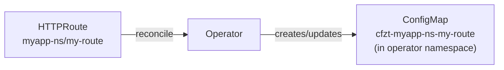
```mermaid
graph LR
    HR["HTTPRoute<br/>myapp-ns/my-route"] -->|reconcile| OP["Operator"]
    OP -->|creates/updates| CM["ConfigMap<br/>cfzt-myapp-ns-my-route<br/>(in operator namespace)"]
```

**Labels applied to every state ConfigMap:**

```yaml
labels:
  app.kubernetes.io/managed-by: cfzt-operator
  cfzt.cloudflare.com/httproute-name: my-route
  cfzt.cloudflare.com/httproute-namespace: myapp-ns
  cfzt.cloudflare.com/tenant: home
```

**Data keys** (all stored as strings):

| Key | Example Value | Written When |
|-----|--------------|--------------|
| `annotation_hash` | `a3f8c2...` | Every reconcile |
| `hostname` | `myapp.example.com` | Every reconcile |
| `tenant_name` | `home` | Every reconcile |
| `tunnel_id` | `xxxxxxxx-xxxx-...` | Every reconcile |
| `zone_id` | `abc123...` | Every reconcile |
| `httproute_namespace` | `myapp-ns` | Every reconcile |
| `httproute_name` | `my-route` | Every reconcile |
| `hostname_route_id` | (tunnel UUID) | Tunnel mode |
| `cname_record_id` | (DNS record ID) | Tunnel mode |
| `dns_record_id` | (DNS record ID) | DNS-only mode |
| `dns_record_ip` | `192.168.1.100` | DNS-only mode |
| `access_app_id` | (UUID) | Access enabled |
| `access_policy_ids` | (UUID) | Access + groups/emails |
| `service_token_id` | (UUID) | Service token enabled |
| `service_token_secret_name` | `cfzt-svctoken-my-route` | Service token enabled |
| `last_reconcile` | `2025-01-15T12:00:00+00:00` | Every reconcile |

### Change Detection

The operator avoids unnecessary Cloudflare API calls by computing a **SHA-256 hash** over the relevant inputs and comparing it to the stored hash.

**Hash inputs:**

```python
{
    "annotations": {
        # All annotations with prefix cfzt.cloudflare.com/
        "cfzt.cloudflare.com/tenant": "home",
        "cfzt.cloudflare.com/hostname": "myapp.example.com",
        ...
    },
    "per_route_template": {
        # Full spec of per-route template (if referenced)
    },
    "base_template": {
        # Full spec of base-{tenant} template (if found)
    }
}
```

This is serialized as sorted JSON and hashed with SHA-256. By including the template specs, any change to a template automatically invalidates the hash for all routes using that template.

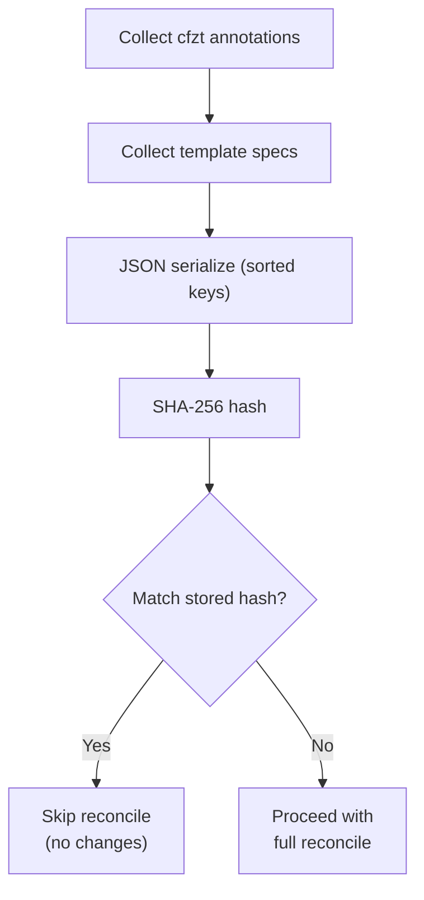
```mermaid
flowchart TD
    A["Collect cfzt annotations"] --> B["Collect template specs"]
    B --> C["JSON serialize (sorted keys)"]
    C --> D["SHA-256 hash"]
    D --> E{"Match stored hash?"}
    E -->|Yes| F["Skip reconcile<br/>(no changes)"]
    E -->|No| G["Proceed with<br/>full reconcile"]
```

### Garbage Collection

State ConfigMaps are cleaned up in three ways:

1. **Normal delete**: When an HTTPRoute is deleted, the delete handler removes CF resources and the state ConfigMap.
2. **Orphan timer**: Every 300 seconds, the orphan cleanup scans for state ConfigMaps whose HTTPRoute no longer exists (or is no longer enabled) and cleans them up.
3. **Manual deletion**: State ConfigMaps can be manually deleted — the next reconcile will re-create them.

---

## Logging Configuration

### Global Log Level

Set via the `LOG_LEVEL` environment variable (or `operator.logLevel` in Helm values):

| Level | kopf Flags | What You See |
|-------|-----------|--------------|
| `DEBUG` | `--verbose --debug` | Everything: K8s API calls, handler args, settings merge details |
| `INFO` | `--verbose` | Reconcile actions, resource create/update/delete, skip notices |
| `WARNING` | `--quiet` | Warnings and errors only (tenant not found, credential failures) |
| `ERROR` | `--quiet` | Errors only |

### Per-Tenant Log Level

Each `CloudflareZeroTrustTenant` CR has a `spec.logLevel` field. This is defined in the CRD but does not currently override the global log level at the handler level — it's reserved for future use.

### Key Log Prefixes

| Logger Name | Module |
|-------------|--------|
| `cfzt.operator` | `main.py` — handler entry/exit |
| `cfzt.reconciler` | `reconciler.py` — reconcile/delete logic |
| `cfzt.k8s_helpers` | `k8s_helpers.py` — K8s API calls |
| `cfzt.cloudflare_api` | `cloudflare_api.py` — Cloudflare SDK calls |

### Example Log Output

```
[INFO] cfzt.operator: Cloudflare Zero-Trust operator started
[INFO] cfzt.operator: Watching all namespaces
[INFO] cfzt.reconciler: No annotation change for default/my-route — skipping
[INFO] cfzt.cloudflare_api: Tunnel route upserted: myapp.example.com
[INFO] cfzt.cloudflare_api: CNAME record created: myapp.example.com → <tunnel>.cfargotunnel.com
[INFO] cfzt.reconciler: Reconciled default/my-route  hostname=myapp.example.com
```

---

## Operator Startup

When the operator pod starts, the following sequence occurs:

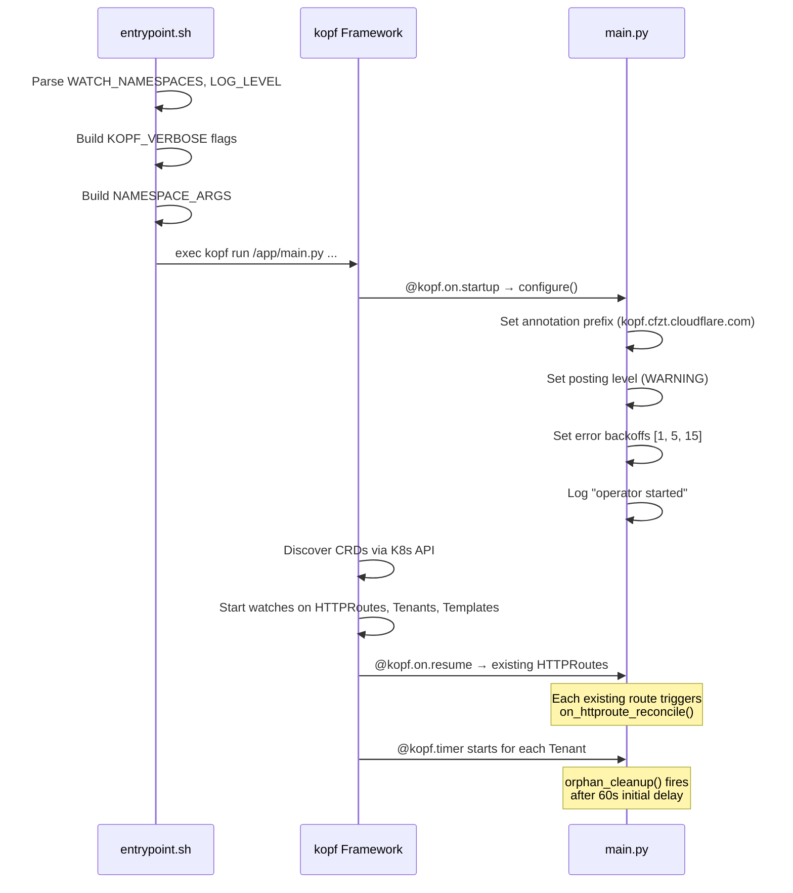
```mermaid
sequenceDiagram
    participant Shell as entrypoint.sh
    participant kopf as kopf Framework
    participant main as main.py

    Shell->>Shell: Parse WATCH_NAMESPACES, LOG_LEVEL
    Shell->>Shell: Build KOPF_VERBOSE flags
    Shell->>Shell: Build NAMESPACE_ARGS
    Shell->>kopf: exec kopf run /app/main.py ...

    kopf->>main: @kopf.on.startup → configure()
    main->>main: Set annotation prefix (kopf.cfzt.cloudflare.com)
    main->>main: Set posting level (WARNING)
    main->>main: Set error backoffs [1, 5, 15]
    main->>main: Log "operator started"

    kopf->>kopf: Discover CRDs via K8s API
    kopf->>kopf: Start watches on HTTPRoutes, Tenants, Templates
    kopf->>main: @kopf.on.resume → existing HTTPRoutes
    Note over main: Each existing route triggers<br/>on_httproute_reconcile()
    kopf->>main: @kopf.timer starts for each Tenant
    Note over main: orphan_cleanup() fires<br/>after 60s initial delay
```

### Startup Behavior

1. **entrypoint.sh** parses environment variables and translates them to kopf CLI flags
2. **kopf** loads kube config (in-cluster or from `~/.kube/config`)
3. **`configure()`** runs — sets persistence storage prefixes, posting level, backoff timing
4. **CRD discovery** — kopf queries the API server for all registered custom resources
5. **Watch streams** start for HTTPRoutes, Tenants, and Templates
6. **Resume** — `@kopf.on.resume` fires for every existing HTTPRoute with the enabled annotation, causing a reconcile pass per route (hash-based skip avoids unnecessary CF calls)
7. **Timers** start — one `orphan_cleanup` timer per Tenant CR, with a 60-second initial delay

---

## Main Reconciliation Flow

The main reconcile is triggered by `@kopf.on.resume`, `@kopf.on.create`, and `@kopf.on.update` on HTTPRoutes matching the annotation filter. All three call the same function: `reconciler.reconcile_httproute()`.

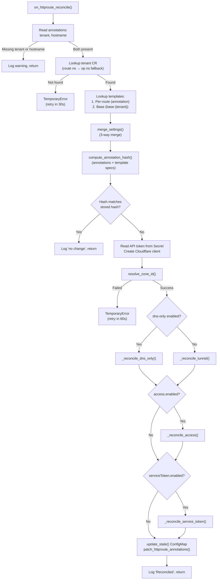
```mermaid
flowchart TD
    START["on_httproute_reconcile()"] --> CHECK_ANN["Read annotations:<br/>tenant, hostname"]
    CHECK_ANN -->|Missing tenant or hostname| SKIP_WARN["Log warning, return"]
    CHECK_ANN -->|Both present| TENANT_LOOKUP["Lookup tenant CR<br/>(route ns → op ns fallback)"]
    
    TENANT_LOOKUP -->|Not found| TEMP_ERR_T["TemporaryError<br/>(retry in 30s)"]
    TENANT_LOOKUP -->|Found| TPL_LOOKUP["Lookup templates:<br/>1. Per-route (annotation)<br/>2. Base (base-{tenant})"]
    
    TPL_LOOKUP --> MERGE["merge_settings()<br/>(3-way merge)"]
    MERGE --> HASH["compute_annotation_hash()<br/>(annotations + template specs)"]
    HASH --> HASH_CMP{"Hash matches<br/>stored hash?"}
    
    HASH_CMP -->|Yes| SKIP_OK["Log 'no change', return"]
    HASH_CMP -->|No| CF_CLIENT["Read API token from Secret<br/>Create Cloudflare client"]
    
    CF_CLIENT --> ZONE["resolve_zone_id()"]
    ZONE -->|Failed| TEMP_ERR_Z["TemporaryError<br/>(retry in 60s)"]
    ZONE -->|Success| MODE{"dns-only enabled?"}
    
    MODE -->|Yes| DNS_ONLY["_reconcile_dns_only()"]
    MODE -->|No| TUNNEL["_reconcile_tunnel()"]
    
    DNS_ONLY --> ACCESS_CHECK
    TUNNEL --> ACCESS_CHECK
    
    ACCESS_CHECK{"access.enabled?"}
    ACCESS_CHECK -->|Yes| ACCESS["_reconcile_access()"]
    ACCESS_CHECK -->|No| SVC_CHECK
    ACCESS --> SVC_CHECK
    
    SVC_CHECK{"serviceToken.enabled?"}
    SVC_CHECK -->|Yes| SVC["_reconcile_service_token()"]
    SVC_CHECK -->|No| PERSIST
    SVC --> PERSIST
    
    PERSIST["update_state() ConfigMap<br/>patch_httproute_annotations()"]
    PERSIST --> DONE["Log 'Reconciled', return"]
```

### Step-by-Step

1. **Annotation check** — Read `cfzt.cloudflare.com/tenant` and `cfzt.cloudflare.com/hostname`. Skip if either is missing.

2. **Tenant lookup** — Search for the `CloudflareZeroTrustTenant` CR:
   - First in the HTTPRoute's namespace
   - Then in the operator's namespace (fallback)
   - Raise `TemporaryError(delay=30)` if not found

3. **Template lookup** — Gather template specs:
   - **Per-route template**: Named in `cfzt.cloudflare.com/template` annotation. Looked up in HTTPRoute ns, then operator ns.
   - **Base template**: `base-{tenant_name}`. Looked up in HTTPRoute ns, then operator ns.

4. **Merge settings** — `config.merge_settings()` produces a `ReconcileSettings` object from the 3-way merge chain. The `{{ hostname }}` variable in template fields (e.g., `originServerName`) is substituted with the actual hostname.

5. **Change detection** — `config.compute_annotation_hash()` over annotations + template specs. Compare with stored `annotation_hash` in the state ConfigMap. If unchanged, log "no change" and return.

6. **Cloudflare client** — Read the API token from the Secret referenced by the tenant's `spec.credentialRef`. Construct a `cloudflare.Cloudflare` client.

7. **Zone resolution** — Call `cloudflare_api.resolve_zone_id()` to find the zone ID from the hostname. If the tenant has `spec.zoneId` set, validate against the discovered value.

8. **Sub-reconcilers** — Execute the applicable sub-reconcilers in order:
   - Tunnel mode (`_reconcile_tunnel`) OR dns-only mode (`_reconcile_dns_only`)
   - Access Application (`_reconcile_access`) if enabled
   - Service Token (`_reconcile_service_token`) if enabled

9. **Persist state** — Write the updated state (all resource IDs + hash + timestamp) to the ConfigMap.

10. **Patch annotations** — Write result annotations (resource IDs, lastReconcile) back to the HTTPRoute. If the HTTPRoute was deleted mid-reconcile (404), the error is caught and logged.

---

## Settings Merge Chain

The `merge_settings()` function in `config.py` implements a 3-way merge to resolve all operator settings for a single HTTPRoute.

### Merge Priority

```
┌──────────────────────────────────────────────┐
│  1. HTTPRoute Annotations                     │  ← Highest priority
│     (cfzt.cloudflare.com/origin.url, etc.)    │
├──────────────────────────────────────────────┤
│  2. Per-route Template Spec                   │  ← cfzt.cloudflare.com/template
│     (CloudflareZeroTrustTemplate)             │
├──────────────────────────────────────────────┤
│  3. Base Template Spec                        │  ← base-{tenant} (auto-discovered)
│     (CloudflareZeroTrustTemplate)             │
├──────────────────────────────────────────────┤
│  4. Hardcoded Defaults                        │  ← Lowest priority
│     (Python dataclass defaults)               │
└──────────────────────────────────────────────┘
```

### How It Works

For each setting, the merge function checks sources in priority order and takes the first non-empty value:

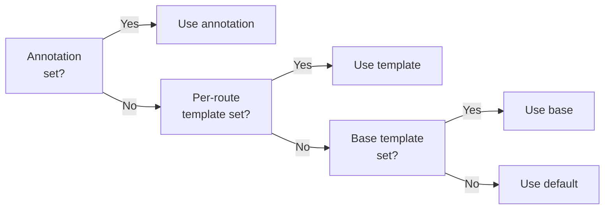
```mermaid
flowchart LR
    ANN["Annotation<br/>set?"] -->|Yes| USE_ANN["Use annotation"]
    ANN -->|No| TPL["Per-route<br/>template set?"]
    TPL -->|Yes| USE_TPL["Use template"]
    TPL -->|No| BASE["Base template<br/>set?"]
    BASE -->|Yes| USE_BASE["Use base"]
    BASE -->|No| DEF["Use default"]
```

### Merge Map — Which Settings Come From Where

| Setting | Annotation Override | Template Key | Default |
|---------|-------------------|-------------|---------|
| **Origin URL** | `cfzt.cloudflare.com/origin.url` | `spec.originService.url` | Auto-derived from HTTPRoute `backendRefs` |
| **HTTP redirect** | — | `spec.originService.httpRedirect` | `true` |
| **noTLSVerify** | `cfzt.cloudflare.com/origin.noTLSVerify` | `spec.originService.originTLS.noTLSVerify` | `false` |
| **originServerName** | — | `spec.originService.originTLS.originServerName` | `""` (auto-defaults to hostname in CF SDK) |
| **caPool** | — | `spec.originService.originTLS.caPool` | `""` |
| **tlsTimeout** | — | `spec.originService.originTLS.tlsTimeout` | `10` |
| **http2Origin** | — | `spec.originService.originTLS.http2Origin` | `false` |
| **matchSNIToHost** | — | `spec.originService.originTLS.matchSNIToHost` | `false` |
| **Access enabled** | `cfzt.cloudflare.com/access.enabled` | `spec.accessApplication.enabled` | `false` |
| **Session duration** | `cfzt.cloudflare.com/access.sessionDuration` | `spec.accessApplication.sessionDuration` | `"24h"` |
| **Allow groups** | `cfzt.cloudflare.com/access.allowGroups` | `spec.accessApplication.allowGroups` | `[]` |
| **Allow emails** | `cfzt.cloudflare.com/access.allowEmails` | `spec.accessApplication.allowEmails` | `[]` |
| **Existing policy names** | `cfzt.cloudflare.com/access.existingPolicyNames` | `spec.accessApplication.existingPolicyNames` | `[]` |
| **Service token enabled** | `cfzt.cloudflare.com/serviceToken.enabled` | `spec.serviceToken.enabled` | `false` |
| **Service token duration** | `cfzt.cloudflare.com/serviceToken.duration` | `spec.serviceToken.duration` | `"8760h"` |
| **DNS-only enabled** | — | `spec.dnsOnly.enabled` | `false` |
| **DNS-only proxied** | — | `spec.dnsOnly.proxied` | `false` |
| **DNS-only TTL** | — | `spec.dnsOnly.ttl` | `120` |
| **DNS-only staticIp** | — | `spec.dnsOnly.staticIp` | `""` |
| **DNS-only ingressServiceRef** | — | `spec.dnsOnly.ingressServiceRef` | `null` |

### `{{ hostname }}` Variable Substitution

Template fields containing the literal string `{{ hostname }}` are replaced with the actual hostname from the HTTPRoute's `cfzt.cloudflare.com/hostname` annotation. This is primarily used for `originServerName`:

```yaml
# Template
spec:
  originService:
    originTLS:
      originServerName: "{{ hostname }}"

# HTTPRoute annotation: cfzt.cloudflare.com/hostname: "myapp.example.com"
# Result: originServerName = "myapp.example.com"
```

### Origin URL Auto-Derivation

When no origin URL is specified anywhere in the merge chain, the operator derives it from the HTTPRoute's `spec.rules[0].backendRefs[0]`:

```python
origin_service = f"http://{ref_name}.{route_namespace}.svc.cluster.local:{ref_port}"
```

---

## Sub-Reconciler Details

### Tunnel Mode

**When**: `dns_only.enabled` is `false` (default)

Creates a Cloudflare Tunnel hostname route and a CNAME DNS record.

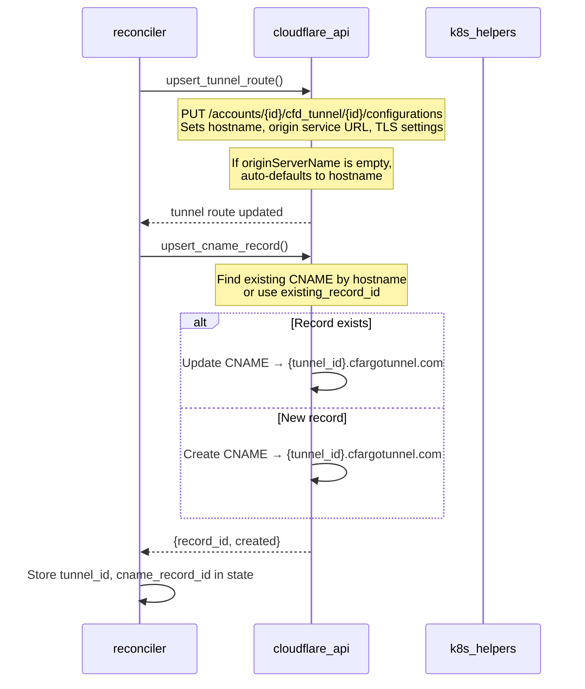
```mermaid
sequenceDiagram
    participant R as reconciler
    participant CF as cloudflare_api
    participant K8s as k8s_helpers

    R->>CF: upsert_tunnel_route()
    Note over CF: PUT /accounts/{id}/cfd_tunnel/{id}/configurations<br/>Sets hostname, origin service URL, TLS settings
    Note over CF: If originServerName is empty,<br/>auto-defaults to hostname
    CF-->>R: tunnel route updated

    R->>CF: upsert_cname_record()
    Note over CF: Find existing CNAME by hostname<br/>or use existing_record_id
    alt Record exists
        CF->>CF: Update CNAME → {tunnel_id}.cfargotunnel.com
    else New record
        CF->>CF: Create CNAME → {tunnel_id}.cfargotunnel.com
    end
    CF-->>R: {record_id, created}

    R->>R: Store tunnel_id, cname_record_id in state
```

**Tunnel route configuration:**

| Field | Source |
|-------|--------|
| `hostname` | `settings.hostname` |
| `service` | `settings.origin_service` (e.g., `https://traefik.traefik.svc:443`) |
| `originRequest.noTLSVerify` | `settings.origin_tls.no_tls_verify` |
| `originRequest.originServerName` | `settings.origin_tls.origin_server_name` (auto-defaults to hostname if empty) |
| `originRequest.caPool` | `settings.origin_tls.ca_pool` |
| `originRequest.connectTimeout` | `settings.origin_tls.tls_timeout` (as `{n}s` string) |
| `originRequest.http2Origin` | `settings.origin_tls.http2_origin` |
| `originRequest.httpHostHeader` | hostname (when `match_sni_to_host` is true) |

### DNS-Only Mode

**When**: `dns_only.enabled` is `true` in the template

Creates a plain DNS A record instead of routing through a Cloudflare Tunnel. No tunnel hostname route is created. Access Application and Service Token are still available.

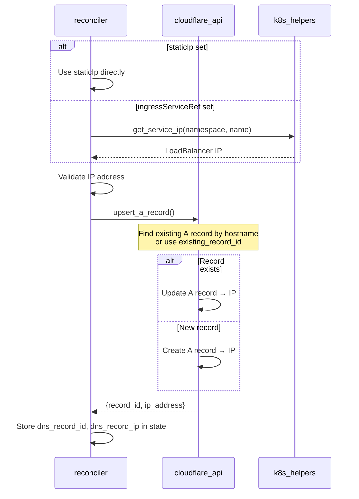
```mermaid
sequenceDiagram
    participant R as reconciler
    participant CF as cloudflare_api
    participant K8s as k8s_helpers

    alt staticIp set
        R->>R: Use staticIp directly
    else ingressServiceRef set
        R->>K8s: get_service_ip(namespace, name)
        K8s-->>R: LoadBalancer IP
    end

    R->>R: Validate IP address

    R->>CF: upsert_a_record()
    Note over CF: Find existing A record by hostname<br/>or use existing_record_id
    alt Record exists
        CF->>CF: Update A record → IP
    else New record
        CF->>CF: Create A record → IP
    end
    CF-->>R: {record_id, ip_address}

    R->>R: Store dns_record_id, dns_record_ip in state
```

**IP resolution priority:**
1. `dnsOnly.staticIp` — Static IP from template
2. `dnsOnly.ingressServiceRef` — Look up LoadBalancer IP from K8s Service
3. If neither → `PermanentError` (configuration issue, not retried)

**A record settings:**
- `proxied` — Enable Cloudflare proxy (orange cloud), default `false`
- `ttl` — DNS TTL in seconds, default `120`

### Access Application

**When**: `access.enabled` is `true`

Creates or updates a Cloudflare Access Application and optionally an Access Policy.

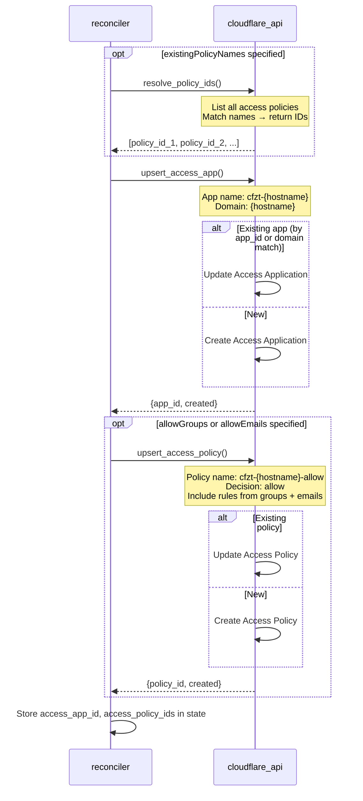
```mermaid
sequenceDiagram
    participant R as reconciler
    participant CF as cloudflare_api

    opt existingPolicyNames specified
        R->>CF: resolve_policy_ids()
        Note over CF: List all access policies<br/>Match names → return IDs
        CF-->>R: [policy_id_1, policy_id_2, ...]
    end

    R->>CF: upsert_access_app()
    Note over CF: App name: cfzt-{hostname}<br/>Domain: {hostname}
    alt Existing app (by app_id or domain match)
        CF->>CF: Update Access Application
    else New
        CF->>CF: Create Access Application
    end
    CF-->>R: {app_id, created}

    opt allowGroups or allowEmails specified
        R->>CF: upsert_access_policy()
        Note over CF: Policy name: cfzt-{hostname}-allow<br/>Decision: allow<br/>Include rules from groups + emails
        alt Existing policy
            CF->>CF: Update Access Policy
        else New
            CF->>CF: Create Access Policy
        end
        CF-->>R: {policy_id, created}
    end

    R->>R: Store access_app_id, access_policy_ids in state
```

**Access Application settings** (all configurable via template or annotation):

| Setting | Default | Description |
|---------|---------|-------------|
| `sessionDuration` | `"24h"` | How long an access session lasts |
| `autoRedirectToIdentity` | `false` | Auto-redirect to IdP |
| `enableBindingCookie` | `false` | Binding cookie |
| `httpOnlyCookieAttribute` | `true` | HTTP-only cookies |
| `sameSiteCookieAttribute` | `"lax"` | SameSite policy |
| `skipInterstitial` | `false` | Skip CF loading page |
| `appLauncherVisible` | `true` | Show in App Launcher |
| `serviceAuth401Redirect` | `false` | 401 instead of redirect |
| `logoUrl` | `""` | Application logo |
| `customDenyMessage` | `""` | Denied access message |
| `customDenyUrl` | `""` | Denied access URL |
| `customNonIdentityDenyUrl` | `""` | Non-identity deny URL |

**Policy types:**
1. **Existing policies** (`existingPolicyNames`) — Referenced by name, resolved to UUIDs at reconcile time. Attached directly to the Access Application.
2. **Inline policy** (`allowGroups` / `allowEmails`) — Creates/updates a managed `cfzt-{hostname}-allow` policy with include rules.

### Service Token

**When**: `serviceToken.enabled` is `true`

Creates a Cloudflare Service Token for machine-to-machine authentication and stores the credentials in a Kubernetes Secret.

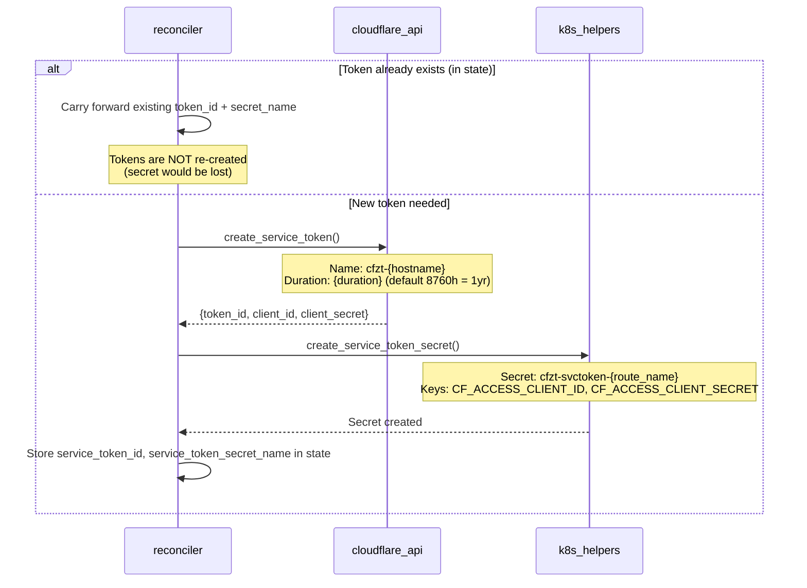
```mermaid
sequenceDiagram
    participant R as reconciler
    participant CF as cloudflare_api
    participant K8s as k8s_helpers

    alt Token already exists (in state)
        R->>R: Carry forward existing token_id + secret_name
        Note over R: Tokens are NOT re-created<br/>(secret would be lost)
    else New token needed
        R->>CF: create_service_token()
        Note over CF: Name: cfzt-{hostname}<br/>Duration: {duration} (default 8760h = 1yr)
        CF-->>R: {token_id, client_id, client_secret}

        R->>K8s: create_service_token_secret()
        Note over K8s: Secret: cfzt-svctoken-{route_name}<br/>Keys: CF_ACCESS_CLIENT_ID, CF_ACCESS_CLIENT_SECRET
        K8s-->>R: Secret created

        R->>R: Store service_token_id, service_token_secret_name in state
    end
```

**Important**: Service tokens are created once and never re-created on subsequent reconciles. The `client_secret` is only available at creation time and is stored in the K8s Secret. If the Secret is deleted, the token credentials are lost.

---

## Delete Flow

Triggered by `@kopf.on.delete` (with `optional=True` — no finalizer).

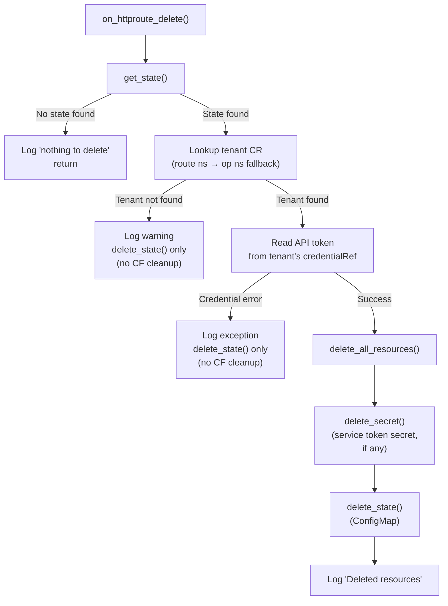
```mermaid
flowchart TD
    START["on_httproute_delete()"] --> GET_STATE["get_state()"]
    GET_STATE -->|No state found| NO_STATE["Log 'nothing to delete'<br/>return"]
    GET_STATE -->|State found| GET_TENANT["Lookup tenant CR<br/>(route ns → op ns fallback)"]
    
    GET_TENANT -->|Tenant not found| WARN_TENANT["Log warning<br/>delete_state() only<br/>(no CF cleanup)"]
    GET_TENANT -->|Tenant found| READ_CREDS["Read API token<br/>from tenant's credentialRef"]
    
    READ_CREDS -->|Credential error| WARN_CREDS["Log exception<br/>delete_state() only<br/>(no CF cleanup)"]
    READ_CREDS -->|Success| DELETE_CF["delete_all_resources()"]
    
    DELETE_CF --> DELETE_SECRET["delete_secret()<br/>(service token secret,<br/>if any)"]
    DELETE_SECRET --> DELETE_STATE["delete_state()<br/>(ConfigMap)"]
    DELETE_STATE --> DONE["Log 'Deleted resources'"]
```

### Deletion Order

The `delete_all_resources()` function in `cloudflare_api.py` deletes in this order:

1. **Access Application** — Must go first (may reference policy/token)
2. **Service Token** — Delete from Cloudflare
3. **Tunnel Hostname Route** — Remove from tunnel configuration
4. **DNS Record** — Delete CNAME or A record

All deletions silently ignore 404 (resource already gone).

### Graceful Degradation on Delete

If the operator can't perform a clean Cloudflare deletion (tenant missing, credentials missing), it still removes the local state ConfigMap to prevent the orphan cleanup from infinitely retrying. A warning is logged.

---

## Template Change Propagation

When a `CloudflareZeroTrustTemplate` is updated, the operator re-reconciles all HTTPRoutes that reference it.

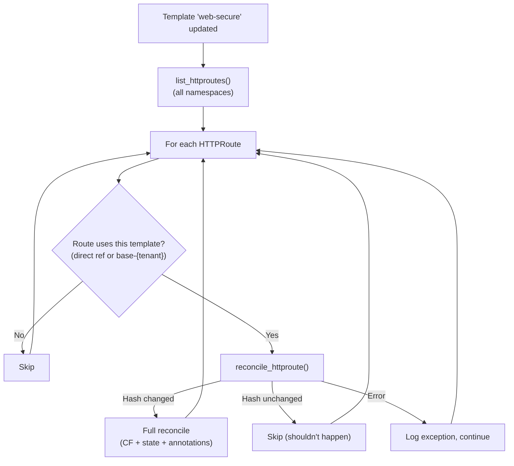
```mermaid
flowchart TD
    TPL_UPDATE["Template 'web-secure' updated"] --> LIST["list_httproutes()<br/>(all namespaces)"]
    LIST --> LOOP["For each HTTPRoute"]
    LOOP --> CHECK{"Route uses this template?<br/>(direct ref or base-{tenant})"}
    CHECK -->|No| NEXT["Skip"]
    CHECK -->|Yes| RECONCILE["reconcile_httproute()"]
    RECONCILE -->|Hash changed| UPDATE["Full reconcile<br/>(CF + state + annotations)"]
    RECONCILE -->|Hash unchanged| SKIP["Skip (shouldn't happen)"]
    RECONCILE -->|Error| LOG_ERR["Log exception, continue"]
    NEXT --> LOOP
    UPDATE --> LOOP
    SKIP --> LOOP
    LOG_ERR --> LOOP
```

### How Routes Are Matched

A template change triggers re-reconciliation for an HTTPRoute if:
- The HTTPRoute's `cfzt.cloudflare.com/template` annotation equals the template name (per-route template)
- The template name equals `base-{tenant_name}` where `tenant_name` is the HTTPRoute's `cfzt.cloudflare.com/tenant` annotation (base template)

### Why Hash Changes Are Guaranteed

The `compute_annotation_hash()` function includes the full template spec in the hash input. When a template's spec changes, the hash changes even though the HTTPRoute's annotations haven't. This ensures the reconciler detects the change and performs the full Cloudflare update.

---

## Orphan Cleanup

The orphan cleanup timer runs on each `CloudflareZeroTrustTenant` CR (kopf timer, not on the operator itself). This means each tenant gets its own periodic cleanup independently.

### Timer Configuration

| Parameter | Value |
|-----------|-------|
| **Interval** | 300 seconds (5 minutes) |
| **Initial delay** | 60 seconds after startup |
| **Scope** | Per-tenant (one timer per Tenant CR) |

### Flow

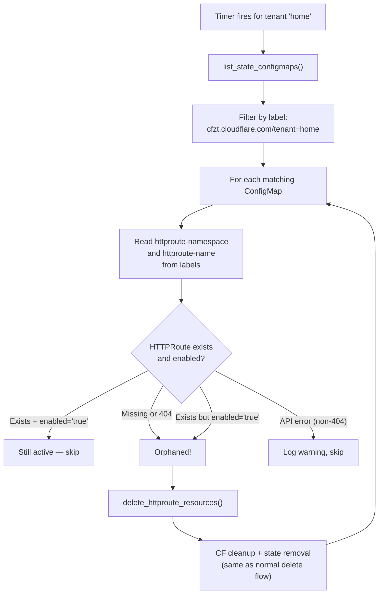
```mermaid
flowchart TD
    TIMER["Timer fires for tenant 'home'"] --> LIST["list_state_configmaps()"]
    LIST --> FILTER["Filter by label:<br/>cfzt.cloudflare.com/tenant=home"]
    FILTER --> LOOP["For each matching ConfigMap"]
    
    LOOP --> READ["Read httproute-namespace<br/>and httproute-name<br/>from labels"]
    READ --> CHECK{"HTTPRoute exists<br/>and enabled?"}
    
    CHECK -->|"Exists + enabled='true'"| ACTIVE["Still active — skip"]
    CHECK -->|"Missing or 404"| ORPHAN["Orphaned!"]
    CHECK -->|"Exists but enabled≠'true'"| ORPHAN
    CHECK -->|"API error (non-404)"| WARN["Log warning, skip"]
    
    ORPHAN --> DELETE["delete_httproute_resources()"]
    DELETE --> CLEANUP["CF cleanup + state removal<br/>(same as normal delete flow)"]
    CLEANUP --> LOOP
```

### When Orphans Occur

- HTTPRoute deleted while operator was down (no delete event received)
- HTTPRoute's `cfzt.cloudflare.com/enabled` annotation removed or set to `"false"`
- HTTPRoute moved to a different namespace
- State ConfigMap manually re-created without a matching HTTPRoute

---

## Error Handling

### kopf Error Types

| Error Type | Behavior |
|-----------|----------|
| `kopf.TemporaryError(delay=N)` | Retry after N seconds. Used for recoverable situations (tenant not found, zone resolution failure, LoadBalancer IP not yet assigned). |
| `kopf.PermanentError` | Do not retry. Used for configuration errors (missing IP in dns-only mode, invalid IP address). |
| Unhandled exception | kopf retries with exponential backoff: 1s, 5s, 15s (max). |

### Error Scenarios

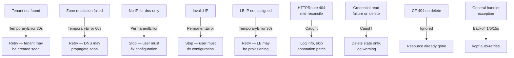
```mermaid
flowchart TD
    E1["Tenant not found"] -->|TemporaryError 30s| R1["Retry — tenant may<br/>be created soon"]
    E2["Zone resolution failed"] -->|TemporaryError 60s| R2["Retry — DNS may<br/>propagate soon"]
    E3["No IP for dns-only"] -->|PermanentError| R3["Stop — user must<br/>fix configuration"]
    E4["Invalid IP"] -->|PermanentError| R4["Stop — user must<br/>fix configuration"]
    E5["LB IP not assigned"] -->|TemporaryError 30s| R5["Retry — LB may<br/>be provisioning"]
    E6["HTTPRoute 404<br/>mid-reconcile"] -->|Caught| R6["Log info, skip<br/>annotation patch"]
    E7["Credential read<br/>failure on delete"] -->|Caught| R7["Delete state only,<br/>log warning"]
    E8["CF 404 on delete"] -->|Ignored| R8["Resource already gone"]
    E9["General handler<br/>exception"] -->|Backoff 1/5/15s| R9["kopf auto-retries"]
```

### Startup Resilience

On startup, `@kopf.on.resume` fires for all existing HTTPRoutes. The annotation hash check ensures that already-reconciled routes are skipped quickly. This makes operator restarts lightweight even with many routes.

If a resume reconcile fails (e.g., Cloudflare API down), kopf's backoff mechanism handles retries gracefully.

---

## Examples

### Example 1: Simple Tunnel Route

**Scenario**: Expose `my-app.example.com` through a Cloudflare Tunnel.

**Resources:**
```yaml
# Tenant (in operator namespace)
apiVersion: cfzt.cloudflare.com/v1alpha1
kind: CloudflareZeroTrustTenant
metadata:
  name: home
  namespace: cloudflare-zero-trust
spec:
  accountId: "abc123def456..."
  tunnelId: "xxxxxxxx-xxxx-xxxx-xxxx-xxxxxxxxxxxx"
  credentialRef:
    name: cfzt-api-token
    key: token
---
# Base template (in operator namespace)
apiVersion: cfzt.cloudflare.com/v1alpha1
kind: CloudflareZeroTrustTemplate
metadata:
  name: base-home
  namespace: cloudflare-zero-trust
spec:
  originService:
    url: "https://traefik.traefik.svc:443"
    originTLS:
      originServerName: "{{ hostname }}"
---
# HTTPRoute (in application namespace)
apiVersion: gateway.networking.k8s.io/v1
kind: HTTPRoute
metadata:
  name: my-app
  namespace: default
  annotations:
    cfzt.cloudflare.com/enabled: "true"
    cfzt.cloudflare.com/tenant: "home"
    cfzt.cloudflare.com/hostname: "my-app.example.com"
spec:
  hostnames: ["my-app.example.com"]
  rules:
    - backendRefs:
        - name: my-app-svc
          port: 8080
```

**What happens:**
1. Operator detects the HTTPRoute create event
2. Looks up tenant `home` → found in operator namespace
3. Looks up template `base-home` → found in operator namespace
4. Merges: origin URL from template (`https://traefik.traefik.svc:443`), originServerName `{{ hostname }}` → `my-app.example.com`
5. Computes hash, no existing state → proceed
6. Creates Cloudflare Tunnel hostname route: `my-app.example.com` → `https://traefik.traefik.svc:443`
7. Creates CNAME: `my-app.example.com` → `{tunnel_id}.cfargotunnel.com`
8. Saves state ConfigMap `cfzt-default-my-app`
9. Patches result annotations onto the HTTPRoute

### Example 2: Route with Access Application

**Scenario**: Expose `admin.example.com` with Cloudflare Access protection.

```yaml
apiVersion: cfzt.cloudflare.com/v1alpha1
kind: CloudflareZeroTrustTemplate
metadata:
  name: protected
  namespace: cloudflare-zero-trust
spec:
  originService:
    url: "https://traefik.traefik.svc:443"
    originTLS:
      originServerName: "{{ hostname }}"
  accessApplication:
    enabled: true
    sessionDuration: "8h"
    existingPolicyNames:
      - "Allow Home Users"
---
apiVersion: gateway.networking.k8s.io/v1
kind: HTTPRoute
metadata:
  name: admin-panel
  namespace: default
  annotations:
    cfzt.cloudflare.com/enabled: "true"
    cfzt.cloudflare.com/tenant: "home"
    cfzt.cloudflare.com/hostname: "admin.example.com"
    cfzt.cloudflare.com/template: "protected"
spec:
  hostnames: ["admin.example.com"]
  rules:
    - backendRefs:
        - name: admin-svc
          port: 8080
```

**Additional steps beyond Example 1:**
1. Resolves `"Allow Home Users"` policy name → UUID via Cloudflare API
2. Creates Access Application `cfzt-admin.example.com` with 8h session, attaches policy
3. Stores `access_app_id` in state ConfigMap

### Example 3: DNS-Only Mode

**Scenario**: Create an A record for `api.example.com` pointing at a LoadBalancer IP.

```yaml
apiVersion: cfzt.cloudflare.com/v1alpha1
kind: CloudflareZeroTrustTemplate
metadata:
  name: dns-only-lb
  namespace: cloudflare-zero-trust
spec:
  dnsOnly:
    enabled: true
    proxied: false
    ttl: 120
    ingressServiceRef:
      name: traefik
      namespace: traefik
---
apiVersion: gateway.networking.k8s.io/v1
kind: HTTPRoute
metadata:
  name: api-route
  namespace: default
  annotations:
    cfzt.cloudflare.com/enabled: "true"
    cfzt.cloudflare.com/tenant: "home"
    cfzt.cloudflare.com/hostname: "api.example.com"
    cfzt.cloudflare.com/template: "dns-only-lb"
spec:
  hostnames: ["api.example.com"]
  rules:
    - backendRefs:
        - name: api-svc
          port: 8080
```

**What happens:**
1. Merges settings — `dns_only.enabled=true`
2. No `staticIp` — looks up Service `traefik/traefik` → gets LoadBalancer IP
3. Creates A record: `api.example.com` → `192.168.1.100` (proxied=false, ttl=120)
4. No tunnel hostname route or CNAME is created
5. Stores `dns_record_id` and `dns_record_ip` in state

### Example 4: Service Token for Machine-to-Machine

**Scenario**: Expose `internal-api.example.com` with a service token for automated clients.

```yaml
apiVersion: gateway.networking.k8s.io/v1
kind: HTTPRoute
metadata:
  name: internal-api
  namespace: default
  annotations:
    cfzt.cloudflare.com/enabled: "true"
    cfzt.cloudflare.com/tenant: "home"
    cfzt.cloudflare.com/hostname: "internal-api.example.com"
    cfzt.cloudflare.com/template: "protected"
    cfzt.cloudflare.com/serviceToken.enabled: "true"
spec:
  hostnames: ["internal-api.example.com"]
  rules:
    - backendRefs:
        - name: internal-api-svc
          port: 8080
```

**What happens:**
1. Normal tunnel + Access Application reconcile (from `protected` template)
2. Service token enabled via annotation override
3. Creates Cloudflare Service Token `cfzt-internal-api.example.com`
4. Creates K8s Secret `cfzt-svctoken-internal-api` with `CF_ACCESS_CLIENT_ID` and `CF_ACCESS_CLIENT_SECRET`
5. On subsequent reconciles, the existing token is carried forward (not re-created)

**Using the token from a client pod:**
```yaml
env:
  - name: CF_ACCESS_CLIENT_ID
    valueFrom:
      secretKeyRef:
        name: cfzt-svctoken-internal-api
        key: CF_ACCESS_CLIENT_ID
  - name: CF_ACCESS_CLIENT_SECRET
    valueFrom:
      secretKeyRef:
        name: cfzt-svctoken-internal-api
        key: CF_ACCESS_CLIENT_SECRET
```
