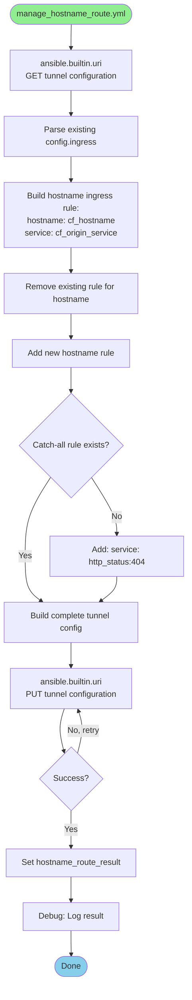

<!-- markdownlint-disable -->
# Reconciliation Flow

Detailed flow documentation showing how the operator reconciles resources once it's running.

## Table of Contents

- [Overview](#overview)
- [Main Reconciliation Loop](#main-reconciliation-loop)
- [Playbook Execution](#playbook-execution)
- [Role Details](#role-details)
- [Task-Level Flow](#task-level-flow)
- [Error Handling](#error-handling)
- [Examples](#examples)

## Overview

Once the operator pod is running, the `entrypoint.sh` script enters an infinite loop that repeatedly executes the main Ansible playbook (`reconcile.yml`) at the configured interval.

**Key Concepts**:
- **Poll-based**: Runs every `POLL_INTERVAL_SECONDS` (default: 60)
- **Sequential**: Processes tenants one at a time
- **Idempotent**: Safe to run repeatedly
- **State-tracked**: Uses annotations to track what's been created

## Main Reconciliation Loop

### Entrypoint to Playbook Flow


### Top-Level Playbook Structure

```yaml
# ansible/playbooks/reconcile.yml

# Play 1: Startup and loop wrapper
- name: Cloudflare Zero Trust Operator Reconciliation
  hosts: localhost
  gather_facts: false
  tasks:
    - name: Display operator startup information
    - name: Start reconciliation loop
      include_role: reconciliation_loop

# Play 2: Actual reconciliation (called by reconciliation_loop)
- name: Reconcile Cloudflare Zero Trust Resources
  hosts: localhost
  gather_facts: false
  tasks:
    - name: Get all CloudflareZeroTrustTenant resources
      include_role: k8s_watch (list_tenants.yml)
    
    - name: Get all IngressRoute resources
      include_role: k8s_watch (list_ingressroutes.yml)
    
    - name: Reconcile each tenant
      include_role: tenant_reconcile
      loop: "{{ cfzt_tenants }}"
```

## Playbook Execution

### Complete Execution Flow


## Role Details

### Role 1: reconciliation_loop

**Purpose**: Wrapper that creates infinite reconciliation loop

**Location**: `ansible/roles/reconciliation_loop/tasks/main.yml`


**Key Tasks**:
1. Run the main playbook (skipping itself to avoid infinite inception)
2. Log the result
3. Wait for the configured interval
4. Call itself recursively (infinite loop)
5. Handle errors gracefully (rescue block)

---

### Role 2: k8s_watch

**Purpose**: Discover Kubernetes resources (Tenants and IngressRoutes)

**Location**: `ansible/roles/k8s_watch/tasks/`

#### Task File: list_tenants.yml


**Output**: 
- Variable `cfzt_tenants`: List of all CloudflareZeroTrustTenant resources

**Example**:
```yaml
cfzt_tenants:
  - metadata:
      name: prod-tenant
      namespace: default
    spec:
      accountId: "abc123..."
      tunnelId: "uuid..."
      credentialRef:
        name: cloudflare-api-token
```

#### Task File: list_ingressroutes.yml


**Output**:
- Variable `all_ingressroutes`: All IngressRoute resources (in watched namespaces)
- Variable `cfzt_ingressroutes`: Filtered IngressRoutes with `cfzt.cloudflare.com/enabled: "true"`

**Filtering Logic**:
```jinja2
{{ all_ingressroutes 
   | selectattr('metadata.annotations.cfzt.cloudflare.com/enabled', 'defined') 
   | selectattr('metadata.annotations.cfzt.cloudflare.com/enabled', 'equalto', 'true') 
   | list }}
```

---

### Role 3: tenant_reconcile

**Purpose**: Orchestrate reconciliation for a single tenant

**Location**: `ansible/roles/tenant_reconcile/tasks/main.yml`


**Key Logic**:

1. **Extract tenant configuration** from the CloudflareZeroTrustTenant CR
2. **Retrieve API token** from referenced Secret
3. **Filter IngressRoutes** belonging to this tenant:
   - Same namespace as tenant
   - If IngressRoute has `cfzt.cloudflare.com/tenant` annotation, must match tenant name
   - If no tenant annotation and only one tenant in namespace, use that tenant
4. **Initialize resource counters** for status tracking
5. **Reconcile each IngressRoute** by calling `reconcile_ingressroute.yml`
6. **Update tenant status** with summary counts

---

### Task File: reconcile_ingressroute.yml

**Purpose**: Reconcile a single IngressRoute against Cloudflare

**Location**: `ansible/roles/tenant_reconcile/tasks/reconcile_ingressroute.yml`


**Detailed Steps**:

#### Step 1: Hostname Route
- Calls Cloudflare API to create/update tunnel hostname route
- Maps public hostname → origin service
- Increments hostname route counter

#### Step 2: Access Application (if enabled)
- Creates/updates Cloudflare Access Application
- Uses hostname as application domain
- Sets session duration
- Stores app ID in annotation

#### Step 3: Access Policy
- Parses allow rules (groups and emails)
- Creates/updates policy attached to Access Application
- Supports multiple groups and emails
- Stores policy ID(s) in annotation

#### Step 4: Service Token (if enabled)
- Creates Cloudflare service token for machine-to-machine auth
- Creates Kubernetes Secret with `client_id` and `client_secret`
- Secret named: `{ingressroute-name}-cfzt-service-token`
- Stores token ID and secret name in annotations

#### Final: Update Annotations
- Patches IngressRoute with all Cloudflare resource IDs
- Adds `lastReconcile` timestamp
- Enables idempotent updates on next reconciliation

---

### Task File: update_tenant_status.yml

**Purpose**: Update CloudflareZeroTrustTenant status with reconciliation results

**Location**: `ansible/roles/tenant_reconcile/tasks/update_tenant_status.yml`


**Status Fields Updated**:

```yaml
status:
  observedGeneration: 1
  lastSyncTime: "2026-02-18T10:00:00Z"
  conditions:
    - type: Ready
      status: "True"
      lastTransitionTime: "2026-02-18T10:00:00Z"
      reason: ReconcileSuccess
      message: "Successfully reconciled 3 IngressRoute(s)"
  summary:
    managedIngressRoutes: 3
    hostnameRoutes: 3
    accessApplications: 2
    accessPolicies: 2
    serviceTokens: 1
```

---

### Role 4: cloudflare_api

**Purpose**: Interact with Cloudflare APIs

**Location**: `ansible/roles/cloudflare_api/tasks/`

This role contains multiple task files, each handling a specific Cloudflare API operation.

#### Task File: manage_hostname_route.yml



**API Call**:
```
PUT https://api.cloudflare.com/client/v4/accounts/{account_id}/cfd_tunnel/{tunnel_id}/configurations
```

**Retry Logic**:
- 3 retries
- 5 second delay between retries
- Handles rate limiting (429)

---

#### Task File: manage_access_app.yml


**API Calls**:
- Create: `POST https://api.cloudflare.com/client/v4/accounts/{account_id}/access/apps`
- Update: `PUT https://api.cloudflare.com/client/v4/accounts/{account_id}/access/apps/{app_id}`

**Idempotency**: Uses `cf_app_id` from annotations to update instead of create

---

#### Task File: manage_access_policy.yml


**Policy Structure**:
```json
{
  "name": "myapp-allow-policy",
  "decision": "allow",
  "include": [
    {"group": {"id": "Engineering"}},
    {"group": {"id": "Admins"}},
    {"email": {"email": "user@example.com"}}
  ],
  "precedence": 1
}
```

**API Calls**:
- Create: `POST https://api.cloudflare.com/client/v4/accounts/{account_id}/access/apps/{app_id}/policies`
- Update: `PUT https://api.cloudflare.com/client/v4/accounts/{account_id}/access/apps/{app_id}/policies/{policy_id}`

---

#### Task File: manage_service_token.yml


**API Call**:
```
POST https://api.cloudflare.com/client/v4/accounts/{account_id}/access/service_tokens
```

**Important**: Service token credentials (`client_id` and `client_secret`) are only returned once at creation time. The operator stores them in a Kubernetes Secret immediately.

---

#### Task File: delete_resources.yml


**Deletion Order** (important for dependencies):
1. Access Policies (dependent on app)
2. Access Application
3. Service Token
4. Hostname from tunnel configuration

**Used when**: IngressRoute is deleted or `cfzt.cloudflare.com/enabled` annotation is removed

---

## Task-Level Flow

### Complete Single IngressRoute Reconciliation


## Error Handling

### Error Propagation Flow


### Retry and Backoff Strategy

**Cloudflare API Calls**:
```yaml
retries: 3
delay: 5  # seconds
until: response.status in [200, 201, 204]
```

**Rate Limit Handling**:
- Cloudflare returns 429 when rate limited
- Ansible URI module retries automatically
- Exponential backoff: 5s → 10s → 20s

**Kubernetes API Calls**:
- No explicit retries (assumed reliable)
- Failed API calls fail the entire reconciliation
- Next reconciliation cycle retries

### Error Status Updates


## Examples

### Example 1: Simple Hostname Route

**IngressRoute**:
```yaml
apiVersion: traefik.io/v1alpha1
kind: IngressRoute
metadata:
  name: simple-app
  annotations:
    cfzt.cloudflare.com/enabled: "true"
    cfzt.cloudflare.com/hostname: "simple.example.com"
spec:
  routes:
    - match: Host(`simple.example.com`)
      services:
        - name: simple-app
          port: 8080
```

**Reconciliation Flow**:
```
1. Parse annotations → hostname: "simple.example.com"
2. Call manage_hostname_route.yml
   └─> GET tunnel config
   └─> Add hostname rule: simple.example.com → http://traefik.traefik.svc:80
   └─> PUT tunnel config
3. Patch IngressRoute:
   └─> cfzt.cloudflare.com/hostnameRouteId: "tunnel-uuid"
   └─> cfzt.cloudflare.com/lastReconcile: "2026-02-18T10:00:00Z"
```

**Result**: Public hostname `simple.example.com` routes through Cloudflare Tunnel to Traefik

---

### Example 2: Access App with Email Allow

**IngressRoute**:
```yaml
apiVersion: traefik.io/v1alpha1
kind: IngressRoute
metadata:
  name: admin-panel
  annotations:
    cfzt.cloudflare.com/enabled: "true"
    cfzt.cloudflare.com/hostname: "admin.example.com"
    cfzt.cloudflare.com/accessApp: "true"
    cfzt.cloudflare.com/allowEmails: "admin@example.com,manager@example.com"
    cfzt.cloudflare.com/sessionDuration: "8h"
spec:
  routes:
    - match: Host(`admin.example.com`)
      services:
        - name: admin-panel
          port: 80
```

**Reconciliation Flow**:
```
1. Parse annotations
   └─> hostname: "admin.example.com"
   └─> accessApp: true
   └─> allowEmails: "admin@example.com,manager@example.com"
   └─> sessionDuration: "8h"

2. Call manage_hostname_route.yml
   └─> Create tunnel route

3. Call manage_access_app.yml
   └─> POST Access Application
   └─> name: "admin-panel"
   └─> domain: "admin.example.com"
   └─> session_duration: "8h"
   └─> Returns: app_id

4. Call manage_access_policy.yml
   └─> Parse emails: ["admin@example.com", "manager@example.com"]
   └─> Build include rules: [
         {"email": {"email": "admin@example.com"}},
         {"email": {"email": "manager@example.com"}}
       ]
   └─> POST Access Policy
   └─> Returns: policy_id

5. Patch IngressRoute:
   └─> cfzt.cloudflare.com/hostnameRouteId: "tunnel-uuid"
   └─> cfzt.cloudflare.com/accessAppId: "app-uuid"
   └─> cfzt.cloudflare.com/accessPolicyIds: "policy-uuid"
   └─> cfzt.cloudflare.com/lastReconcile: "2026-02-18T10:00:00Z"
```

**Result**: 
- Public hostname protected by Cloudflare Access
- Only `admin@example.com` and `manager@example.com` can access
- Session lasts 8 hours

---

### Example 3: Full Stack with Service Token

**IngressRoute**:
```yaml
apiVersion: traefik.io/v1alpha1
kind: IngressRoute
metadata:
  name: api-service
  annotations:
    cfzt.cloudflare.com/enabled: "true"
    cfzt.cloudflare.com/hostname: "api.example.com"
    cfzt.cloudflare.com/accessApp: "true"
    cfzt.cloudflare.com/allowGroups: "Engineering"
    cfzt.cloudflare.com/serviceToken: "true"
spec:
  routes:
    - match: Host(`api.example.com`)
      services:
        - name: api-backend
          port: 8000
```

**Reconciliation Flow**:
```
1. Parse annotations
   └─> hostname: "api.example.com"
   └─> accessApp: true
   └─> allowGroups: "Engineering"
   └─> serviceToken: true

2. Create hostname route (same as above)

3. Create Access Application (same as above)

4. Call manage_access_policy.yml
   └─> Parse groups: ["Engineering"]
   └─> Build include rules: [
         {"group": {"id": "Engineering"}}
       ]
   └─> POST Access Policy
   └─> Returns: policy_id

5. Call manage_service_token.yml
   └─> POST Service Token
   └─> name: "api-service-service-token"
   └─> Returns: token_id, client_id, client_secret

6. Create Kubernetes Secret
   └─> name: "api-service-cfzt-service-token"
   └─> data:
       ├─> client_id: "xxxx"
       └─> client_secret: "yyyy"

7. Patch IngressRoute:
   └─> cfzt.cloudflare.com/hostnameRouteId: "tunnel-uuid"
   └─> cfzt.cloudflare.com/accessAppId: "app-uuid"
   └─> cfzt.cloudflare.com/accessPolicyIds: "policy-uuid"
   └─> cfzt.cloudflare.com/serviceTokenId: "token-uuid"
   └─> cfzt.cloudflare.com/serviceTokenSecretName: "api-service-cfzt-service-token"
   └─> cfzt.cloudflare.com/lastReconcile: "2026-02-18T10:00:00Z"
```

**Result**:
- Hostname protected by Cloudflare Access
- Members of "Engineering" group can access
- Service token available in Secret for machine-to-machine auth
- Applications can use credentials: `CF-Access-Client-Id` and `CF-Access-Client-Secret` headers

---

### Example 4: Update Flow (Idempotency)

**Scenario**: IngressRoute already reconciled, now updating `allowEmails`

**Before**:
```yaml
annotations:
  cfzt.cloudflare.com/enabled: "true"
  cfzt.cloudflare.com/hostname: "app.example.com"
  cfzt.cloudflare.com/accessApp: "true"
  cfzt.cloudflare.com/allowEmails: "user1@example.com"
  # Operator-managed annotations:
  cfzt.cloudflare.com/accessAppId: "existing-app-id"
  cfzt.cloudflare.com/accessPolicyIds: "existing-policy-id"
```

**After Update**:
```yaml
annotations:
  cfzt.cloudflare.com/enabled: "true"
  cfzt.cloudflare.com/hostname: "app.example.com"
  cfzt.cloudflare.com/accessApp: "true"
  cfzt.cloudflare.com/allowEmails: "user1@example.com,user2@example.com"  # Added user2
```

**Reconciliation Flow**:
```
1. Parse annotations
   └─> existing_app_id: "existing-app-id"
   └─> existing_policy_ids: "existing-policy-id"
   └─> allowEmails: "user1@example.com,user2@example.com"

2. Call manage_access_app.yml
   └─> cf_app_id defined → UPDATE path
   └─> PUT https://.../access/apps/existing-app-id
   └─> (No changes to app, but ensures it exists)

3. Call manage_access_policy.yml
   └─> Parse emails: ["user1@example.com", "user2@example.com"]
   └─> cf_policy_id defined → UPDATE path
   └─> PUT https://.../policies/existing-policy-id
   └─> Updates policy with new email list

4. Patch IngressRoute:
   └─> (IDs remain the same)
   └─> cfzt.cloudflare.com/lastReconcile: "2026-02-18T10:05:30Z"  # Updated timestamp
```

**Result**: Policy updated in place, no duplicate resources created

---

## Summary

The reconciliation flow follows a clear pattern:

1. **Discovery**: List tenants and IngressRoutes
2. **Iteration**: For each tenant, for each IngressRoute
3. **Reconciliation**: Create/update Cloudflare resources via API
4. **State Tracking**: Store resource IDs in annotations
5. **Status Updates**: Report summary to tenant status
6. **Repeat**: Loop continuously at configured interval

The entire flow is **idempotent**, **declarative**, and **state-tracked**, making it safe to run repeatedly and allowing GitOps workflows.
