<!-- markdownlint-disable -->
# Reconciliation Flow

Detailed flow documentation showing how the operator reconciles resources once it's running.

## Table of Contents

- [Overview](#overview)
- [State Management](#state-management)
- [Logging Configuration](#logging-configuration)
- [Operator Configuration (Self-Reconciliation)](#operator-configuration-self-reconciliation)
- [Main Reconciliation Loop](#main-reconciliation-loop)
- [Playbook Execution](#playbook-execution)
- [Role Details](#role-details)
- [Task-Level Flow](#task-level-flow)
- [Error Handling](#error-handling)
- [Examples](#examples)

## Overview

Once the operator pod is running, the `entrypoint.sh` script enters an infinite loop that repeatedly executes the main Ansible playbook (`reconcile.yml`) at the configured interval.

**Key Concepts**:
- **Poll-based**: Runs every `POLL_INTERVAL_SECONDS` (default: 60)
- **Sequential**: Processes tenants one at a time
- **Idempotent**: Safe to run repeatedly
- **Stateful**: Uses ConfigMaps to track HTTPRoute state and avoid unnecessary Cloudflare API calls
- **Change detection**: Only contacts Cloudflare API when cfzt annotations change

## State Management

The operator implements **stateful reconciliation** to minimize Cloudflare API calls and improve efficiency.

### State Tracking Mechanism

**ConfigMap per HTTPRoute**:
- **Name**: `cfzt-{namespace}-{httproute-name}` (in operator namespace)
- **Purpose**: Track annotation state and Cloudflare resource IDs
- **Avoids conflicts**: Namespace prefix handles duplicate names across namespaces

**ConfigMap Data**:
```yaml
data:
  annotation_hash: "sha256 hash of all cfzt.cloudflare.com/* annotations"
  cloudflare_ids: '{"tunnel_id": "...", "access_app_id": "...", ...}'
  last_sync_time: "2026-02-18T10:00:00Z"
  httproute_namespace: "default"
  httproute_name: "myapp"
```

**Change Detection**:
1. Calculate SHA256 hash of all `cfzt.cloudflare.com/*` annotations
2. Compare with stored hash in ConfigMap
3. Only reconcile if:
   - ConfigMap doesn't exist (new HTTPRoute)
   - Annotation hash differs (configuration changed)
4. Skip reconciliation if hash matches (no changes)

**Garbage Collection**:
- After each reconciliation cycle, cleanup orphaned ConfigMaps
- Orphaned = ConfigMap exists but HTTPRoute no longer exists
- Prevents ConfigMap accumulation over time

## Logging Configuration

The operator provides flexible logging configuration with both **global** and **per-tenant** verbosity control, plus **colored terminal output** for better readability.

### Global Log Level

Configured via environment variable in operator deployment:

```yaml
env:
  - name: LOG_LEVEL
    value: "INFO"  # DEBUG, INFO, WARNING, ERROR
```

**Log Levels**:
- `DEBUG`: Maximum verbosity (ANSIBLE_VERBOSITY=2) - shows all task details, variables, API calls
- `INFO`: Standard verbosity (ANSIBLE_VERBOSITY=1) - shows high-level reconciliation events
- `WARNING`: Minimal verbosity (ANSIBLE_VERBOSITY=0) - shows only warnings and errors
- `ERROR`: Minimal verbosity (ANSIBLE_VERBOSITY=0) - shows only errors

### Per-Tenant Log Level

Individual tenants can override the global log level in their Custom Resource:

```yaml
apiVersion: cfzt.cloudflare.com/v1alpha1
kind: CloudflareZeroTrustTenant
metadata:
  name: staging
  namespace: default
spec:
  logLevel: DEBUG  # Optional: Override global LOG_LEVEL for this tenant
  accountId: "..."
  # ... other spec fields
```

**Override Behavior**:
- If `spec.logLevel` is set, it takes precedence for that tenant's reconciliation
- If not set, uses global `LOG_LEVEL` environment variable
- Allows debugging specific tenants without enabling verbose logs globally

### Colored Output

Ansible output includes ANSI color codes for better terminal readability:

**Environment Configuration** (applied in `entrypoint.sh`):
```bash
export ANSIBLE_FORCE_COLOR="true"
export ANSIBLE_NOCOLOR="false"
export ANSIBLE_STDOUT_CALLBACK="default"
export ANSIBLE_STDOUT_CALLBACK_COLORS="bright"
export ANSIBLE_DIFF_ALWAYS="True"
```

**Color Scheme**:
- ✅ **Green**: Successful tasks (ok, skipped)
- 🔶 **Yellow**: Changed tasks (updated resources)
- 🔴 **Red**: Failed tasks (errors)
- 🔵 **Cyan**: Task names and headers
- **Diffs**: Shows before/after changes when resources are updated

**Viewing Logs**:
```bash
# Stream colored logs from operator pod
kubectl logs -n cloudflare-zero-trust deployment/cfzt-operator -f

# Watch specific tenant reconciliation
kubectl logs -n cloudflare-zero-trust deployment/cfzt-operator -f | grep "staging"
```

### Debug Mode

When LOG_LEVEL=DEBUG or spec.logLevel=DEBUG, enables additional debugging:

```bash
export ANSIBLE_DEBUG="True"  # Show internal Ansible debugging
export ANSIBLE_VERBOSITY=2   # Maximum task verbosity
```

**Debug Output Includes**:
- Full task parameters and variables
- API request/response details
- Template rendering output
- Task timing information
- Module argument specifications

## Operator Configuration (Self-Reconciliation)

The operator can **dynamically reconfigure itself** by watching a `CloudflareZeroTrustOperatorConfig` Custom Resource. This allows changing pod scheduling, resources, and behavior without manual redeployment.

### OperatorConfig CRD

**Purpose**: Configure operator pod placement, resources, and runtime behavior

**Location**: Should exist in operator namespace (e.g., `cloudflare-zero-trust`)

**Singleton**: Only one OperatorConfig per operator deployment

**Example**:
```yaml
apiVersion: cfzt.cloudflare.com/v1alpha1
kind: CloudflareZeroTrustOperatorConfig
metadata:
  name: operator-config
  namespace: cloudflare-zero-trust
spec:
  replicas: 1
  resources:
    requests:
      cpu: "200m"
      memory: "512Mi"
    limits:
      cpu: "1000m"
      memory: "1Gi"
  nodeSelector:
    node-role.kubernetes.io/infra: ""
  tolerations:
    - key: "dedicated"
      operator: "Equal"
      value: "infrastructure"
      effect: "NoSchedule"
  environmentVariables:
    pollIntervalSeconds: 30
    logLevel: "INFO"
```

### Self-Configuration Flow


**Self-Configuration Steps**:

1. **Check for OperatorConfig**: Query for `CloudflareZeroTrustOperatorConfig` in operator namespace
2. **Compare generations**: Compare `metadata.generation` vs `status.observedGeneration`
3. **Build updated spec**: Merge OperatorConfig settings into current Deployment spec
4. **Apply deployment**: Patch operator's own Deployment with new configuration
5. **Update status**: Set `status.observedGeneration`, `status.deploymentReady`, conditions

**Configurable Fields**:
- `replicas`: Number of operator pods
- `resources`: CPU/memory requests and limits
- `affinity`: Node affinity and pod anti-affinity rules
- `nodeSelector`: Node labels for pod placement
- `tolerations`: Tolerate specific node taints
- `priorityClassName`: Pod priority for scheduling
- `imagePullPolicy`: Container image pull policy
- `environmentVariables`: Override POLL_INTERVAL, LOG_LEVEL, WATCH_NAMESPACES
- `podLabels`: Additional pod labels
- `podAnnotations`: Additional pod annotations (e.g., Prometheus scrape config)

**Status Updates**:
```yaml
status:
  observedGeneration: 5
  lastAppliedTime: "2026-02-18T10:00:00Z"
  deploymentReady: true
  conditions:
    - type: Applied
      status: "True"
      reason: ConfigurationApplied
      message: OperatorConfig successfully applied to deployment
    - type: Ready
      status: "True"
      reason: DeploymentReady
      message: Operator deployment is ready
```

### Usage Examples

**Basic resource adjustment**:
```bash
# Update operator resources
kubectl patch cfztconfig operator-config -n cloudflare-zero-trust --type=merge -p '
spec:
  resources:
    requests:
      memory: "1Gi"
    limits:
      memory: "2Gi"
'

# Operator will detect change and update itself within 60 seconds (or current poll interval)
```

**Schedule on dedicated nodes**:
```yaml
apiVersion: cfzt.cloudflare.com/v1alpha1
kind: CloudflareZeroTrustOperatorConfig
metadata:
  name: operator-config
  namespace: cloudflare-zero-trust
spec:
  nodeSelector:
    node-role.kubernetes.io/infra: ""
  tolerations:
    - key: node-role.kubernetes.io/infra
      operator: Exists
      effect: NoSchedule
```

**Check configuration status**:
```bash
# View current OperatorConfig status
kubectl get cfztconfig -n cloudflare-zero-trust

# Detailed status
kubectl describe cfztconfig operator-config -n cloudflare-zero-trust
```

## Main Reconciliation Loop

### Entrypoint to Playbook Flow


### Top-Level Playbook Structure

```yaml
# ansible/playbooks/reconcile.yml

# Play 1: Startup and loop wrapper
- name: Cloudflare Zero Trust Operator Reconciliation
  hosts: localhost
  gather_facts: false
  tasks:
    - name: Display operator startup information
    - name: Start reconciliation loop
      include_role: reconciliation_loop

# Play 2: Actual reconciliation (called by reconciliation_loop)
- name: Reconcile Cloudflare Zero Trust Resources
  hosts: localhost
  gather_facts: false
  tasks:
    - name: Get all CloudflareZeroTrustTenant resources
      include_role: k8s_watch (list_tenants.yml)
    
    - name: Get all HTTPRoute resources
      include_role: k8s_watch (list_httproutes.yml)
    
    - name: Reconcile each tenant
      include_role: tenant_reconcile
      loop: "{{ cfzt_tenants }}"
```

## Playbook Execution

### Complete Execution Flow


## Role Details

The operator is implemented as four Ansible roles. Each role has a dedicated README with task-level flow diagrams.

| Role | Pod | README |
|---|---|---|
| `operator_config` | manager, kube_worker | [ansible/roles/operator_config/README.md](../ansible/roles/operator_config/README.md) |
| `kube_worker` | kube_worker | [ansible/roles/kube_worker/README.md](../ansible/roles/kube_worker/README.md) |
| `cloudflare_worker` | cloudflare_worker | [ansible/roles/cloudflare_worker/README.md](../ansible/roles/cloudflare_worker/README.md) |
| `cloudflare_api` | cloudflare_worker | [ansible/roles/cloudflare_api/README.md](../ansible/roles/cloudflare_api/README.md) |

---

### Role: `operator_config`

**Pod:** manager, kube_worker  
**Entrypoint:** `tasks/main.yml`

Reads the `CloudflareZeroTrustOperatorConfig` CR and self-manages the operator Deployment. The manager pod uses it to create the worker Deployments on startup; the kube_worker uses it to apply configuration changes and write CR status.


**Key task files:**

| Task | Purpose |
|---|---|
| `main.yml` | Fetch `CloudflareZeroTrustOperatorConfig` CR |
| `apply_config.yml` | Merge CR spec onto operator Deployment (replicas, resources, env vars, scheduling) |
| `manage_worker_deployments.yml` | Create/update kube_worker and cloudflare_worker Deployments (same image, different `ROLE` env) |
| `update_status.yml` | Write `Applied` and `Ready` conditions + `observedGeneration` to CR status |

---

### Role: `kube_worker`

**Pod:** kube_worker  
**Entrypoints:** individual task files called from `reconcile_kube_worker.yml` (no `main.yml`)

Kubernetes state manager. Monitors tenants and HTTPRoutes, creates `CloudflareTask` CRs as a work queue, and collects results back from completed tasks. Makes zero direct Cloudflare API write calls (only a read-only zone-ID lookup).

```mermaid
flowchart TD
    COLLECT["collect_results.yml
read Completed tasks → patch HTTPRoutes
create Secrets → delete tasks"]
    TENANTS["list_tenants.yml
fetch CloudflareZeroTrustTenant CRs"]
    ROUTES["list_httproutes.yml
fetch HTTPRoutes with cfzt enabled"]
    RECONCILE["reconcile_tenant.yml × each tenant
filter routes → create_task.yml × each route"]

    COLLECT --> TENANTS --> ROUTES --> RECONCILE
```



**Key task files:**

| Task | Purpose |
|---|---|
| `collect_results.yml` | Find Completed/Failed CloudflareTask CRs; call `process_completed_task.yml` for each |
| `process_completed_task.yml` | Extract result IDs, patch HTTPRoute annotations, create service token Secret, call `update_state.yml`, delete task |
| `update_state.yml` | Create/update ConfigMap `cfzt-{ns}-{name}` with annotation hash + Cloudflare IDs |
| `list_tenants.yml` | Fetch all `CloudflareZeroTrustTenant` CRs |
| `list_httproutes.yml` | Fetch all HTTPRoutes; filter to those with `cfzt.cloudflare.com/enabled: "true"` |
| `reconcile_tenant.yml` | Extract tenant facts, filter routes, call `create_task.yml` per route |
| `create_task.yml` | Check state hash → load template → merge settings → resolve zone ID → build + apply CloudflareTask CR |
| `check_state.yml` | Compare current annotation SHA256 to stored ConfigMap hash |
| `cleanup_orphaned.yml` | Delete ConfigMaps for HTTPRoutes that no longer exist (utility, not in main loop) |

**Change detection:**

```
cfzt_annotations = all annotations matching ^cfzt\.cloudflare\.com/
current_hash     = sha256(cfzt_annotations | to_json)
needs_reconciliation = (no ConfigMap) OR (stored_hash != current_hash)
```

**Template merge priority:** `CloudflareZeroTrustTemplate` → `tenant.spec.defaults` → built-in defaults

---

### Role: `cloudflare_worker`

**Pod:** cloudflare_worker  
**Entrypoint:** `tasks/main.yml`

Cloudflare API executor. Claims Pending CloudflareTask CRs and executes all configured Cloudflare API operations in sequence, reporting results back to the task status.

```mermaid
flowchart TD
    MAIN["main.yml
find Pending + unstarted tasks"]
    CLAIM["claim_and_execute.yml
claim → execute → report
(block/rescue guarantees no stuck InProgress)"]
    EXEC["execute_task.yml
sequential operations per spec.operations flags"]
    REPORT["report_result.yml
patch phase: Completed + status.result"]

    MAIN --> CLAIM --> EXEC --> REPORT
```



**Operations executed by `execute_task.yml` (in order, each guarded by `when:`):**

| # | Operation | `spec.operations` flag | `cloudflare_api` task |
|---|---|---|---|
| 1 | Tunnel hostname route | `tunnelRoute.enabled` | `manage_hostname_route.yml` |
| 2 | CNAME DNS record | `cnameDns.enabled` + zone_id set | `manage_tunnel_cname.yml` |
| 3 | Access Application | `accessApp.enabled` | `manage_access_app.yml` |
| 4 | Access Policy | `accessApp.enabled` + no existingPolicyIds | `manage_access_policy.yml` |
| 5 | Service Token | `serviceToken.enabled` | `manage_service_token.yml` |
| 6 | DNS A record (dns-only) | `dnsRecord.enabled` | `manage_dns_record.yml` |

**CloudflareTask phase lifecycle:**

```
Pending → InProgress (claimed) → Completed (all operations ok)
                               → Failed    (any operation threw)
```

---

### Role: `cloudflare_api`

**Pod:** cloudflare_worker (via `include_role: … tasks_from:`)  
**Entrypoint:** individual task files

Library role. Each task file is an idempotent unit covering one class of Cloudflare API operation. All tasks return structured result facts consumed by `execute_task.yml`.

**Task files:**

| Task | API interaction | Result fact |
|---|---|---|
| `lookup_zone_id.yml` | GET `/zones?name=` (2-label fallback 3-label) | `resolved_zone_id` |
| `manage_hostname_route.yml` | GET + PUT `/tunnels/{id}/configurations` | `hostname_route_result` |
| `manage_tunnel_cname.yml` | POST/PATCH `/zones/{id}/dns_records` | `tunnel_cname_result` |
| `manage_dns_record.yml` | POST/PATCH `/zones/{id}/dns_records` (A record) | `dns_record_result` |
| `manage_access_app.yml` | GET + POST/PUT `/accounts/{id}/access/apps` | `access_app_result` |
| `manage_access_policy.yml` | POST/PUT `/accounts/{id}/access/apps/{id}/policies` | `access_policy_result` |
| `manage_service_token.yml` | POST `/accounts/{id}/access/service_tokens` (create-only) | `service_token_result` |
| `delete_resources.yml` | DELETE policies → app → token → tunnel rule → DNS record | — |

**Idempotency strategy:**

- Hostname route: GET full config, replace rule, PUT back
- CNAME/A record: skip POST if existing ID matches; PATCH if content differs
- Access app/policy: GET existing by hostname, PUT if found, POST if not
- Service token: POST only if no existing `cf_existing_token_id`
- All deletes: `status_code: [200, 204, 404]` — 404 = already gone

## Task-Level Flow

### Complete Single HTTPRoute Reconciliation


## Error Handling

### Error Propagation Flow


### Retry and Backoff Strategy

**Cloudflare API Calls**:
```yaml
retries: 3
delay: 5  # seconds
until: response.status in [200, 201, 204]
```

**Rate Limit Handling**:
- Cloudflare returns 429 when rate limited
- Ansible URI module retries automatically
- Exponential backoff: 5s → 10s → 20s

**Kubernetes API Calls**:
- No explicit retries (assumed reliable)
- Failed API calls fail the entire reconciliation
- Next reconciliation cycle retries

### Error Status Updates


## Examples

### Example 1: Simple Hostname Route

**HTTPRoute**:
```yaml
apiVersion: gateway.networking.k8s.io/v1
kind: HTTPRoute
metadata:
  name: simple-app
  annotations:
    cfzt.cloudflare.com/enabled: "true"
    cfzt.cloudflare.com/hostname: "simple.example.com"
spec:
  routes:
    - match: Host(`simple.example.com`)
      services:
        - name: simple-app
          port: 8080
```

**Reconciliation Flow**:
```
1. Parse annotations → hostname: "simple.example.com"
2. Call manage_hostname_route.yml
   └─> GET tunnel config
   └─> Add hostname rule: simple.example.com → http://traefik.traefik.svc:80
   └─> PUT tunnel config
3. Patch HTTPRoute:
   └─> cfzt.cloudflare.com/hostnameRouteId: "tunnel-uuid"
   └─> cfzt.cloudflare.com/lastReconcile: "2026-02-18T10:00:00Z"
```

**Result**: Public hostname `simple.example.com` routes through Cloudflare Tunnel to Traefik

---

### Example 2: Access App with Email Allow

**HTTPRoute**:
```yaml
apiVersion: gateway.networking.k8s.io/v1
kind: HTTPRoute
metadata:
  name: admin-panel
  annotations:
    cfzt.cloudflare.com/enabled: "true"
    cfzt.cloudflare.com/hostname: "admin.example.com"
    cfzt.cloudflare.com/accessApp: "true"
    cfzt.cloudflare.com/allowEmails: "admin@example.com,manager@example.com"
    cfzt.cloudflare.com/sessionDuration: "8h"
spec:
  routes:
    - match: Host(`admin.example.com`)
      services:
        - name: admin-panel
          port: 80
```

**Reconciliation Flow**:
```
1. Parse annotations
   └─> hostname: "admin.example.com"
   └─> accessApp: true
   └─> allowEmails: "admin@example.com,manager@example.com"
   └─> sessionDuration: "8h"

2. Call manage_hostname_route.yml
   └─> Create tunnel route

3. Call manage_access_app.yml
   └─> POST Access Application
   └─> name: "admin-panel"
   └─> domain: "admin.example.com"
   └─> session_duration: "8h"
   └─> Returns: app_id

4. Call manage_access_policy.yml
   └─> Parse emails: ["admin@example.com", "manager@example.com"]
   └─> Build include rules: [
         {"email": {"email": "admin@example.com"}},
         {"email": {"email": "manager@example.com"}}
       ]
   └─> POST Access Policy
   └─> Returns: policy_id

5. Patch HTTPRoute:
   └─> cfzt.cloudflare.com/hostnameRouteId: "tunnel-uuid"
   └─> cfzt.cloudflare.com/accessAppId: "app-uuid"
   └─> cfzt.cloudflare.com/accessPolicyIds: "policy-uuid"
   └─> cfzt.cloudflare.com/lastReconcile: "2026-02-18T10:00:00Z"
```

**Result**: 
- Public hostname protected by Cloudflare Access
- Only `admin@example.com` and `manager@example.com` can access
- Session lasts 8 hours

---

### Example 3: Full Stack with Service Token

**HTTPRoute**:
```yaml
apiVersion: gateway.networking.k8s.io/v1
kind: HTTPRoute
metadata:
  name: api-service
  annotations:
    cfzt.cloudflare.com/enabled: "true"
    cfzt.cloudflare.com/hostname: "api.example.com"
    cfzt.cloudflare.com/accessApp: "true"
    cfzt.cloudflare.com/allowGroups: "Engineering"
    cfzt.cloudflare.com/serviceToken: "true"
spec:
  routes:
    - match: Host(`api.example.com`)
      services:
        - name: api-backend
          port: 8000
```

**Reconciliation Flow**:
```
1. Parse annotations
   └─> hostname: "api.example.com"
   └─> accessApp: true
   └─> allowGroups: "Engineering"
   └─> serviceToken: true

2. Create hostname route (same as above)

3. Create Access Application (same as above)

4. Call manage_access_policy.yml
   └─> Parse groups: ["Engineering"]
   └─> Build include rules: [
         {"group": {"id": "Engineering"}}
       ]
   └─> POST Access Policy
   └─> Returns: policy_id

5. Call manage_service_token.yml
   └─> POST Service Token
   └─> name: "api-service-service-token"
   └─> Returns: token_id, client_id, client_secret

6. Create Kubernetes Secret
   └─> name: "api-service-cfzt-service-token"
   └─> data:
       ├─> client_id: "xxxx"
       └─> client_secret: "yyyy"

7. Patch HTTPRoute:
   └─> cfzt.cloudflare.com/hostnameRouteId: "tunnel-uuid"
   └─> cfzt.cloudflare.com/accessAppId: "app-uuid"
   └─> cfzt.cloudflare.com/accessPolicyIds: "policy-uuid"
   └─> cfzt.cloudflare.com/serviceTokenId: "token-uuid"
   └─> cfzt.cloudflare.com/serviceTokenSecretName: "api-service-cfzt-service-token"
   └─> cfzt.cloudflare.com/lastReconcile: "2026-02-18T10:00:00Z"
```

**Result**:
- Hostname protected by Cloudflare Access
- Members of "Engineering" group can access
- Service token available in Secret for machine-to-machine auth
- Applications can use credentials: `CF-Access-Client-Id` and `CF-Access-Client-Secret` headers

---

### Example 4: Update Flow (Idempotency)

**Scenario**: HTTPRoute already reconciled, now updating `allowEmails`

**Before**:
```yaml
annotations:
  cfzt.cloudflare.com/enabled: "true"
  cfzt.cloudflare.com/hostname: "app.example.com"
  cfzt.cloudflare.com/accessApp: "true"
  cfzt.cloudflare.com/allowEmails: "user1@example.com"
  # Operator-managed annotations:
  cfzt.cloudflare.com/accessAppId: "existing-app-id"
  cfzt.cloudflare.com/accessPolicyIds: "existing-policy-id"
```

**After Update**:
```yaml
annotations:
  cfzt.cloudflare.com/enabled: "true"
  cfzt.cloudflare.com/hostname: "app.example.com"
  cfzt.cloudflare.com/accessApp: "true"
  cfzt.cloudflare.com/allowEmails: "user1@example.com,user2@example.com"  # Added user2
```

**Reconciliation Flow**:
```
1. Parse annotations
   └─> existing_app_id: "existing-app-id"
   └─> existing_policy_ids: "existing-policy-id"
   └─> allowEmails: "user1@example.com,user2@example.com"

2. Call manage_access_app.yml
   └─> cf_app_id defined → UPDATE path
   └─> PUT https://.../access/apps/existing-app-id
   └─> (No changes to app, but ensures it exists)

3. Call manage_access_policy.yml
   └─> Parse emails: ["user1@example.com", "user2@example.com"]
   └─> cf_policy_id defined → UPDATE path
   └─> PUT https://.../policies/existing-policy-id
   └─> Updates policy with new email list

4. Patch HTTPRoute:
   └─> (IDs remain the same)
   └─> cfzt.cloudflare.com/lastReconcile: "2026-02-18T10:05:30Z"  # Updated timestamp
```

**Result**: Policy updated in place, no duplicate resources created

---

## Summary

The reconciliation flow follows a clear pattern:

1. **Discovery**: List tenants and HTTPRoutes
2. **Iteration**: For each tenant, for each HTTPRoute
3. **State Check**: Calculate annotation hash and compare with stored ConfigMap
4. **Conditional Reconciliation**: Only contact Cloudflare API if changes detected
5. **State Update**: Store annotation hash and Cloudflare IDs in ConfigMap
6. **Cleanup**: Remove orphaned ConfigMaps after each cycle
7. **Status Updates**: Report summary to tenant status
8. **Repeat**: Loop continuously at configured interval

The entire flow is **idempotent**, **declarative**, and **stateful**, making it safe to run repeatedly while minimizing unnecessary Cloudflare API calls. This approach enables efficient GitOps workflows with minimal API overhead.
