<!-- markdownlint-disable -->
# Reconciliation Flow

Detailed flow documentation showing how the operator reconciles resources once it's running.

## Table of Contents

- [Overview](#overview)
- [State Management](#state-management)
- [Logging Configuration](#logging-configuration)
- [Operator Configuration (Self-Reconciliation)](#operator-configuration-self-reconciliation)
- [Main Reconciliation Loop](#main-reconciliation-loop)
- [Playbook Execution](#playbook-execution)
- [Role Details](#role-details)
- [Task-Level Flow](#task-level-flow)
- [Error Handling](#error-handling)
- [Examples](#examples)

## Overview

Once the operator pod is running, the `entrypoint.sh` script enters an infinite loop that repeatedly executes the main Ansible playbook (`reconcile.yml`) at the configured interval.

**Key Concepts**:
- **Poll-based**: Runs every `POLL_INTERVAL_SECONDS` (default: 60)
- **Sequential**: Processes tenants one at a time
- **Idempotent**: Safe to run repeatedly
- **Stateful**: Uses ConfigMaps to track IngressRoute state and avoid unnecessary Cloudflare API calls
- **Change detection**: Only contacts Cloudflare API when cfzt annotations change

## State Management

The operator implements **stateful reconciliation** to minimize Cloudflare API calls and improve efficiency.

### State Tracking Mechanism

**ConfigMap per IngressRoute**:
- **Name**: `cfzt-{namespace}-{ingressroute-name}` (in operator namespace)
- **Purpose**: Track annotation state and Cloudflare resource IDs
- **Avoids conflicts**: Namespace prefix handles duplicate names across namespaces

**ConfigMap Data**:
```yaml
data:
  annotation_hash: "sha256 hash of all cfzt.cloudflare.com/* annotations"
  cloudflare_ids: '{"tunnel_id": "...", "access_app_id": "...", ...}'
  last_sync_time: "2026-02-18T10:00:00Z"
  ingressroute_namespace: "default"
  ingressroute_name: "myapp"
```

**Change Detection**:
1. Calculate SHA256 hash of all `cfzt.cloudflare.com/*` annotations
2. Compare with stored hash in ConfigMap
3. Only reconcile if:
   - ConfigMap doesn't exist (new IngressRoute)
   - Annotation hash differs (configuration changed)
4. Skip reconciliation if hash matches (no changes)

**Garbage Collection**:
- After each reconciliation cycle, cleanup orphaned ConfigMaps
- Orphaned = ConfigMap exists but IngressRoute no longer exists
- Prevents ConfigMap accumulation over time

## Logging Configuration

The operator provides flexible logging configuration with both **global** and **per-tenant** verbosity control, plus **colored terminal output** for better readability.

### Global Log Level

Configured via environment variable in operator deployment:

```yaml
env:
  - name: LOG_LEVEL
    value: "INFO"  # DEBUG, INFO, WARNING, ERROR
```

**Log Levels**:
- `DEBUG`: Maximum verbosity (ANSIBLE_VERBOSITY=2) - shows all task details, variables, API calls
- `INFO`: Standard verbosity (ANSIBLE_VERBOSITY=1) - shows high-level reconciliation events
- `WARNING`: Minimal verbosity (ANSIBLE_VERBOSITY=0) - shows only warnings and errors
- `ERROR`: Minimal verbosity (ANSIBLE_VERBOSITY=0) - shows only errors

### Per-Tenant Log Level

Individual tenants can override the global log level in their Custom Resource:

```yaml
apiVersion: cfzt.cloudflare.com/v1alpha1
kind: CloudflareZeroTrustTenant
metadata:
  name: staging
  namespace: default
spec:
  logLevel: DEBUG  # Optional: Override global LOG_LEVEL for this tenant
  accountId: "..."
  # ... other spec fields
```

**Override Behavior**:
- If `spec.logLevel` is set, it takes precedence for that tenant's reconciliation
- If not set, uses global `LOG_LEVEL` environment variable
- Allows debugging specific tenants without enabling verbose logs globally

### Colored Output

Ansible output includes ANSI color codes for better terminal readability:

**Environment Configuration** (applied in `entrypoint.sh`):
```bash
export ANSIBLE_FORCE_COLOR="true"
export ANSIBLE_NOCOLOR="false"
export ANSIBLE_STDOUT_CALLBACK="default"
export ANSIBLE_STDOUT_CALLBACK_COLORS="bright"
export ANSIBLE_DIFF_ALWAYS="True"
```

**Color Scheme**:
- ✅ **Green**: Successful tasks (ok, skipped)
- 🔶 **Yellow**: Changed tasks (updated resources)
- 🔴 **Red**: Failed tasks (errors)
- 🔵 **Cyan**: Task names and headers
- **Diffs**: Shows before/after changes when resources are updated

**Viewing Logs**:
```bash
# Stream colored logs from operator pod
kubectl logs -n cloudflare-zero-trust deployment/cfzt-operator -f

# Watch specific tenant reconciliation
kubectl logs -n cloudflare-zero-trust deployment/cfzt-operator -f | grep "staging"
```

### Debug Mode

When LOG_LEVEL=DEBUG or spec.logLevel=DEBUG, enables additional debugging:

```bash
export ANSIBLE_DEBUG="True"  # Show internal Ansible debugging
export ANSIBLE_VERBOSITY=2   # Maximum task verbosity
```

**Debug Output Includes**:
- Full task parameters and variables
- API request/response details
- Template rendering output
- Task timing information
- Module argument specifications

## Operator Configuration (Self-Reconciliation)

The operator can **dynamically reconfigure itself** by watching a `CloudflareZeroTrustOperatorConfig` Custom Resource. This allows changing pod scheduling, resources, and behavior without manual redeployment.

### OperatorConfig CRD

**Purpose**: Configure operator pod placement, resources, and runtime behavior

**Location**: Should exist in operator namespace (e.g., `cloudflare-zero-trust`)

**Singleton**: Only one OperatorConfig per operator deployment

**Example**:
```yaml
apiVersion: cfzt.cloudflare.com/v1alpha1
kind: CloudflareZeroTrustOperatorConfig
metadata:
  name: operator-config
  namespace: cloudflare-zero-trust
spec:
  replicas: 1
  resources:
    requests:
      cpu: "200m"
      memory: "512Mi"
    limits:
      cpu: "1000m"
      memory: "1Gi"
  nodeSelector:
    node-role.kubernetes.io/infra: ""
  tolerations:
    - key: "dedicated"
      operator: "Equal"
      value: "infrastructure"
      effect: "NoSchedule"
  environmentVariables:
    pollIntervalSeconds: 30
    logLevel: "INFO"
```

### Self-Configuration Flow


**Self-Configuration Steps**:

1. **Check for OperatorConfig**: Query for `CloudflareZeroTrustOperatorConfig` in operator namespace
2. **Compare generations**: Compare `metadata.generation` vs `status.observedGeneration`
3. **Build updated spec**: Merge OperatorConfig settings into current Deployment spec
4. **Apply deployment**: Patch operator's own Deployment with new configuration
5. **Update status**: Set `status.observedGeneration`, `status.deploymentReady`, conditions

**Configurable Fields**:
- `replicas`: Number of operator pods
- `resources`: CPU/memory requests and limits
- `affinity`: Node affinity and pod anti-affinity rules
- `nodeSelector`: Node labels for pod placement
- `tolerations`: Tolerate specific node taints
- `priorityClassName`: Pod priority for scheduling
- `imagePullPolicy`: Container image pull policy
- `environmentVariables`: Override POLL_INTERVAL, LOG_LEVEL, WATCH_NAMESPACES
- `podLabels`: Additional pod labels
- `podAnnotations`: Additional pod annotations (e.g., Prometheus scrape config)

**Status Updates**:
```yaml
status:
  observedGeneration: 5
  lastAppliedTime: "2026-02-18T10:00:00Z"
  deploymentReady: true
  conditions:
    - type: Applied
      status: "True"
      reason: ConfigurationApplied
      message: OperatorConfig successfully applied to deployment
    - type: Ready
      status: "True"
      reason: DeploymentReady
      message: Operator deployment is ready
```

### Usage Examples

**Basic resource adjustment**:
```bash
# Update operator resources
kubectl patch cfztconfig operator-config -n cloudflare-zero-trust --type=merge -p '
spec:
  resources:
    requests:
      memory: "1Gi"
    limits:
      memory: "2Gi"
'

# Operator will detect change and update itself within 60 seconds (or current poll interval)
```

**Schedule on dedicated nodes**:
```yaml
apiVersion: cfzt.cloudflare.com/v1alpha1
kind: CloudflareZeroTrustOperatorConfig
metadata:
  name: operator-config
  namespace: cloudflare-zero-trust
spec:
  nodeSelector:
    node-role.kubernetes.io/infra: ""
  tolerations:
    - key: node-role.kubernetes.io/infra
      operator: Exists
      effect: NoSchedule
```

**Check configuration status**:
```bash
# View current OperatorConfig status
kubectl get cfztconfig -n cloudflare-zero-trust

# Detailed status
kubectl describe cfztconfig operator-config -n cloudflare-zero-trust
```

## Main Reconciliation Loop

### Entrypoint to Playbook Flow


### Top-Level Playbook Structure

```yaml
# ansible/playbooks/reconcile.yml

# Play 1: Startup and loop wrapper
- name: Cloudflare Zero Trust Operator Reconciliation
  hosts: localhost
  gather_facts: false
  tasks:
    - name: Display operator startup information
    - name: Start reconciliation loop
      include_role: reconciliation_loop

# Play 2: Actual reconciliation (called by reconciliation_loop)
- name: Reconcile Cloudflare Zero Trust Resources
  hosts: localhost
  gather_facts: false
  tasks:
    - name: Get all CloudflareZeroTrustTenant resources
      include_role: k8s_watch (list_tenants.yml)
    
    - name: Get all IngressRoute resources
      include_role: k8s_watch (list_ingressroutes.yml)
    
    - name: Reconcile each tenant
      include_role: tenant_reconcile
      loop: "{{ cfzt_tenants }}"
```

## Playbook Execution

### Complete Execution Flow

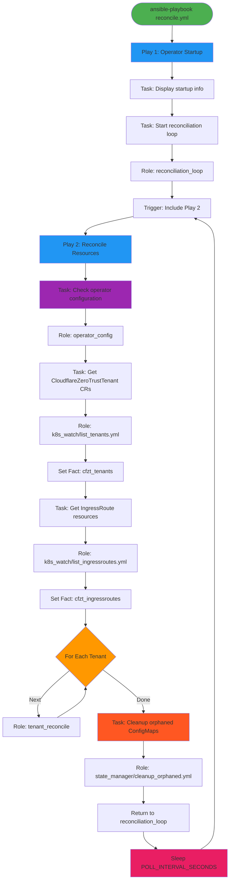

## Role Details

### Role 1: reconciliation_loop

**Purpose**: Wrapper that creates infinite reconciliation loop

**Location**: `ansible/roles/reconciliation_loop/tasks/main.yml`

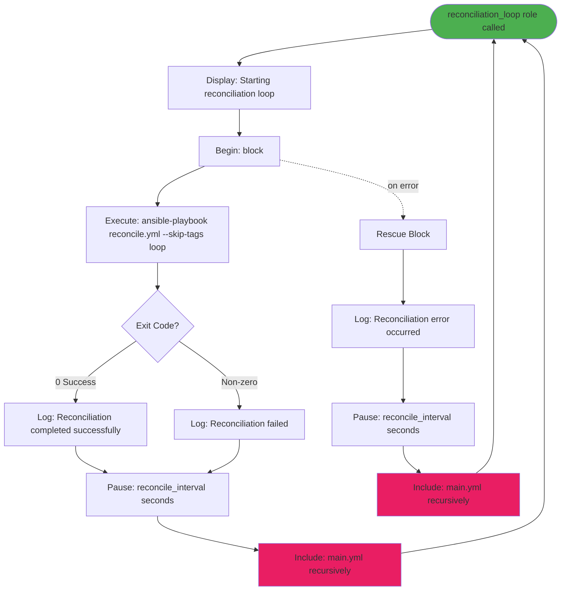

**Key Tasks**:
1. Run the main playbook (skipping itself to avoid infinite inception)
2. Log the result
3. Wait for the configured interval
4. Call itself recursively (infinite loop)
5. Handle errors gracefully (rescue block)

---

### Role 2: k8s_watch

**Purpose**: Discover Kubernetes resources (Tenants and IngressRoutes)

**Location**: `ansible/roles/k8s_watch/tasks/`

#### Task File: list_tenants.yml

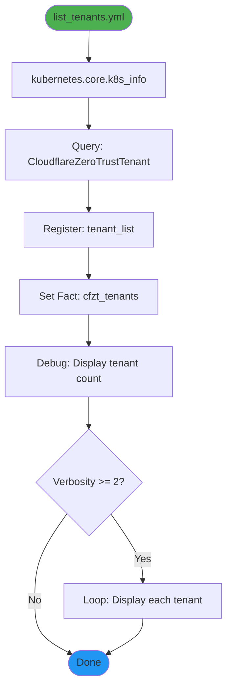

**Output**: 
- Variable `cfzt_tenants`: List of all CloudflareZeroTrustTenant resources

**Example**:
```yaml
cfzt_tenants:
  - metadata:
      name: prod-tenant
      namespace: default
    spec:
      accountId: "abc123..."
      tunnelId: "uuid..."
      credentialRef:
        name: cloudflare-api-token
```

#### Task File: list_ingressroutes.yml

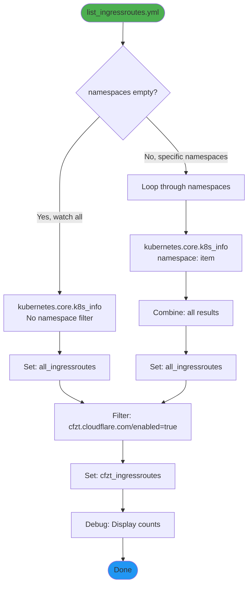

**Output**:
- Variable `all_ingressroutes`: All IngressRoute resources (in watched namespaces)
- Variable `cfzt_ingressroutes`: Filtered IngressRoutes with `cfzt.cloudflare.com/enabled: "true"`

**Filtering Logic**:
```jinja2
{{ all_ingressroutes 
   | selectattr('metadata.annotations.cfzt.cloudflare.com/enabled', 'defined') 
   | selectattr('metadata.annotations.cfzt.cloudflare.com/enabled', 'equalto', 'true') 
   | list }}
```

---

### Role 3: state_manager

**Purpose**: Manage state tracking ConfigMaps for IngressRoutes

**Location**: `ansible/roles/state_manager/tasks/`

The state_manager role has three task files:

#### Task File: check_state.yml

**Purpose**: Determine if IngressRoute needs reconciliation

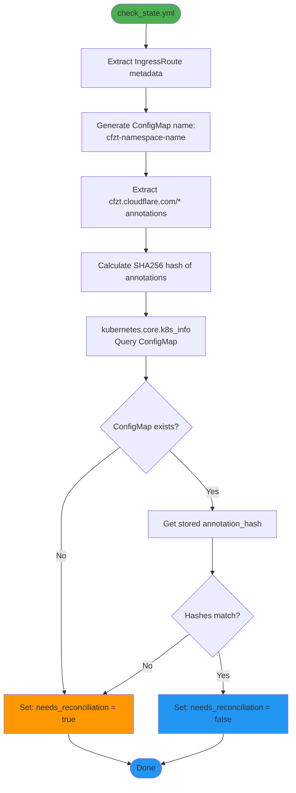

**Outputs**:
- `needs_reconciliation`: Boolean indicating if reconciliation required
- `state_configmap_name`: Name of the state ConfigMap
- `current_annotation_hash`: Current hash for comparison

#### Task File: update_state.yml

**Purpose**: Update ConfigMap after successful reconciliation

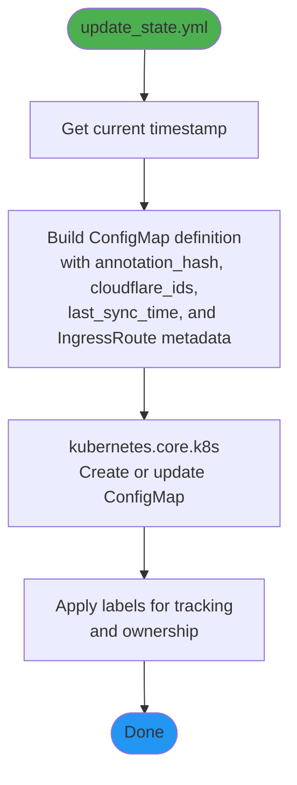

**Inputs**:
- `cloudflare_ids`: Dictionary of Cloudflare resource IDs created
- `current_annotation_hash`: Hash to store

#### Task File: cleanup_orphaned.yml

**Purpose**: Remove ConfigMaps for deleted IngressRoutes

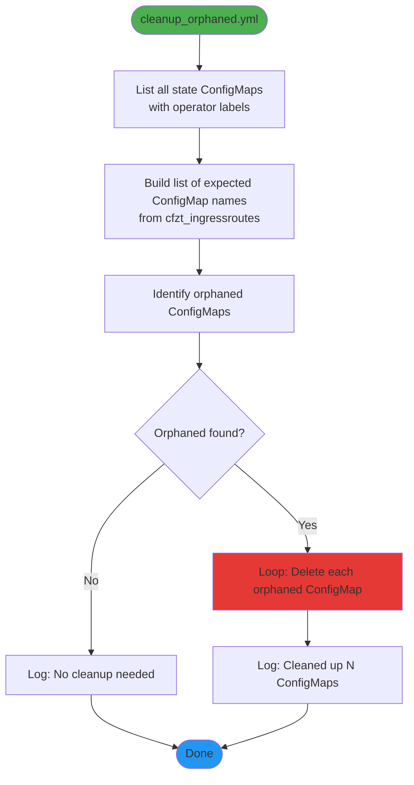

**When called**: After all tenants reconciled in each cycle

---

### Role 4: tenant_reconcile

**Purpose**: Orchestrate reconciliation for a single tenant

**Location**: `ansible/roles/tenant_reconcile/tasks/main.yml`

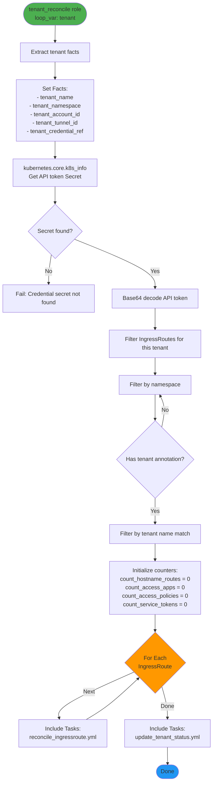

**Key Logic**:

1. **Extract tenant configuration** from the CloudflareZeroTrustTenant CR
2. **Retrieve API token** from referenced Secret
3. **Filter IngressRoutes** belonging to this tenant:
   - Same namespace as tenant
   - If IngressRoute has `cfzt.cloudflare.com/tenant` annotation, must match tenant name
   - If no tenant annotation and only one tenant in namespace, use that tenant
4. **Initialize resource counters** for status tracking
5. **Reconcile each IngressRoute** by calling `reconcile_ingressroute.yml`
6. **Update tenant status** with summary counts

---

### Task File: reconcile_ingressroute.yml

**Purpose**: Reconcile a single IngressRoute against Cloudflare

**Location**: `ansible/roles/tenant_reconcile/tasks/reconcile_ingressroute.yml`

```mermaid
flowchart TD
    START([reconcile_ingressroute.yml<br/>loop_var: ingressroute]) --> STATE_CHECK[Step 0: Check state]
    
    STATE_CHECK --> CALL_STATE[Include Role: state_manager<br/>tasks_from: check_state.yml]
    CALL_STATE --> NEEDS{needs_reconciliation?}
    
    NEEDS -->|No, unchanged| SKIP[Skip: Log no changes detected]
    NEEDS -->|Yes, changed/new| EXTRACT[Extract IngressRoute metadata]
    
    SKIP --> END([Done])
    
    EXTRACT --> INIT_IDS[Initialize cloudflare_resource_ids dict]
    
    INIT_IDS --> PARSE[Parse annotations:<br/>- hostname<br/>- tunnel_id<br/>- origin_service<br/>- create_access_app<br/>- allow_groups<br/>- allow_emails<br/>- session_duration<br/>- create_service_token<br/>- existing_*_ids]
    
    PARSE --> VALIDATE{hostname defined?}
    VALIDATE -->|No| FAIL[Fail: Missing hostname]
    VALIDATE -->|Yes| STEP1[Step 1: Manage Hostname Route]
    
    STEP1 --> CALL_CF1[Include Role: cloudflare_api<br/>tasks_from: manage_hostname_route.yml]
    CALL_CF1 --> STORE1[Store: tunnel_id, hostname in IDs dict]
    STORE1 --> INC1[Increment: count_hostname_routes]
    
    INC1 --> CHECK_ACCESS{accessApp=true?}
    
    CHECK_ACCESS -->|No| CHECK_TOKEN
    CHECK_ACCESS -->|Yes| STEP2[Step 2: Manage Access App]
    
    STEP2 --> CALL_CF2[Include Role: cloudflare_api<br/>tasks_from: manage_access_app.yml]
    CALL_CF2 --> STORE2[Store: access_app_id in IDs dict]
    STORE2 --> INC2[Increment: count_access_apps]
    
    INC2 --> STEP3[Step 3: Parse allow rules]
    STEP3 --> PARSE_GROUPS[Parse allow_groups<br/>Split by comma]
    PARSE_GROUPS --> PARSE_EMAILS[Parse allow_emails<br/>Split by comma]
    
    PARSE_EMAILS --> CALL_CF3[Include Role: cloudflare_api<br/>tasks_from: manage_access_policy.yml]
    CALL_CF3 --> STORE3[Store: access_policy_id in IDs dict]
    STORE3 --> INC3[Increment: count_access_policies]
    
    INC3 --> PATCH_ACCESS[kubernetes.core.k8s<br/>Patch IngressRoute with:<br/>- accessAppId<br/>- accessPolicyIds]
    
    PATCH_ACCESS --> CHECK_TOKEN{serviceToken=true?}
    
    CHECK_TOKEN -->|No| FINAL_PATCH
    CHECK_TOKEN -->|Yes| STEP4[Step 4: Manage Service Token]
    
    STEP4 --> CALL_CF4[Include Role: cloudflare_api<br/>tasks_from: manage_service_token.yml]
    CALL_CF4 --> STORE4[Store: service_token_id in IDs dict]
    STORE4 --> INC4[Increment: count_service_tokens]
    
    INC4 --> CREATE_SECRET{Token created?}
    CREATE_SECRET -->|Yes| K8S_SECRET[kubernetes.core.k8s<br/>Create Secret with token credentials]
    CREATE_SECRET -->|No| PATCH_TOKEN
    
    K8S_SECRET --> PATCH_TOKEN[kubernetes.core.k8s<br/>Patch IngressRoute with:<br/>- serviceTokenId<br/>- serviceTokenSecretName]
    
    PATCH_TOKEN --> FINAL_PATCH[kubernetes.core.k8s<br/>Patch IngressRoute with:<br/>- hostnameRouteId<br/>- lastReconcile timestamp]
    
    FINAL_PATCH --> UPDATE_STATE[Step 5: Update state]
    UPDATE_STATE --> CALL_UPDATE[Include Role: state_manager<br/>tasks_from: update_state.yml]
    CALL_UPDATE --> STORE_STATE[Store in ConfigMap:<br/>- annotation_hash<br/>- cloudflare_ids<br/>- last_sync_time]
    
    STORE_STATE --> END
    
    style START fill:#4CAF50
    style NEEDS fill:#FF9800
    style SKIP fill:#2196F3
    style CHECK_ACCESS fill:#FF9800
    style CHECK_TOKEN fill:#FF9800
    style CREATE_SECRET fill:#FF9800
    style UPDATE_STATE fill:#FF5722
    style END fill:#2196F3
```

**Detailed Steps**:

#### Step 0: State Check (NEW)
- Calculate hash of all `cfzt.cloudflare.com/*` annotations
- Query state ConfigMap for this IngressRoute
- Compare hashes to determine if reconciliation needed
- **Skip entire reconciliation if no changes detected**

#### Step 1: Hostname Route
- Calls Cloudflare API to create/update tunnel hostname route
- Maps public hostname → origin service
- Stores tunnel_id and hostname in cloudflare_ids dictionary
- Increments hostname route counter

#### Step 2: Access Application (if enabled)
- Creates/updates Cloudflare Access Application
- Uses hostname as application domain
- Sets session duration
- Stores access_app_id in cloudflare_ids dictionary
- Patches IngressRoute with app ID annotation

#### Step 3: Access Policy
- Parses allow rules (groups and emails)
- Creates/updates policy attached to Access Application
- Supports multiple groups and emails
- Stores access_policy_id in cloudflare_ids dictionary
- Patches IngressRoute with policy ID annotation

#### Step 4: Service Token (if enabled)
- Creates Cloudflare service token for machine-to-machine auth
- Creates Kubernetes Secret with `client_id` and `client_secret`
- Secret named: `{ingressroute-name}-cfzt-service-token`
- Stores service_token_id in cloudflare_ids dictionary
- Patches IngressRoute with token ID and secret name annotations

#### Step 5: Update State (NEW)
- Updates state ConfigMap with:
  - Current annotation hash
  - All Cloudflare resource IDs collected during reconciliation
  - Last sync timestamp
- Enables efficient change detection on next cycle

---

### Task File: update_tenant_status.yml

**Purpose**: Update CloudflareZeroTrustTenant status with reconciliation results

**Location**: `ansible/roles/tenant_reconcile/tasks/update_tenant_status.yml`

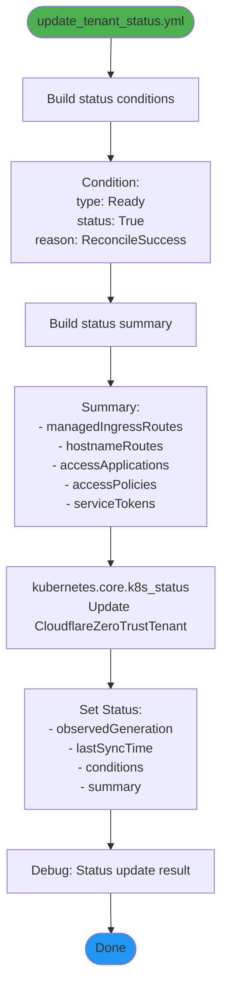

**Status Fields Updated**:

```yaml
status:
  observedGeneration: 1
  lastSyncTime: "2026-02-18T10:00:00Z"
  conditions:
    - type: Ready
      status: "True"
      lastTransitionTime: "2026-02-18T10:00:00Z"
      reason: ReconcileSuccess
      message: "Successfully reconciled 3 IngressRoute(s)"
  summary:
    managedIngressRoutes: 3
    hostnameRoutes: 3
    accessApplications: 2
    accessPolicies: 2
    serviceTokens: 1
```

---

### Role 5: cloudflare_api

**Purpose**: Interact with Cloudflare APIs

**Location**: `ansible/roles/cloudflare_api/tasks/`

This role contains multiple task files, each handling a specific Cloudflare API operation.

#### Task File: manage_hostname_route.yml

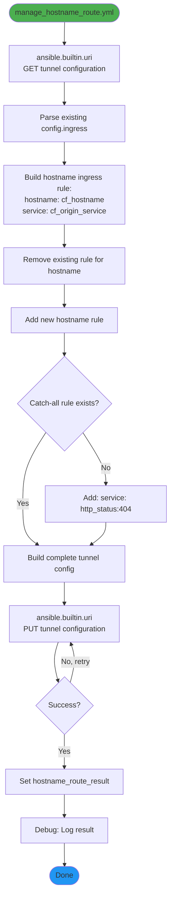

**API Call**:
```
PUT https://api.cloudflare.com/client/v4/accounts/{account_id}/cfd_tunnel/{tunnel_id}/configurations
```

**Retry Logic**:
- 3 retries
- 5 second delay between retries
- Handles rate limiting (429)

---

#### Task File: manage_access_app.yml

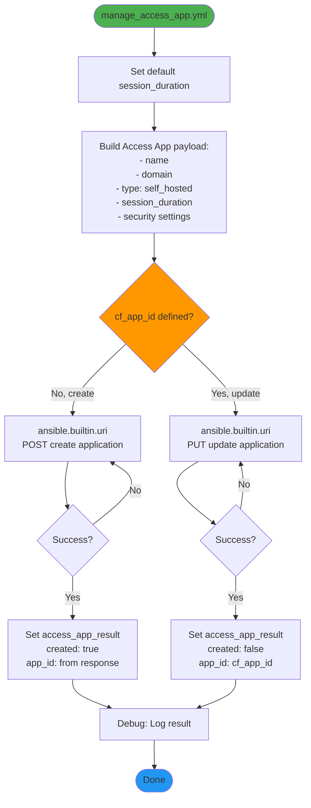

**API Calls**:
- Create: `POST https://api.cloudflare.com/client/v4/accounts/{account_id}/access/apps`
- Update: `PUT https://api.cloudflare.com/client/v4/accounts/{account_id}/access/apps/{app_id}`

**Idempotency**: Uses `cf_app_id` from annotations to update instead of create

---

#### Task File: manage_access_policy.yml

```mermaid
flowchart TD
    START([manage_access_policy.yml]) --> BUILD_GROUPS{cf_allow_groups defined?}
    
    BUILD_GROUPS -->|Yes| MAP_GROUPS[Build group rules:<br/>Each group → group object]
    BUILD_GROUPS -->|No| BUILD_EMAILS
    
    MAP_GROUPS --> BUILD_EMAILS{cf_allow_emails defined?}
    
    BUILD_EMAILS -->|Yes| MAP_EMAILS[Build email rules:<br/>Each email → email object]
    BUILD_EMAILS -->|No| COMBINE
    
    MAP_EMAILS --> COMBINE[Combine include rules]
    
    COMBINE --> CHECK_EMPTY{Rules empty?}
    CHECK_EMPTY -->|Yes| DEFAULT[Set default: everyone]
    CHECK_EMPTY -->|No| BUILD_PAYLOAD
    
    DEFAULT --> BUILD_PAYLOAD[Build Access Policy payload:<br/>- name<br/>- decision: allow<br/>- include: rules<br/>- precedence: 1]
    
    BUILD_PAYLOAD --> CHECK_ID{cf_policy_id defined?}
    
    CHECK_ID -->|No, create| POST[ansible.builtin.uri<br/>POST create policy]
    CHECK_ID -->|Yes, update| PUT[ansible.builtin.uri<br/>PUT update policy]
    
    POST --> SET_CREATE[Set access_policy_result]
    PUT --> SET_UPDATE[Set access_policy_result]
    
    SET_CREATE --> LOG
    SET_UPDATE --> LOG[Debug: Log result]
    
    LOG --> END([Done])
    
    style START fill:#4CAF50
    style CHECK_EMPTY fill:#FF9800
    style CHECK_ID fill:#FF9800
    style END fill:#2196F3
```

**Policy Structure**:
```json
{
  "name": "myapp-allow-policy",
  "decision": "allow",
  "include": [
    {"group": {"id": "Engineering"}},
    {"group": {"id": "Admins"}},
    {"email": {"email": "user@example.com"}}
  ],
  "precedence": 1
}
```

**API Calls**:
- Create: `POST https://api.cloudflare.com/client/v4/accounts/{account_id}/access/apps/{app_id}/policies`
- Update: `PUT https://api.cloudflare.com/client/v4/accounts/{account_id}/access/apps/{app_id}/policies/{policy_id}`

---

#### Task File: manage_service_token.yml

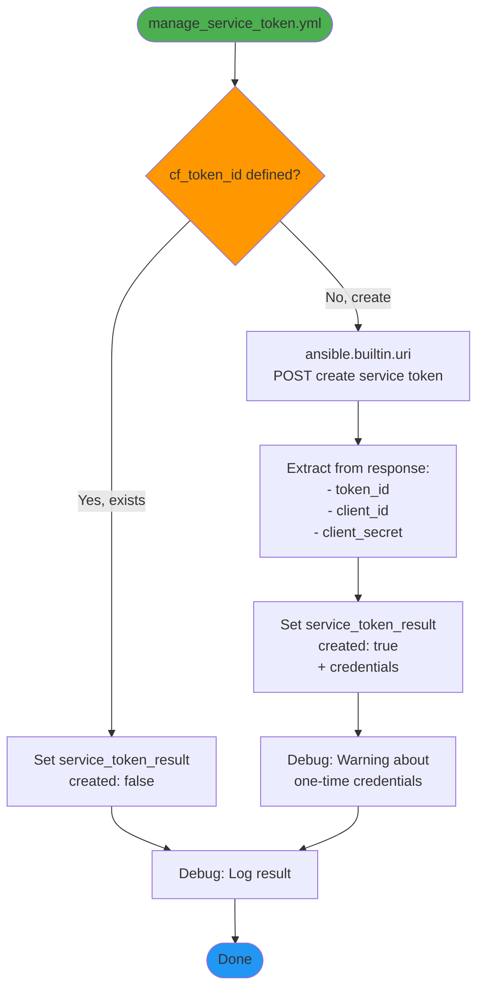

**API Call**:
```
POST https://api.cloudflare.com/client/v4/accounts/{account_id}/access/service_tokens
```

**Important**: Service token credentials (`client_id` and `client_secret`) are only returned once at creation time. The operator stores them in a Kubernetes Secret immediately.

---

#### Task File: delete_resources.yml

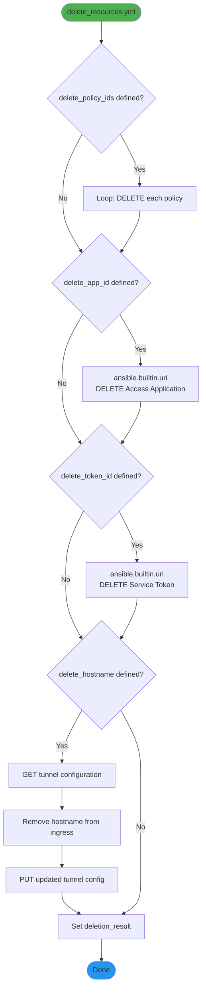

**Deletion Order** (important for dependencies):
1. Access Policies (dependent on app)
2. Access Application
3. Service Token
4. Hostname from tunnel configuration

**Used when**: IngressRoute is deleted or `cfzt.cloudflare.com/enabled` annotation is removed

---

## Task-Level Flow

### Complete Single IngressRoute Reconciliation


## Error Handling

### Error Propagation Flow


### Retry and Backoff Strategy

**Cloudflare API Calls**:
```yaml
retries: 3
delay: 5  # seconds
until: response.status in [200, 201, 204]
```

**Rate Limit Handling**:
- Cloudflare returns 429 when rate limited
- Ansible URI module retries automatically
- Exponential backoff: 5s → 10s → 20s

**Kubernetes API Calls**:
- No explicit retries (assumed reliable)
- Failed API calls fail the entire reconciliation
- Next reconciliation cycle retries

### Error Status Updates


## Examples

### Example 1: Simple Hostname Route

**IngressRoute**:
```yaml
apiVersion: traefik.io/v1alpha1
kind: IngressRoute
metadata:
  name: simple-app
  annotations:
    cfzt.cloudflare.com/enabled: "true"
    cfzt.cloudflare.com/hostname: "simple.example.com"
spec:
  routes:
    - match: Host(`simple.example.com`)
      services:
        - name: simple-app
          port: 8080
```

**Reconciliation Flow**:
```
1. Parse annotations → hostname: "simple.example.com"
2. Call manage_hostname_route.yml
   └─> GET tunnel config
   └─> Add hostname rule: simple.example.com → http://traefik.traefik.svc:80
   └─> PUT tunnel config
3. Patch IngressRoute:
   └─> cfzt.cloudflare.com/hostnameRouteId: "tunnel-uuid"
   └─> cfzt.cloudflare.com/lastReconcile: "2026-02-18T10:00:00Z"
```

**Result**: Public hostname `simple.example.com` routes through Cloudflare Tunnel to Traefik

---

### Example 2: Access App with Email Allow

**IngressRoute**:
```yaml
apiVersion: traefik.io/v1alpha1
kind: IngressRoute
metadata:
  name: admin-panel
  annotations:
    cfzt.cloudflare.com/enabled: "true"
    cfzt.cloudflare.com/hostname: "admin.example.com"
    cfzt.cloudflare.com/accessApp: "true"
    cfzt.cloudflare.com/allowEmails: "admin@example.com,manager@example.com"
    cfzt.cloudflare.com/sessionDuration: "8h"
spec:
  routes:
    - match: Host(`admin.example.com`)
      services:
        - name: admin-panel
          port: 80
```

**Reconciliation Flow**:
```
1. Parse annotations
   └─> hostname: "admin.example.com"
   └─> accessApp: true
   └─> allowEmails: "admin@example.com,manager@example.com"
   └─> sessionDuration: "8h"

2. Call manage_hostname_route.yml
   └─> Create tunnel route

3. Call manage_access_app.yml
   └─> POST Access Application
   └─> name: "admin-panel"
   └─> domain: "admin.example.com"
   └─> session_duration: "8h"
   └─> Returns: app_id

4. Call manage_access_policy.yml
   └─> Parse emails: ["admin@example.com", "manager@example.com"]
   └─> Build include rules: [
         {"email": {"email": "admin@example.com"}},
         {"email": {"email": "manager@example.com"}}
       ]
   └─> POST Access Policy
   └─> Returns: policy_id

5. Patch IngressRoute:
   └─> cfzt.cloudflare.com/hostnameRouteId: "tunnel-uuid"
   └─> cfzt.cloudflare.com/accessAppId: "app-uuid"
   └─> cfzt.cloudflare.com/accessPolicyIds: "policy-uuid"
   └─> cfzt.cloudflare.com/lastReconcile: "2026-02-18T10:00:00Z"
```

**Result**: 
- Public hostname protected by Cloudflare Access
- Only `admin@example.com` and `manager@example.com` can access
- Session lasts 8 hours

---

### Example 3: Full Stack with Service Token

**IngressRoute**:
```yaml
apiVersion: traefik.io/v1alpha1
kind: IngressRoute
metadata:
  name: api-service
  annotations:
    cfzt.cloudflare.com/enabled: "true"
    cfzt.cloudflare.com/hostname: "api.example.com"
    cfzt.cloudflare.com/accessApp: "true"
    cfzt.cloudflare.com/allowGroups: "Engineering"
    cfzt.cloudflare.com/serviceToken: "true"
spec:
  routes:
    - match: Host(`api.example.com`)
      services:
        - name: api-backend
          port: 8000
```

**Reconciliation Flow**:
```
1. Parse annotations
   └─> hostname: "api.example.com"
   └─> accessApp: true
   └─> allowGroups: "Engineering"
   └─> serviceToken: true

2. Create hostname route (same as above)

3. Create Access Application (same as above)

4. Call manage_access_policy.yml
   └─> Parse groups: ["Engineering"]
   └─> Build include rules: [
         {"group": {"id": "Engineering"}}
       ]
   └─> POST Access Policy
   └─> Returns: policy_id

5. Call manage_service_token.yml
   └─> POST Service Token
   └─> name: "api-service-service-token"
   └─> Returns: token_id, client_id, client_secret

6. Create Kubernetes Secret
   └─> name: "api-service-cfzt-service-token"
   └─> data:
       ├─> client_id: "xxxx"
       └─> client_secret: "yyyy"

7. Patch IngressRoute:
   └─> cfzt.cloudflare.com/hostnameRouteId: "tunnel-uuid"
   └─> cfzt.cloudflare.com/accessAppId: "app-uuid"
   └─> cfzt.cloudflare.com/accessPolicyIds: "policy-uuid"
   └─> cfzt.cloudflare.com/serviceTokenId: "token-uuid"
   └─> cfzt.cloudflare.com/serviceTokenSecretName: "api-service-cfzt-service-token"
   └─> cfzt.cloudflare.com/lastReconcile: "2026-02-18T10:00:00Z"
```

**Result**:
- Hostname protected by Cloudflare Access
- Members of "Engineering" group can access
- Service token available in Secret for machine-to-machine auth
- Applications can use credentials: `CF-Access-Client-Id` and `CF-Access-Client-Secret` headers

---

### Example 4: Update Flow (Idempotency)

**Scenario**: IngressRoute already reconciled, now updating `allowEmails`

**Before**:
```yaml
annotations:
  cfzt.cloudflare.com/enabled: "true"
  cfzt.cloudflare.com/hostname: "app.example.com"
  cfzt.cloudflare.com/accessApp: "true"
  cfzt.cloudflare.com/allowEmails: "user1@example.com"
  # Operator-managed annotations:
  cfzt.cloudflare.com/accessAppId: "existing-app-id"
  cfzt.cloudflare.com/accessPolicyIds: "existing-policy-id"
```

**After Update**:
```yaml
annotations:
  cfzt.cloudflare.com/enabled: "true"
  cfzt.cloudflare.com/hostname: "app.example.com"
  cfzt.cloudflare.com/accessApp: "true"
  cfzt.cloudflare.com/allowEmails: "user1@example.com,user2@example.com"  # Added user2
```

**Reconciliation Flow**:
```
1. Parse annotations
   └─> existing_app_id: "existing-app-id"
   └─> existing_policy_ids: "existing-policy-id"
   └─> allowEmails: "user1@example.com,user2@example.com"

2. Call manage_access_app.yml
   └─> cf_app_id defined → UPDATE path
   └─> PUT https://.../access/apps/existing-app-id
   └─> (No changes to app, but ensures it exists)

3. Call manage_access_policy.yml
   └─> Parse emails: ["user1@example.com", "user2@example.com"]
   └─> cf_policy_id defined → UPDATE path
   └─> PUT https://.../policies/existing-policy-id
   └─> Updates policy with new email list

4. Patch IngressRoute:
   └─> (IDs remain the same)
   └─> cfzt.cloudflare.com/lastReconcile: "2026-02-18T10:05:30Z"  # Updated timestamp
```

**Result**: Policy updated in place, no duplicate resources created

---

## Summary

The reconciliation flow follows a clear pattern:

1. **Discovery**: List tenants and IngressRoutes
2. **Iteration**: For each tenant, for each IngressRoute
3. **State Check**: Calculate annotation hash and compare with stored ConfigMap
4. **Conditional Reconciliation**: Only contact Cloudflare API if changes detected
5. **State Update**: Store annotation hash and Cloudflare IDs in ConfigMap
6. **Cleanup**: Remove orphaned ConfigMaps after each cycle
7. **Status Updates**: Report summary to tenant status
8. **Repeat**: Loop continuously at configured interval

The entire flow is **idempotent**, **declarative**, and **stateful**, making it safe to run repeatedly while minimizing unnecessary Cloudflare API calls. This approach enables efficient GitOps workflows with minimal API overhead.
